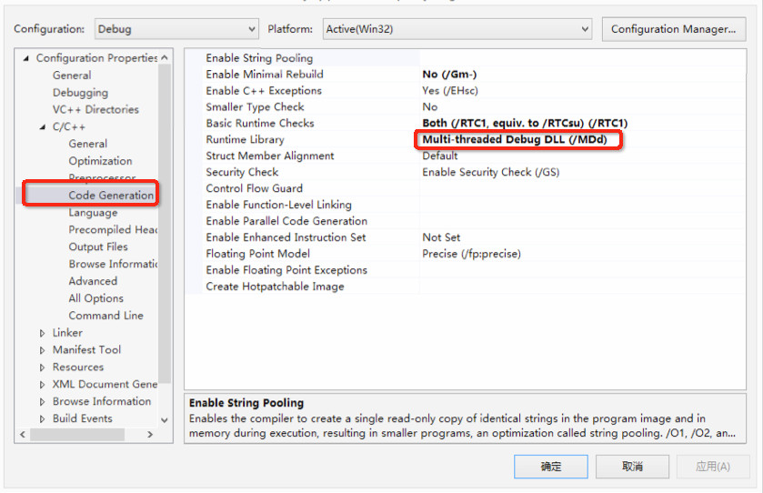

# Customize Cocos Framework & Simulator

### Overview

The following section provides guidance on how to create and include custom Cocos Framework & Simulator for your games.

### Version Requirement

Customizing Cocos Framework requires Cocos Framework v3.7 or higher. This document is used for version v3.8 or higher.

The directories below are based on v3.8 and the installation of Cocos Framework.

### How to customize Cocos Framework

Customizing Cocos Framework is actually modifying its source codes. After the installation of Cocos Framework, you can customize the framework with IDE or code editors.

* On Mac, you can open projects `/Applications/Cocos/frameworks/cocos2d-x-v3.8/build/CocosFramework.xcodeproj` with XCode. Then you need to modify and debug codes.
* On Windows, you can open projects ` [installation directory]/frameworks/cocos2d-x-v3.8/build/CocosFramework.sln` with Visual Studio. Then you need to modify and debug codes.

### How to release the custom Cocos Framework

#### Build a new precompiled library

There is a scripting tool in Cocos Framework to compile source codes to precompiled library: `cocos gen-libs`.

The following is a detailed description of how to use this scripting tool:

```
usage: cocos gen-libs [-h] [-c] [-e ENGINE_PATH] [-p {ios,mac,android,win32}]
                      [-m {debug,release}] [--dis-strip] [--vs VS_VERSION]
                      [--app-abi APP_ABI]

Generate prebuilt libs of engine. The libs will be placed in 'prebuilt' folder
of the engine root path.

optional arguments:
  -h, --help            show this help message and exit
  -c                    Remove the 'prebuilt' folder at first.
  -e ENGINE_PATH        Specify the engine path. Default is the engine root
                        path of current tools.
  -p {ios,mac,android,win32}
                        Specify the target platform. Can specify multi
                        platform by using '-p' multi times. Default generate
                        all available platforms.
  -m {debug,release}, --mode {debug,release}
                        Generate cocos libs for debug or release. Default is
                        release.
  --dis-strip           Disable the strip of the generated libs.

Windows Options:
  --vs VS_VERSION       Specify the Visual Studio version, such as 2013.
                        Default find available version automatically.

Android Options:
  --app-abi APP_ABI     Set the APP_ABI of ndk-build. Can be multi value
                        separated with ':'. Sample : --app-aib
                        armeabi:x86:mips. Default value is 'armeabi'.

```

For example:

1. `cocos gen-libs -c` : Clear previous precompiled library and compile all platforms.
2. `cocos gen-libs -p win32 --vs 2015` : Compile Win32 platform with Visual Studio 2015.

Precompiled library will be created in the following directory `frameworks/cocos2d-x-v3.8/prebuilt`. Include the new precompiled library to game projects.

**Note**

* To customize Cocos Framework, you need to modify source codes and maintain project files. Any problem in the custom codes or projects will lead to a failure in implementing compiling tools.
* When you're genrating prebuilt libs with `-m debug`, you should modify the Visual Studio configuration of your game project like this:
Change the value of `C/C++ -> Code Generation -> Runtime Library` from `/MD` to `/MDd`. Take a look at the image:


#### Create a new simulator

There is a scripting tool in Cocos Framework to compile source codes to precompiled library: `cocos gen-simulator`。

The following is a detailed description of how to use this scripting tool:

```
usage: cocos gen-simulator [-h] [-c] [-e ENGINE_PATH] [-m {debug,release}]
                           [-o OUT_DIR] [-p {ios,mac,android,win32}]
                           [--vs VS_VERSION]

Generate Cocos Simulator.

optional arguments:
  -h, --help            show this help message and exit
  -c, --clean           Clean the output directory before generating. Will
                        remove the output directory at first.
  -e ENGINE_PATH        Specify the engine path. Default is the engine root
                        path of current tools.
  -m {debug,release}, --mode {debug,release}
                        Generate simulator for debug or release. Default is
                        debug.
  -o OUT_DIR, --output OUT_DIR
                        Where to save Cocos Simulator. Default is the
                        'simulator' folder in the root path of engine.
  -p {ios,mac,android,win32}
                        Specify the target platform. Can specify multi
                        platform by using '-p' multi times. Default generate
                        all available platforms.
  --vs VS_VERSION       Specify the Visual Studio version, such as 2013.
                        Default find available version automatically.
```

For example:

1. `cocos gen-simulator -c` : Clear previous simulators and compile all platforms.
2. `cocos gen-simulator -p win32 --vs 2015` : Compile Win32 simulator with Visual Studio 2015.

### Integrate custom simulator

Copy and replace the files under " **installation directory/Cocos/cocos-simulator-bin** ". Once you have done it, you can use the custom simulator.

***Note** Simulator is mainly used to preview projects. If you want to use a new simulator, you need to replace the current used simulator with the new one.*
