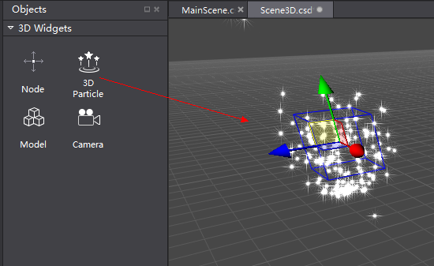
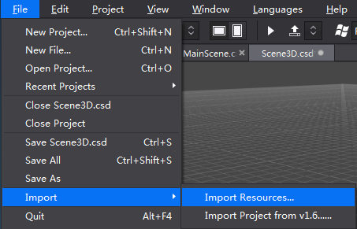
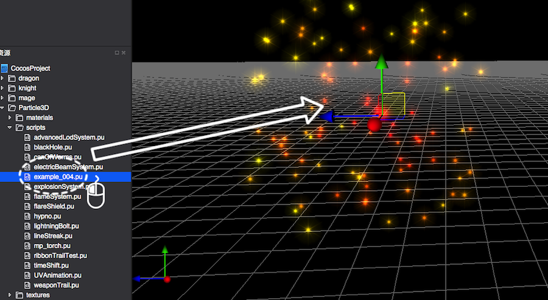

#3D Particles Overview

Parcles use a large number of small objects, controlled by emitter or scripts, to simulate phenomena such as water, fire, smoke and smoke, etc. To use 3D particles, do the following:

**1 Create a 3D particle**

Drag and drop a 3D particle from 3D Objects to Scene.

**2 Modify objects' properties**

Modify basic properties, or move and dynamically adjust a particle's states with mouse, such as its position, scale and rotation, etc. You can use Particle Universe to create more particle effects and import the files into Cocos Studio.

**3 Import particle resources**

Import particle resources to a project, and then drag and drop them to scene.

&emsp;&emsp;

&emsp;&emsp;&emsp;&emsp;&emsp;&emsp;&emsp;&emsp;&emsp;&emsp;&emsp;&emsp;&emsp;&emsp;&emsp;&emsp;

To use particle resources, just drag and drop them to the Scene.

Drag and drop particle files to Particle widget to replace previous resources.
