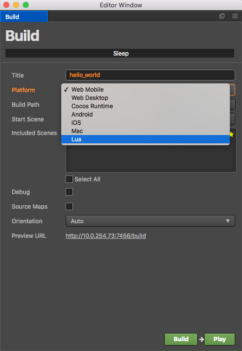
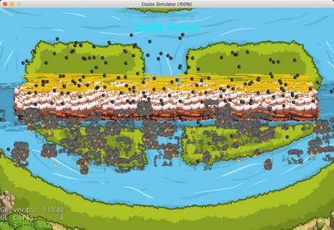

# Lua Engine Support

__Cocos Creator__ developers that use Lua can build scenes and UI, and use Lua script to control nodes and UIs in game.

## Main features

Currently supported features:

- `Sprite` - Sprite image renderer
- `Canvas` - Mainly used for responsive multi-resolution design
- `Widget` - You can set up automatic alignment with responsive Canvas or elements
- `Button` - Response to player interaction
- `EditBox` - For players to enter text
- `ParticleSystem` - Renderer for particle effects
- `TileMap` - Renderer for map generated by Tiled Map Editor
- `Animation` - Currently only sprite animation supported
- `Label (System Font)` - Currently only system font supported
- `Component with Lifetime events` - Components and life cycle management

## Instructions for use

There are three steps needed to use scenes created by __Cocos Creator__ in Lua project.
This will be further streamlined in coming versions.

### Setup

1. First you need to download the latest version of the [Creator-Lua template project](http://cocos2d-x.org/filedown/CocosCreator-Lua-v1.0).

    Or you can pull from __GitHub__:

    ```sh
    $ git clone https://github.com/dualface/creator-lua.git
    ```

    For the rest of this document we refer to this as __PATH-TO-CREATOR-LUA__.

2. Create a new project Lua:
  ```sh
  cocos new -l lua GAME-NAME
  ```

3. Remove Lua Project `src` and` res` directory of all files. 

4. Copy the __PATH-TO-CREATOR-LUA/lua-project/src__ files and all subdirectories in the 
directory to __src__ Lua project.

5. Copy the __PATH-TO-CREATOR-LUA /lua-project/convert-creator-build.sh__ and 
__PATH-TO-CREATOR-LUA /lua-project/convert-creator-build.bat__ project file to the Lua 
directory.

### Building A Scene

1. In __Cocos Creator__, save the edited scenes, and then select the menu 
__Project -> Build publish__.
2. Publish the platform of choice for the __Lua__

    

3. Click the __Build__ button

After completion the publishing path will contain all the scenes and their resources. These 
resources can not be used in a Lua project without being converted.

### Converting to Lua format

1. From the command-line goto the Lua project directory.
2. If you are on OSX or Linux, run __./convert-creator-build.sh ../creator-project/build/lua__. 
If you are on Windows, run __convert-creator-build.bat .. \creator-project\build\lua__.
3. You will see __done__ if everything converts successfully.

After the conversion is complete, open the operation of the project (or use `cocos run` command), 
you can see the effect of the scene:



### Precautions

After every change made to the Scene you need to do __build -> Convert__ operation.