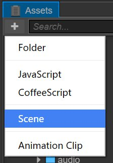

# Assets

**Assets** is used for us to access and manage the working area of project assets. Adding assets in here is normally a necessary step when starting to make game. You can use **HelloWorld** template to create a new project and then you can see there are many basic asset types in **assets**.

## Introduction for the interface

**assets** shows the contents in project assets folders in tree view, but be noticed that only the assets put under `assets` catalog in the project folder will be showed in here. Please read [Project structure] for project folder structure (../project-structure.md). Now let me introduce the elements in each interface:

- **Create** button on the top left corner is used to create new asset
- The input box on the top right can be used to search and filter the asset filenames that contain specific text.
- The main part of the panel is the asset list for the asset folder where you can add, delete or alter assets using context menu or dragging operation.

## Asset list

Asset list can include any folder structure. Folders in **assets** will show as icon. Click the arrow on the left to the icon, the contents in this folder will be unfold/fold.

The rest showed in the list other than folders are all asset files. Files in the asset list will not show their expanded-names, instead, they will use icons to indicate the type of file or asset, for example, the project created by **HelloWorld** template includes three core assets:

- **image assets**：currently includes image files like `jpg` and `png`, icon will show as thumbnail of the image.
- **script assets**: the JavaScript file programmer writes and uses `js` as the filename extension. We add function and game logic to the component by editing these scripts.
- **scene assets**: scene file opened by double click. Only the scene file is opened can we keep creating and making the contents.

More common asset types and asset workflow, please read [Asset workflow](../asset-workflow/index.md).

### Create assets

Currently, the assets can be created in **assets** are as follows:

- Folder
- Script file
- Scene
- Movie clips

Click **create** button on the top left corner, the create assets menu including the above asset list will be popped out. Click any item in it will create new corresponding assets at the current selected position.

### Select asset

You can use the following asset selection in asset list:

- Click to select a single asset
- Press <kbd>Ctrl</kbd> or <kbd>Cmd</kbd> on the keyboard and click the mouse to join more assets into the selection
- Press <kbd>Shift</kbd> on the keyboard and click the mouse to select continuous assets

You can execute move, delete and other operations to those selected assets.

### Move asset

After selecting the asset(can select many for once), hold down the mouse and drag to move the asset(s) to other position. Drag the assets into the folder, you will see the folder with the mouse hovering over is highlighted by orange.

Release the mouse at this time so that the asset(s) is moved into the highlighted folder.

### Delete asset

For those chosen assets, you can execute the following operation to delete:

- Right click and choose `delete` from the popped out menu
- Press <kbd>Delete</kbd>（Windows）or <kbd>Cmd + Backspace</kbd>（Mac) after choosing the asset

Since deleting assets is an irreversible operation, there will be a dialog box popped out demanding user to confirm. Once click yes, the assets will be deleted permanently and cannot be found in recycling station (Windows) or trash bin (Mac)! Please use it with caution and do version management or manual backup.

### Other operations

The right click menu of **assets** also includes the following operation:

- `rename`: rename the asset
- `create`: same function with **create** button, it will add asset to the current selected folder. If the current selected one is asset file, it will add new asset to the same folder with current selected asset.
- `show in explorer（Windows）or Finder （Mac）`: open the asset folder in the file manager window of operating system.
- `Go to the asset location in Library`: open the imported asset location in `Library` of project folder. Please read [project structure](../project-structure.md) for detailed information.
- `Show UUID`: show the current selected asset's UUID in**console** window.
- `Refresh`: rerun the import operation of this asset.

Besides, for specific asset type, you can enter the editing status like scene asset and script asset by double clicking asset.

## Filter asset

Enter text in the search box at the top right of **assets** to filter filenames with all the assets including the input text. You can also input filename extensions like `*.png` so it will list all the assets with this specific extension.

---

Keep moving on to [Scene editor](scene.md).
