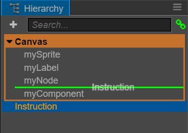

# Hierarchy manager

**Hierarchy manager** includes all nodes in current opened scene, no matter the node includes the visible image or not. You can choose, create and delete nodes in here and create set membership of node by dragging one node to another.

Click to choose node, and the selected node will be highlighted in blue. Current selected node will show with blue frame in **scene editor** and update contents in **attribute inspector**.

## Create node

There are two ways to create node in hierarchy manager:

- Click  `+` button on the top left corner or right click the mouse to enter the **create node** submenu in right click menu. In this submenu, you can select different node types including Sprite, Label, Button and other nodes with different functions and expressions.
- Drag assets like image, font or particle from **explorer** to hierarchy manager. Then you can create corresponding image rendering node with the selected assets.

## Delete node

After select node, you can delete the selected node by the `delete` option in the right click menu or press the hot key <kbd>Delete</kbd>（Windows）or <kbd>Cmd + Backspace</kbd>. If the selected node contains child node, then the child node will be deleted along with it.

## Establish and edit node hierarchy relationship

Dragging node A to node B makes node A the child node of node B. Similar with [explorer](assets.md), hierarchy manager also show nodes' hierarchical relationship in tree view. Click the triangle icon on the left of node and you can unfold or fold the child node list.

## Change node's showing order

Other than dragging one node to another, you can also keeps dragging node up and down to change the order of node in the list. The orange square indicates the range of parent node which the node belongs to and the green line represents the position the node will be inserted.

The ranking of node in the list determines the showing order of node in the scene. The lower the node is in the hierarchy manager, the later will its rendering happen in the scene and will cover the nodes rank higher in the list.

## Other operations

Right click the node, the popup menu also includes the following operation:

- **Copy/paste**：copy the node to the clipboard and then paste it to other places or open another scene to paste the node just copied.
- **Copy node**：generate node replication exactly the same with the selected node and they are at the same level.
- **Rename**：rename the node
- **Show route in console**：In complicated scenes, we sometimes need to get the complete hierarchy route of the node to access it when running the script. Click this option so you can see the node's route in **console**.

---

Continue on to read about [Attribute inspector](inspector.md).
