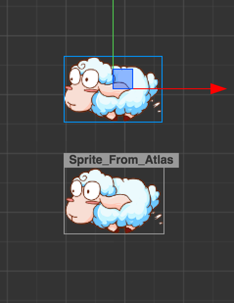
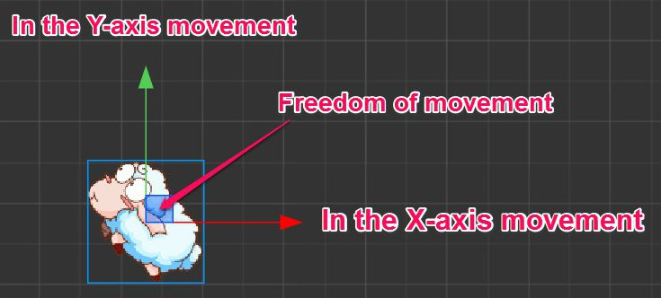
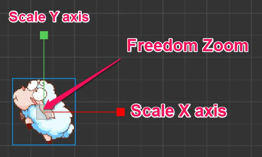
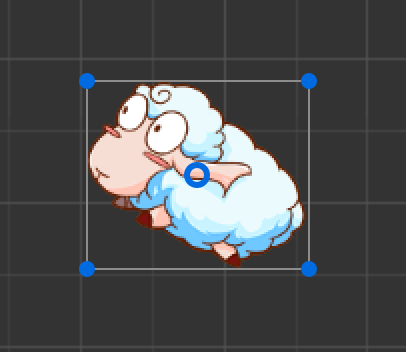

# Scene editor

**Scene editor** is the core working area of content creation. You will use it to choose and place the scene image, character, special effet, UI and other game elements. In this working area, you can select and use **transform tool** to change the node's attributes like position, rotation, scale and size. Here you can also preview WYSIWYG scene effect.

## View Introduction

### Navigation

You can move and locate the view in **scene editor** by the following operations:

- <kbd>right click to drag</kbd>：horizontally remove the view.
- <kbd>mouse wheel</kbd>：zoom in/out the view by taking the current mouse hovering position as the center.

### Coordinate system and grid

There will be a set of scaleplate and grids on the background of the scene view, which indicate the position information of each point in **world coordinate system**. Point reads `(0,0)` is the origin of the world coordinate system in the scene. When using the mouse wheel to zoom out the view display, each scale represents a distance of `100` pixel. Due to the differences in the zooming in/out scale of current view, the number representing the distance from this point to origin will display on different scales, the unit of which is pixel.

Scale and grid in the scene are important reference information for us to place the scene elements. For informations on the relationship between coordinate system and node attributes like position, please read [../../content-workflow/transform.md] section.

### Indicator Frame of Design resolution

The purple frame in the view represents the content area that displays in the scene by default. The size of this area is determined by **design resolution**. For settings and effects of deign resolution, please read [../../components/canvas.md] section.

## Select a node

When the mouse is hovering on the node in the scene, the constraint frame of the node will display a grey singlet line. The node will be selected if you left click the mouse. You can only use transform tools (like position, rotation) to set node operations after selecting it.

There will be wireframe in blue around the selected node to prompt the constraint frame for node.

### Node name prompt

When the mouse is hovering on the node, the node name will be displayed together with the node constraint frame. You can decide your target before clicking to confirm your selection according to the suspend prompt at places where nodes are gathering.

About the naming of nodes, please read the introduction in [hierarchy manager](hierarchy.md).

### The node constraint box

You can see the constraint box(in grey or blue) when hovering on or selecting the node, and the rectangular region of the constraint box indicates the **size** attribute size of the node. Even though the node doesn't contain image rendering component(such as **Sprite**), you can set `size` attribute for the node and the tranparent region within the constraint box of node can be selected by clicking the mouse or hovered.

Node's `size` attribute plays an important role in multiresolution adapt and layout strategy. For more information about usage of node size, please read [multiresolution adapt and elements aligning](../..ui/multi-resolution-align.md).

### Multiselect nodes

Press the left mouse button and drag in **scene editor** and you can draw a blue marquee. Nodes overlap with the marquee will be selected all together when releasing the mouse. You can slide the mouse at your will to change the marquee area before releasing the mouse.

After selecting multiple nodes, any transform operation will make effects on all the selected nodes.

## Use transform tool to arrange node

The core function of **scene editor** is to edit and arrange the visible elements in the scene in the way of WYSIWYG. We mainly arrage the nodes in the way we hope them to be by series **transform tool** on the top left corner of the main window's tool bar.

### Move transform tool

**Move transform tool** is the tranform tool default in activated state when opening the editor. This tool can be activated by clicking the first button on top left corner of main window's tool bar.

Select any node so you can see the node center(or anchor's position) appears a gizmo composed of red and green arrows and blue cube.

**Gizmo** refers to a controller that can interactive with mouse and appears in certain editing states in the scene editor. These controllers are only to assist editing without being shown in the game while it is running.

When the move transform tool is activated:

- Press red arrow and drag mouse, then the node will be moved on the x axis;
- Press green arrow and drag mouse, then the node will be moved on the y axis;
- Press blue cube and drag mouse, then the node will be moved freely on both the axises.

When the scene editor is activated, press keyboard shortcut <kbd>W</kbd> and you can switch to move tranform tool at any time.

### Rotate transform tool

Click the second button on the tool bar located at the main window's top left corner or press the keyboard shortcut <kbd>E</kbd> in scene editor and you can activate **rotate transform tool**.

The gizmo of rotate transform tool is mainly made up of an arrow and a circle. The direction of arrowhead indicates the angle of current node `rotation`. By dragging arrow or any point in the circle, you can rotate the node and you can get the angle value of current rotation on gizmo before you release the mouse.

### Scale transform tool

Click the third button on the tool bar located at main window's top left corner or press the keyboard shortcut <kbd>R</kbd> in the scene editor and you can activate **scale transform tool**.

- Press red arrow and drag mouse, then the node will be zoomed on the direction of x axis;
- Press green arrow and drag mouse, then the node will be zoomed on the direction of y axis;
- Press the yellow square in the middle, then the whole node image will be zoomed keeping the aspect ratio.

All the child nodes will be zoomed in the same ratio with the node.

### Rectangle tranform tool

Click the fourth button on the tool bar located at the main window's top left corner or press the keyboard shortcut <kbd>T</kbd> in scene editor and you can activate **rectangle tranform tool**.

Drag any end-points of the gizmo so you can change the attributes of `width` and `height` in node size while the opposite angles end points position keep the same.

Drag any side on the gizmo so you can change the attributes of `width` and `height` in node size while the opposite sides position keep the same.

In UI elements layout, **rectangle transform tool** is always used to precisely control the position and length of the node's dimensions. As to the image elements that must keep original image aspect ratio, the rectangle transform tool is normally not the best choice for size adjustment.

---

Keep moving on to [hierarchy manager](hierarchy.md) file.
