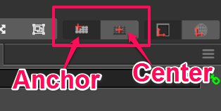

# Tool bar

**Tool bar** is right above the main editor window including five sets of control buttons or pieces of information that provide editing functions for specific panels and allow the user to conveniently implement workflows.

### Choose transform tool

This provides the editing node transform attribute (position, rotation, scale, size) function for the **scene editor**. Please refer to [use transform tool to place node](editor-panels/scene.md#--8) for detailed information.

### Transform tool display mode
Control the display mode of the **transform tool** in **scene editor** with the two sets of buttons below.

Position mode:

* Anchor: transform tool will be displayed at the position where the node **Anchor** is.
* Central point: transform tool will be displayed at the position where the central point of the node is (influenced by the constraint box size).

Rotation mode:

* Local transform tool's rotation (handle direction) will stay the same as the **Rotation** attribute of the node.
* World: transform tool's rotation stays the same and the handles of the x and y axes stay the same as the direction of the world coordinate.

### Run game preview

This includes two buttons:

* Run preview: run the scene being currently edited in the browser.
* Refresh device: reload the current scene on all the devices that are connected to this machine to preview the game (including local browser and other mobile devices connected to the native machine).

### Preview address

Here is shown the LAN address of the desktop computer running Cocos Creator. The mobile devices connected to the same local area network can access this address to preview and debug the game.

### Open project folder

Open the project folder in the operating system explorer or finder.

---

Continue on to read about the [editor layout](layout.md).
