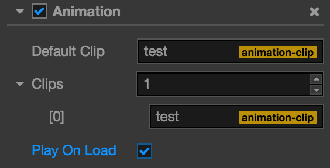
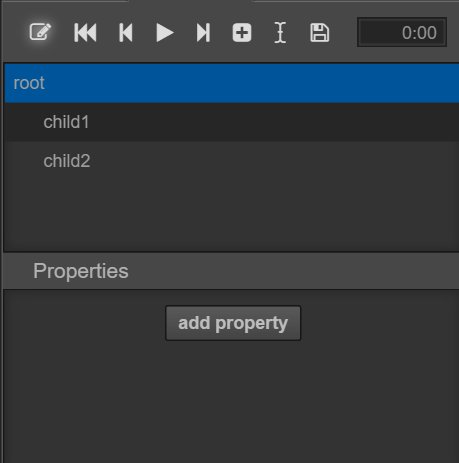

# Animation component reference
**Animation **component enables node and its child node to make animation.

Click the `add component` button at the bottom of **attribute inspector**, and then select `Animation` from `add other components` so you can add **Animation** component to node.

## Animation attribute

| Attribute |   Function Explanation
| -------------- | ----------- |
| Default Clip | Default animation clip. If you set value for this one and **Play On Load** is true, then the animation will play the content of **Default Clip** automatically after loading.
| Clips | Default list type is null, **AnimationClip** added in here will reflect into the **animation editor**, user can edit content of **Clips** in **animation editor**
| Play On Load | Boolean type, whether auto-play the content of **Default Clip** after the animation has completed loading.

## Detailed explanation

If we need to have many nodes contained in one animation, then normally we will create a new node as the animation's **root node**. Add **Animation ** component to this **root node**, then the other child nodes of this root node will come into this animation automatically.

If the following node tree is added:

then the hierarchy in animation editor will show as:

More information about**Animation**, please keep moving on to [Animation system](../animation/index.md)

Keep moving on to [Canvas component reference](canvas.md) file.