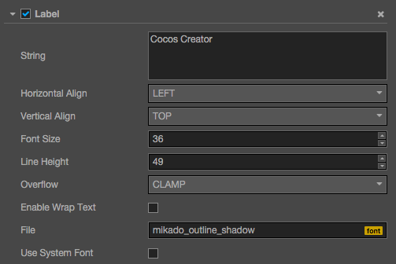

# Label component reference

The Label component is used to show a piece of text which could be in the system font, TrueType font or BMFont. Label also has the layout function.

Click `add component` button at the bottom of **attribute inspector** and then select `Label` from `add rendering component` so you can add Label component to the node.

# Label attribute

| Attribute |   Function Explanation
| -------------- | ----------- |
|String| Text content character string.
|Horizontal Align| Horizontal alignment pattern of the text. The options are LEFT, CENTER and RIGHT.
|Vertical Align| Vertical alignment pattern of the text. The options are TOP, CENTER and BOTTOM.
|Font Size| Font size of the text.
|Line Height| Line height of the text.
|Overflow| Layout pattern of the text. Currently supports CLAMP, SHRINK and RESIZE_HEIGHT. See `Label layout` for more detailed information.
|Enable Wrap Text| Enable or disable the text line feed.
|File| Designate font file which the text rendering needs. If the system font is used, then this attribute can be set to null.
|Use System Font| Boolean value, whether use system font or not.

# Label Layout

| Attribute |   Function Explanation
| -------------- | ----------- |
|CLAMP| The text size won't zoom in or out as the Bounding Box size changes. When Wrap Text is disabled, parts exceeding the Bounding Box won't be showed according to the normal characters layout. When Wrap Text is enabled, it will try to wrap the text exceeding the range to the next line. If the vertical space is not enough, the text shown incompletely will also be hid.
|SHRINK| The text size will zoom in or out (won't zoom out automatically, the maximum size that will show is what Font Size specified) as the Bounding Box size changes. When Wrap Text is enabled, if the width is not enough, it will try to wrap the text to the next line before automatically adapting the Bounding Box's size to make the text show completely. If Wrap Text is disabled, then it will compose according to the current text and zoom automatically if it exceeds the boundaries.
|RESIZE_HEIGHT| The text Bounding Box is adaptive to the text layout. The user cannot manually change the text height under this status. The text height is automatically calculated by the internal algorithm.

# Detailed explanation

The Label component can alter the rendering font type by dragging the TTF font file and BMFont font file into the `File` attribute in `attribute inspector`. If you want to stop using the font file, you can use the system font again by checking `Use System Font`.

---

Keep moving on to [Animation component reference](animation.md) file.
