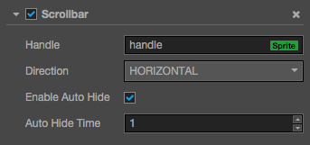

# ScrollBar component reference

ScrollBar allows the user to scroll a picture (the public beta version is currently not supported) by dragging a slider. It's a bit similar to the `Slider` component, but it is mostly used for scrolling while Slider is used to set values.

Click the `add component` button at the bottom of **attribute inspector** and then select `ScrollBar` from `add UI component` so you can add the ScrollBar component to the node.

## ScrollBar attribute

| Attribute |   Function Explanation
| -------------- | ----------- |
| Handle| ScrollBar foreground picture. Its length/width will be calculated according to the content size of ScrollView and the actual display area size.
| Direction | Scroll direction. Currently has horizontal and vertical directions.
| Enable Auto Hide | Enable or disable auto hide. If it is enabled, then `Auto Hide Time` will hide automatically after ScrollBar shows.
| Auto Hide Time | Auto hide time, need to set `Enable Auto Hide` along with it.

## Detailed explanation

ScrollBar normally is used together with `ScrollView` instead of using it alone. Besides, ScrollBar needs to designate a `Sprite` component which is `Handle` in the attribute panel.

Normally we will also designate a background picture for ScrollBar to indicate the length or width of the whole ScrollBar.

---

Keep moving on to [Layout component reference](layout.md)。