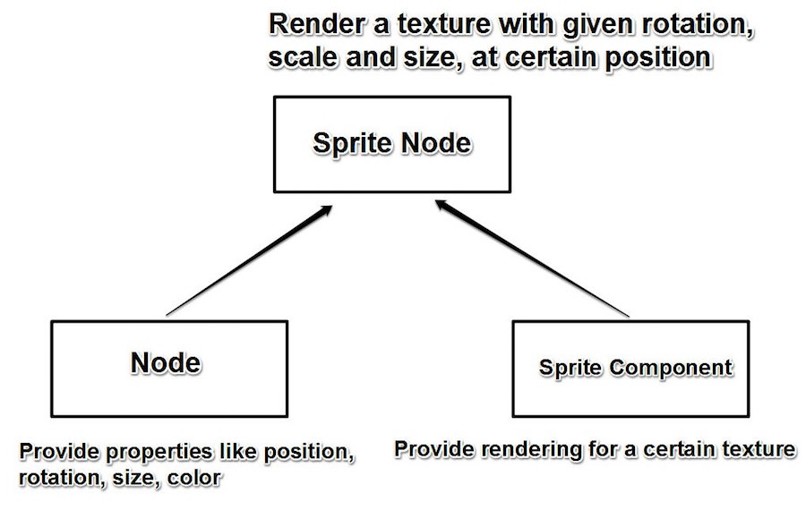
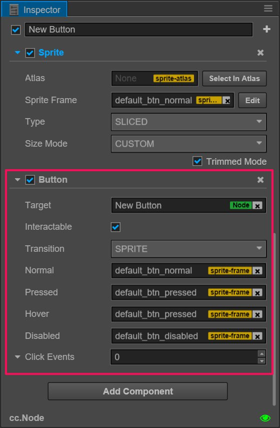

# Node and component

The core of Cocos Creator's workflow is component-based development. The component-based framework is also known as the **component-entity system** (or [Entity-Component System](https://en.wikipedia.org/wiki/Entity_component_system)). Simply put, we construct the entity in combination mode instead of inheriting mode.

In Cocos Creator, a **Node** is an entity carrying component. We will make nodes that have many kinds of expressions and functions by mounting a **Component** that has many kinds of functions itself on the node. Let’s see how to create a node and add a component to the scene.

## Create Node

To get a node having a specific function fastest, you can use the **create node** button on the left corner of the **hierarchy manager**. We can make a very simple Sprite node as an example. Click the **create node** button and then choose ’create rendering node/Sprite’:

Then we can see the new Sprite node in the **scene editor** and **hierarchy manager**. The new node is named ‘New Sprite’, meaning this is a node whose function is mainly provided by the Sprite component. You can also try clicking the **create node** button again to choose other node types so that you can find their different names and expressions.

## Component

### Sprite component

Now since we have some nodes, let's see what a component is and the connections between the components and nodes. Select the ‘New Sprite’ that we just created and you can see what the **attribute inspector** says:

The part starting with ‘Node’ in the **attribute inspector** is the property of the node. The property of the node includes changeable information about the node like position, rotation, scale and size as well other information such as anchor, color and opacity. We will introduce each in detail in the [node properties](node-properties.md) section.

In the following picture, the part starting with ‘Sprite’ is the property of the Sprite component. In 2D games, the Sprite component is responsible for most of the image rendering. The most important property of the Sprite component is ‘Sprite Frame’ where we can designate the image files that Sprite is going to render in the game. Let's try to drag a picture resource from the **resource manager** to the ‘Sprite Frame’ property in the **attribute inspector**:

We see that the previous Sprite default image turns into the image we assigned. This is what the Sprite component does: rendering images.

### The influence of the node attribute on the Sprite component

When a node combines with the Sprite component, the rendering method of an image can be controlled by modifying the node attribute. You can adjust your node according to the settings marked by red lines in the following picture. You can see that the image rotation, scale, color and opacity changes:

We mentioned earlier that the component based structure achieves function extensions by combining. The following picture shows how the node and the Sprite component combine.

## Node Color and Opacity property

The property of **Color** and **Opacity** in the above picture have direct influence on the Sprite component rendering image. Color and opacity can also influence the display of the rendering component [Label](../components/label.md).

These two properties will multiply the content of the rendering component itself to determine each pixel's color and opacity during rendering. In addition, the Opacity property will act on a child node and easily achieve the fade in and fade out effect of a set of node contents by altering the ‘Opacity’ of the parent node.

## Add other components

We can add multiple components on one node to add more functions to the node. In the example above, we can continue to select the ‘New Sprite’ node, click the **add component** button at the bottom of the **attribute inspector** panel and select ‘add UI component/Button’ to add a Button component.

Then set the Button component according to the following picture (the actual color attribute can be set freely according to your own taste):

Next, click the **operation preview** button on the toolbar  and hover the mouse over the image in the browser operation window. You can then see the color of the image changes which means the adding of the Button component to the node has taken effect!

## Brief Summary

In the above example, we first combined the Sprite component with the node which led us to the scene image that could designate the resource for the rendering image. Then we could display this image in different ways by altering the node attributes like scale and color. Next we could even add a Button component to the node so that it could react according to the different statuses of the button (normal, hover, down, etc.). This is the component based development workflow in Cocos Creator. We can use this method to combine different functions within a node to achieve a series of complicated targets, such as a character's mobile attack controls, auto scrolling of background images, layouts of UI elements, interaction functions and so on.

It's worth mentioning that a single node can only add one rendering component including **Sprite**, **Label**, **Particle** and so on.

## Reference reading

- [Understand component-entity system - i_dovelemon's blog](http://blog.csdn.net/i_dovelemon/article/details/25798677)

Continue on to read about [coordinate system and transform](transform.md).
