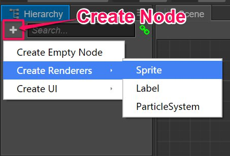
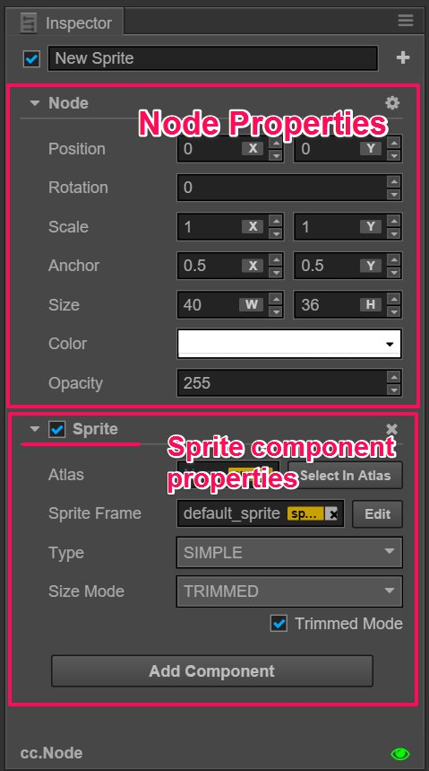
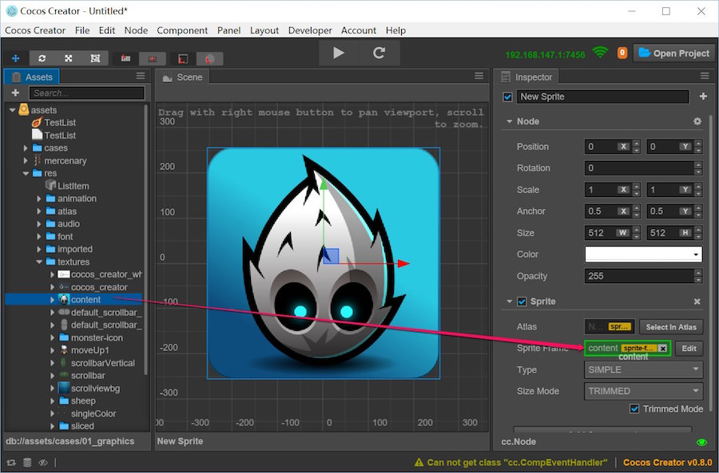
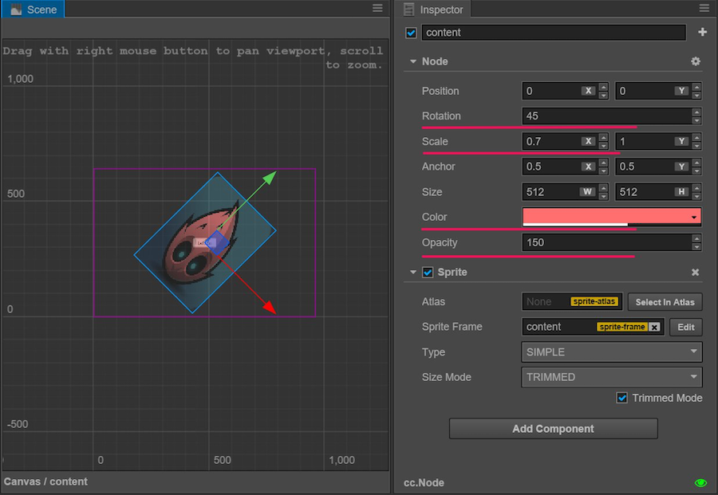

# Node and component

The core of Cocos Creator's workflow is component-based development. The component-based framework is also known as the **component-entity system**（or [Entity-Component System](https://en.wikipedia.org/wiki/Entity_component_system)）. Simply put, we construct the entity in combination mode instead of inheriting mode.

In Cocos Creator, **Node** is the entity that carries components. We will make nodes have all kinds of expressions and functions by mounting **Component** which has all kinds of functions on the node. Now let's see how to create node and add components in the scene.

## Create Node

To get a node with a specific function fastest, you can use the **create node** button on the top left corner of the **hierarchy manager**. Let's make an example by creating a most simple Sprite node. Click the **create node** button and then choose `create rendering node/Sprite`:

Then we can see the new Sprite node in the **scene editor** and **hierarchy manager**. The new node is named `New Sprite` meaning this is a node whose function is mainly provided by the Sprite component. You can also try to click **create node** button again to choose other node types so that you can find their different names and expressions.

## Component

### Sprite component

Now that we have some nodes, let's see what a component is and the connections between the component and node. Select `New Sprite` we just created, you can see what the **attribute inspector** says:

The part starting with `Node` in **attribute inspector** is the property of the node. The property of the node includes transform information of the node like position, rotatation, scale, size and other information about the node, such as anchor, color and opacity. We will introduce each of them in details in the [Node properties](node-properties.md) section.

The following part starting with `Sprite` is the property of the Sprite component. In 2D games, the Sprite component is responsible for most of the images' rendering. The most important property of the Sprite component is `Sprite Frame` where we can assign the image files that Sprite is going to render in the game. Let's try to drag a picture resource from the **resource manager** to the `Sprite Frame` property in the **attribute inspector**:

We can witness the previous default image of Sprite turns into the image we assign, this is what the Sprite component does: rendering images.

### The influence of the node attribute on the Sprite component

When the node combines with the Sprite component, it can control the rendering method of the image by changing the node attribute. You can adjust your node according to the settings marked in red lines in the following picture. You can see that the image rotation, scale, color and opacity changes:

We mentioned earlier that the component-based structure realizes the fuction extensions by combining. The following picture shows how the node and the Sprite component combines.

## Node Color and Opacity property

The property of **Color** and **Opacity** in the above picture have direct influence on the Sprite component rendering image. Color and opacity can also influence the display of the rendering component as [Label](../components/label.md).

These two properties will multiply the rendering content of the rendering component itself to determine each pixel's color and opacity during rendering. Besides, the Opacity property will act on the child node and realize the fade in and fade out effect of a set of node contents easily by altering the `Opacity` of the parent node.

## Add other components

Add multiple components on one node to add more functions to this node. In the example above, we can still select the node of `New Sprite` and click the **add component** button at the bottom of the **attribute inspector** panel and then select `add UI component/Button` to add a Button component.

Then finally set the Button component as the following picture shows(the actual color attribute can be set freely according to your own taste):

Next, click the **operation preview** button on the toolbar  and hover the mouse over the image in the browser operation window, then you can see the color of the image changes which means the action of adding the Button component for the node has took effect!

## Brief summary

In the above example, we first combined the Sprite component with node which led us to the scene image that can designate the rendering image resource, then we could display this image in differenct ways by altering the node attributes like scale and color. Next we can even add a Button component to this node so that this node can react according to the different status of the button (normal, hover, down, etc.). This is the component-based development workflow in Cocos Creator, we can use this to combine different functions in a node to realize a series of complicated targets, such as the character's mobile attack control, background image's auto scroll, UI elements' layout, interaction function and so on.

It's worth mentioning that one node can only add one rendering component which includes **Sprite**, **Label**, **Particle** and so on.

## Reference reading

- [Understand component-entity system - i_dovelemon's blog](http://blog.csdn.net/i_dovelemon/article/details/25798677)

Keep moving on to [Coordinate system and transform](transform.md) file.