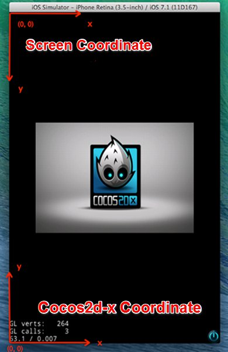
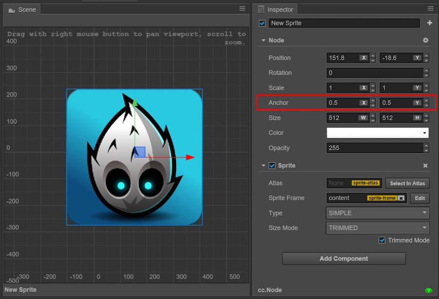
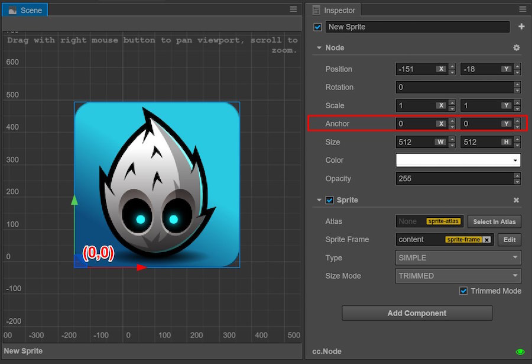
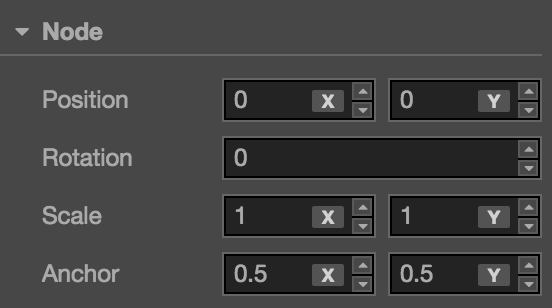
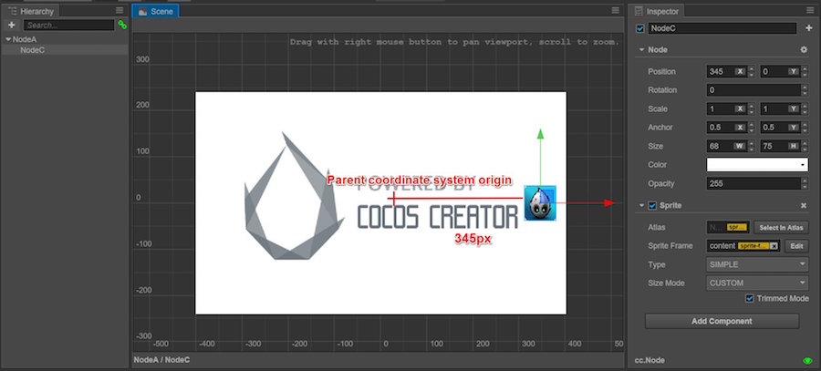
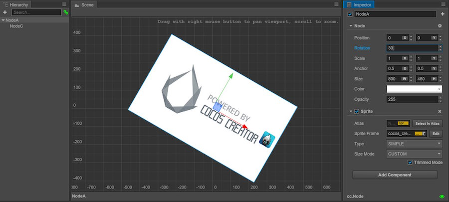
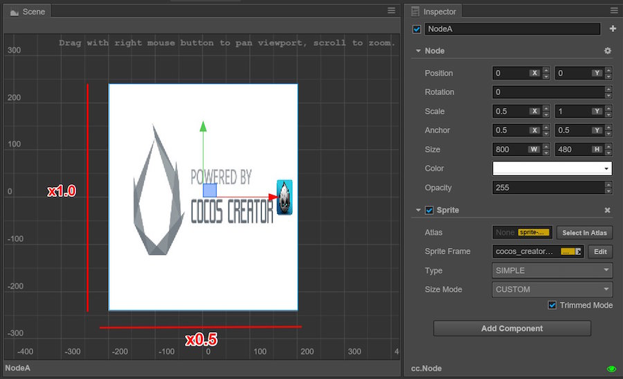

# Coordinate system and node transformation attribute

In the [Scene editor](../basics/editor-panels/scene.md) and [Node and component](node-component.md) files, we introduced that we can change node's display behavior by using **change tools** and editing the node's attributes in the **attribute inspector** . We will learn more about the coordinate system of where the node is and the operating principles of the node's four transformation attributes of Position, Rotation, Scale, Size in this section.

## Cocos Creator coordinate system

We have learnt that we can set the position attribute for the node, then where will a node with a specific position attribute be displayed on the screen when the game is operating? Like a map in real life, we can run satellite positioning only with both longitude and latitude, we also need to learn about the coordinate system of Cocos Creator to understand the meaning of the node position.

### Cartesian coordinate system

The Cocos Creator coordinate system is exactly the same as the cocos2d-x engine coordinate system, and the cocos2d-x and OpenGL coordinate systems are both originated from the Cartesian coordinate system. In the Cartesian coordinate system, the original point of the right-handed system is in the left bottom corner with x towards the right, y towards the top and z towards the outside. The coordinate system we use is the Cartesian right-handed coordinate system.

### Screen coordinate system and cocos2d-x coordinate system

The standard screen coordinate system uses a different coordinate system from OpenGL which has a huge difference with the cocos2d-x coordinate system.

The coordinate system used in developing applications with native SDK in iOS, Android, Windows Phone and other platforms is the standard screen coordinate system, the origin is on the screen upper left corner while x is towards the right and y downwards.

The cocos2d-x coordinate system is the same with the OpenGL coordinate system, the origin is on the lower left corner while x is towards the right and y upwards.

### World Coordinate and Local Coordinate

World coordinate is also called absolute coordinate. It is the united coordinate system to show the scene space in Cocos Creator game development.「World」is used to indicate the scene in our game.

Local coordinate is also called relative coordinate which is related to the node. Each node has its own unique coordinate, so when the node is moving or changing directions, the coordinate related with this node will move or change directions along with it.

**Nodes** in Cocos Creator can have a hierarchical structure of set membership. The node position we altered in the node's **Position** attribute setting is the **local coordinate** relative to the parent node not the world coordinate. Finally, Cocos Creator will map these nodes' local coordinate to the world coordinate when drawing the whole scene.

To confirm the mode of action for each node coordinate, we also need to know the concept of **anchor** .

### Anchor

**Anchor** is another important property of nodes. It determines which point in the constraint frame of the node itself should be taken as the position of the whole node. The position we see the transformation tool show after we choose the node is the anchor position of the node.

Anchor is expressed by `anchorX` and `anchorY` which are the multiplication factors in the range of `0 ~ 1` and calculate the anchor position by node size. `(0.5, 0.5)` indicates the anchor is located in the position where the node length is multiplied by 0.5 and node width multiplied by 0.5 which is the center of the node.

When the anchor attribute is set as `(0, 0)`, the anchor is at the initial origin position of the node's local coordinate, i.e. the left bottom corner of the node constraint frame.

### The local coordinate of the child node

Once the anchor position is decided, all the child nodes will take the **anchor position** as the coordinate origin. One thing we need to note is that this action is not the same as the default action in the cocos2d-x engine, it is a feature of the Cocos Creator coordinate!

Hypothetically, the node structure in the scene is as follows:

When our scene contains nodes from a different hierarchy, we should take the following steps when we determine the position of each node in the world coordinate:

1. Process each node from scene root level. `NodeA` in the above image is a root level node. First, determine the display position and coordinate origin position (same as the anchor position) according to the **Position** attribute and the **Anchor** attribute of NodeA.
2. Then process all the direct child nodes of NodeA which are `NodeB` and its sibling nodes. Determine the position in the scene space and the coordinate origin position of NodeB in NodaA's local coordinate.
3. No matter how many levels that the nodes have, process them all in order from highest level to the lowest. Each node should use the coordinate and its own position anchor attribute of the parent node to determine the position in the scene space.

## Transform property

Besides the **Anchor** we introduced above, the node also includes four other main transformation properties. We are introducing them next.

### Position

**Position** is composed of `x` and `y` properties which set the node coordinate on the current coordinate x axis and y axis.

`NodeA` is the above image is at the scene root level, its position is `(507, 354)`（can be shown to refer to the scale on the background of **scene editor**）, the position of its child node `NodeC` is `(345, 0)`. You can see that the position of the child node migrated based on the parent node's anchor.

The default value of the position property is `(0, 0)` which means that the newly added node will always show up at the parent node's coordinate origin position. The default position of nodes in Cocos Creator is `(0, 0)`, the default anchor is set as `(0.5, 0.5)`. Nodes under this setting will be at the center position of the parent node by default so that all the contents will be taken in when making UI or combining the players' character.

In the scene editor, you can always use [move transform tools](../basics/editor-panels/scene.md#--9) to change node position.

### Rotation

**Rotation** is another important property that will have effect on the node local coordinate. The rotate property only has one value to indicate the current rotation angle of the node. When the angle value is positive, the node rotates clockwise; when the angle value is negative, the node rotates counterclockwise.

The node hierarchical relationship in the image above is the same as in the previous image only with the **Rotation** attibute of `NodeA` set as `30` degrees. As well as `NodeA` itself rotating 30 degrees clockwise, its child node `NodeC` also rotates 30 degrees clockwise taking the anchor of `NodeA` as the center.

In the scene editor, you can always use [rotate transform tools](../basics/editor-panels/scene.md#--10) to change the rotation of node.

### Scale

The **Scale** property is a set of multiplication factors which are composed of `scaleX` and `scaleY` to represent the node scale percentage on the x axis and y axis.

The scale property of `NodeA` in the above image is set as `(0.5, 1.0)` which means to reduce the node 0.5 times on the x axis and remain the same on the y axis. You can see the image of its child node `NodeC` is also reduced on the x axis, so the scale property will influence all the child nodes.

The scale property set on the child node will make additive effects to the parent node. The child node of a child node will multiply all the scale properties on each hierarchy to get the scale percentage used in the world coordinate. This point is the same as the position and rotation property only position and rotation property, while the scale property makes the effects more obvious by multiplication.

The scale property acts on the effects of the properties of position, size and others. When you change the scale property, the node's position and size won't change，but it will multiply the position, size and other properties by a scale before showing the node image; the value from the multiplication is the actual position and size that the node will appear.

In the scene editor, you can always use [scale transform tools](../basics/editor-panels/scene.md#--11) to change the scale of the node.

### Size

The **Size** property is composed of `Width` and `Height` to stipulate the constraint frame's size. For the Sprite node, the size of the constraint frame is the size of the image that will appear.

Therefore, the size property can easily be confused with the scale property. They both can influence the size of the Sprite image, but they influence it in different ways. Th size property, along with position and anchor, regulates the four endpoint positions of the node and determines the image display range of these four points constraints according to its result. The size property plays a vital role in rendering the [Sliced Sprite](../ui/sliced-sprite.md).

Meanwhile, scale property gets the node's width and height after scaling based on the multiplication of the size value. When determining the size of the image, size is the basis while scale is the variable so to speak. Besides, the size property will not influence the size of the child node (but can make indirect influence through [Widget](../ui/widget-align.md)）which has a huge difference with the scale property.

In the scene editor, you can always use [rectangle transform tools](../basics/editor-panels/scene.md#--11) to change the node size.

---

Keep moving on to [Manage node hierarchy and display order](node-tree.md) file.