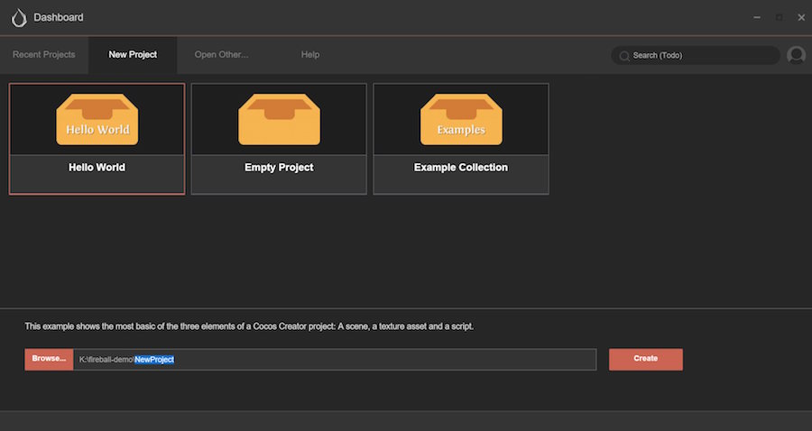
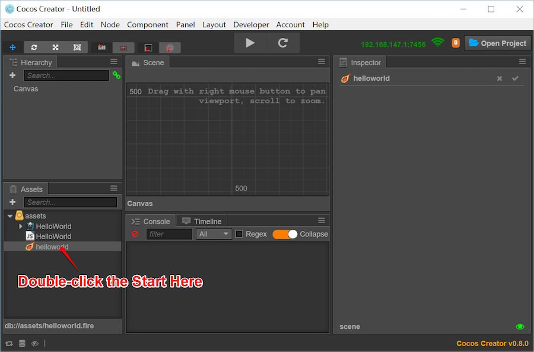
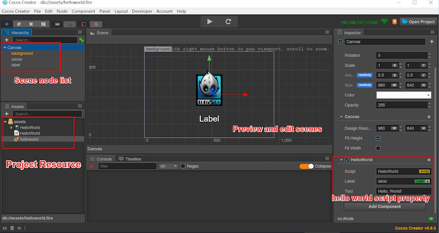
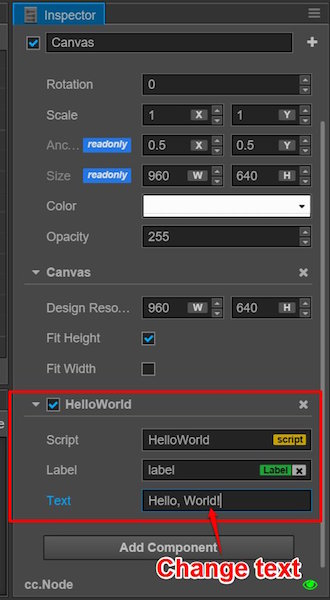
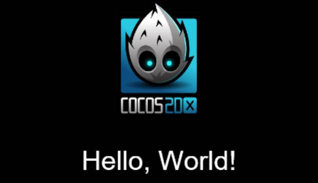

# Hello World

After understanding how to use the Dashboard, let's see how to create and open a Hello World project now.

## Create a New Project

In the Dashboard, open the **Create a New Project** tab and choose the `Hello World` project template.

Then appoint the path of the new project in the project path bar below. The last section of the path is the project folder.

After finishing inputting the path, click the **Create a New Project** button at the bottom right corner, the project will be automatically created from the Hello World project template and will be opened.

## Open the scene and start working

The Workflow cores of Cocos Creator are data driven. When opening a project for the first time, no scene will open by default. To view the content of the Hello World template, we need to first open a scene resource document.

Double click the `Hello World` scene document indicated by the arrow in the **Resource Manager**. All the scene documents in Cocos Creator use ![../asset-workflow/index/scene.png] as their icon.

## Hello World project decomposition

After opening the `Hello World` scene, we can see all the contents of this template project.

The content of the scene will respectively appear in four core panels **resource manager, arrangement manager, scene editor and property checker** according to workflows. Introductions to the editor interface and main panel will be shown in detail in the following [Editor Overview](../basics/editor-overview.md) section.

## Preview scene

To see a preview of the game scene, please click the**preview game** button at the top of the editor window.

Cocos Creator will use your default browser to run the current game scene. The effect is as illustrated below:

Click the drop down menu in the top left corner of the preview window and from here you can choose the preview effects for different device screens.

## Modifying the welcome message

The initial embodiment of Cocos Creator's focusing on data driven is that when we need to change the welcome message of Hello Word, we don't need to edit the script code any more, but can directly modify properties of the words that are saved in the scene.

Firstly click the `Canvas` node in the **arrangement manager**, to which our `Hello World` component script is attached.

Next, find the `Hello World` component property at the bottom of the **property checker**, and change the text in the `Text` property into `Hello, world!`:

When running the preview again, we will see that the welcome message has been updated:

## Summary

The content of this section lets us know how to start the workflows of Cocos Creator from the scene. And by modifying the welcome message, it gives a brief introduction to the working methods of data driven. Next, we will lead you to finish a relatively complete leisure game through a step by step process. We believe that you will have a more comprehensive understanding Cocos Creator's workflows after this.

---

Continue on to read about [Quick Start](quick-start.md).
