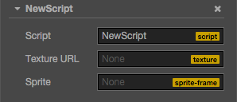
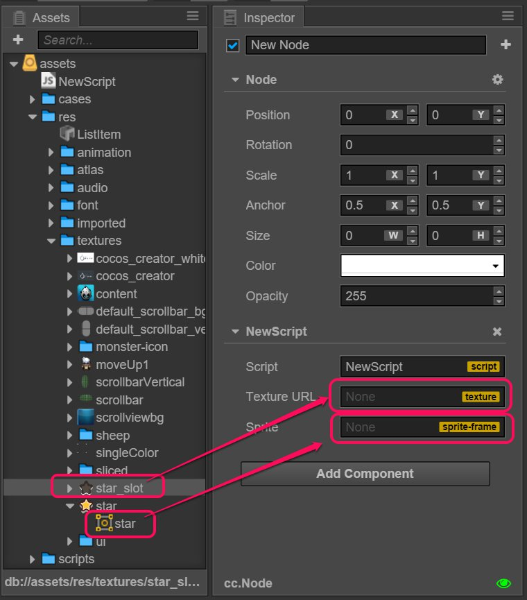

# Get asset

Cocos Creator has a whole set of uniform asset management mechanisms. In this tutorial, we will introduce

- Classification of assets
- How to set assets in the **attribute inspector** 
- How to dynamically load assets by URL
- How to get the URL of Raw Assets

## Classification of assets

Assets currently can be classified into two different types, one type is called **Asset**, the other is called **Raw Asset**.

### Asset

Most assets like `cc.SpriteFrame`, `cc.AnimationClip` and `cc.Prefab` all belong to Asset. The loading of Asset is uniform and automatic. Assets that rely on each other can be preloaded automatically.

> For example, when the engine is loading the scene, it will first automatically load the assets linked to the scene and if these assets are linked to other assets, then these other assets will also be loaded first. Only when the loading is complete will the loading of the scene be finished.

Therefore, as long as you get an Asset object, then this object must be the one that has finished loading and can access all the asset data directly through the attributes of this object. If you are going to use these assets in the engine, the Asset object that the engine API receives must be a loaded one.

### Raw Asset

The object received by the existing API previously in Cocos2d is not the Asset object mentioned above but a URL presented by a character string. These former asset types that the API uses are called Raw Assets. `cc.Texture2D`, `cc.Font` and `cc.AudioClip` are all Raw Assets. If you are going to use Raw Assets in the engine, all you have to do is to pass the URL of the asset to the engine API, then the engine interior will automatically load the assets represented by this URL.

If you are going to declare a Raw Asset attribute type as `cc.Texture2D` in CCClass, you may want to define it first:

```js
cc.Class({
    extends: cc.Component,t a 
    properties: {
    
        textureURL: {
            default: null,
            type: cc.Texture2D
        }
        
    }
});
```

The problem with writing in this way is that `textureURL` in the code is actually a character string rather than a living example of `cc.Texture2D`. To avoid confusing the two types here, use `url: cc.Texture2D` rather than `type: cc.Texture2D` when declaring the Raw Asset attribute in CCClass.
```js
cc.Class({
    extends: cc.Component,
    properties: {
    
        textureURL: {
            default: "",
            url: cc.Texture2D
        }
        
    }
});
```

## How to set assets in the **attribute inspector**

No matter whether using Assets or Raw Assets, as long as you define the type in the script, you can set assets easily in the**attribute inspector**. Hypothetically, we could have a component like this:

```js
// NewScript.js

cc.Class({
    extends: cc.Component,
    properties: {
    
        textureURL: {
            default: "",
            url: cc.Texture2D
        },
        spriteFrame: {
            default: null,
            type: cc.SpriteFrame
        },
        
    }
});
```

Here is how it looks like in the **attribute inspector** after adding it into the scene:



Then we drag an image and a SpriteFrame separately from **assets** to the corresponding attribute in the **attribute inspector**:



The result is as follows:


In this way you can get the set asset directly from the script:

```js
    onLoad: function () {
        var spriteFrame = this.spriteFrame;
        var textureURL = this.textureURL;
        
        spriteFrame.setTexture(textureURL);
    }
```

Although it is very straight forward to set assets in the **attribute inspector**, assets can only be pre-set in the scene without dynamic switching. If you need dynamic switching, you need to check the following contents out.

## How to dynamically load assets by URL

(Coming Soon...)

## How to get the URL of Raw Assets

If you have an image `assets/res/textures/star.png`, you can't load it using this URL directly from the engine.

```js
var texture = cc.textureCache.addImage("assets/res/textures/star.png");   // Error! File not found
```

You need a URL transform through the use of `cc.url.raw`:

```js
var realUrl = cc.url.raw("res/textures/star.png");
var texture = cc.textureCache.addImage(realUrl);   // OK!
```
