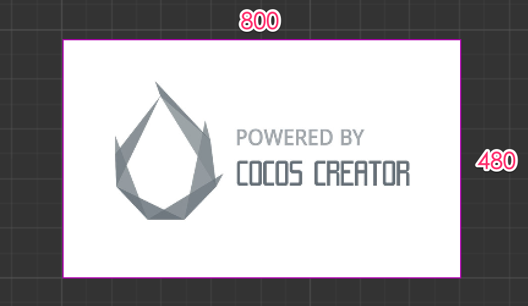
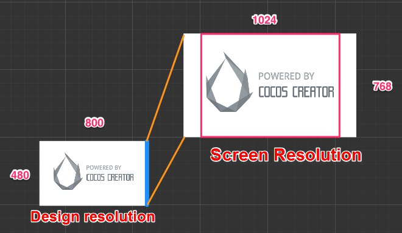
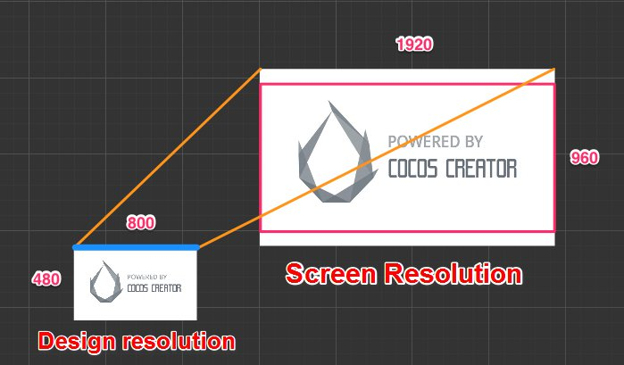
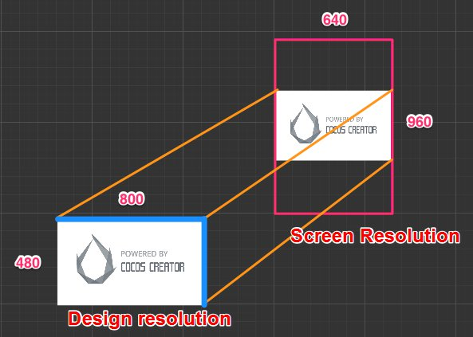
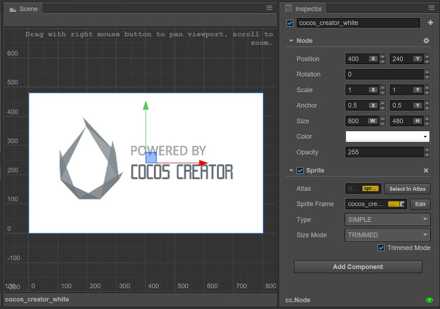

# Fit scheme for multi-resolution

Cocos Creator is devoted to solving the problem of adapting to screens with various resolutions with one set of resources from the beginning. Generally speaking, we realize the adaptation scheme for multi-resolution through the following technology:

- **Canvas** component immediately obtains the actual resolution of the device screen and appropriately adjusts the size of all the render elements in the scene.
- **Widget** is put on rendering elements, which can align the element with different referential positions of the parent node according to different needs.
- **Label** component has a built-in function that provides various dynamic layout modes. When the bounding box of labels change because of the alignment requirement of the Widget, labels will present the perfect layout effect according to your needs.
- **Sliced Sprite** provides images whose size can be arbitrarily designated. Simultaneously, it can meet various alignment requirements and display images with high definition on screens of any resolution.

Next, we start off by getting to know the concepts of design resolution and screen resolution, then we will go on to make understanding of the zooming in/out function of the **Canvas** component.

## Design resolution and screen resolution

**design resolution** is the resolution sample used by content creators when creating the scene. But **screen resolution** is the actual resolution of the device that the game is running on.

Normally, design resolution will use the screen resolution of the device that is being used the most by the targeted group on the market, such as: screen resolutions of `800x480` and `1280x720` that are being used by Android devices currently, or screen resolutions of `1136x640` and `960x640` that are being used by iOS devices. Therefore, after designers or directors set up the scene by using design resolution, the game will automatically adapt to the device used by the major targeted group.

Then when the design resolution is different from the screen resolution, how could Cocos Creator adapt to the device?

Supposing the design resolution is `800x480`, designers will create a background image of the same resolution.

### When design resolution and screen resolution have the same ratio of width to height

When design resolution and screen resolution have the same ratio of width to height, supposing the screen resolution is `1600x960`, enlarging the background image to 1600/800 = **2 times** will perfectly fit the screen. This is the simplest situation, which will not be discussed in detail here.

### When the ratio of width to height of design resolution is larger than that of screen resolution, the height should be adjusted to avoid black borders

Supposing the screen resolution is `1024x768`, a red frame is used in the following picture to indicate the visible area of the device screen. We use `Fit Height` mode provided by the Canvas component to make the height of the design resolution automatically cover the height of the screen, i.e., enlarging the scene image to 768/480 = **1.6 times**.

This is a fairly good adaptation mode when the ratio of width to height of the design resolution is larger than that of the screen resolution. As illustrated above, although some parts of the background image will be cut down on the two sides of the screen, it can be ensured that no goof or black borders will appear in the visible area of the screen. Then the position of UI elements can be adjusted by the Widget, which makes sure that the UI elements will appear in the visible area of the screen. We will introduce this in detail in the next section [Widget Align](widget-align.md).

### When the ratio of width to height of the design resolution is larger than that of the screen resolution, the width should be adjusted to avoid black borders

Supposing the screen resolution is `1920x960`, a red frame is also used in the following picture to indicate the visible area of the device screen. We use `Fit Width` mode provided by the Canvas component to make the width of the design resolution automatically cover the width of the screen, i.e., enlarging the scene to 1920/800 = **2.4 times**

When the ratio of width to height of the design resolution is relatively small, the use of this mode will cut down some parts of the background image on the upper/lower sides of the screen.

### No matter how much the ratio of width to height of the screen is, all the contents of design resolution will be completely displayed, and black borders are permitted.

In the last example, supposing the screen has a resolution of `640 x 960`. If you want to make sure the background image is completely displayed on the screen, you need to simultaneously open  **Fit Height** and **Fit Width** in the Canvas component. The zooming in/out proportion of the scene image is calculated according to the smaller dimension in the screen resolution. In the example in the following picture, because the ratio of width to height of the screen is less than 1, the calculation of the zooming in/out proportion will be based on width, i.e., 640/800 = **0.8 times**.

Under such a displaying mode, there might be black borders on the screen or scene image that exceed the design resolution (goof). Although developers try their best to avoid black borders in general, if you want to make sure all the contents within the scale of design resolution are displayed on the screen, you can use this mode too.

### According to the ratio of width to height, 'Fit Width' or 'Fit Height' will be automatically chosen.

If there are no strict requirements for the content that might be cut down on the four sides of the screen, you don't need to open any fit mode in the Canvas component. Then **Fit Height** or **Fit Width** will be automatically chosen according to the ratio of width to height to avoid black borders. In other words, when the ratio of width to height of the design resolution is larger than that of the screen resolution, 'Fit Height' will be automatically opened (as in the first picture above); when the ratio of width to height of the design resolution is smaller than that of the screen resolution, 'Fit Width' will be automatically opened(as in the second picture above).

### Canvas component doesn't provide a fit mode that can respectively zoom in/out of the x axis and the y axis, which will distort the image.

In the Cocos engine, there is a fit mode called `ExactFit`, which doesn't have black borders, or cut down the image within the scale of design resolution. But the price is the zooming in/out ratio of the scene image to the direction of the x/y axis  is different, which will distort the image.

If you don't mind distortions of the image, you can use the engine API to realize fit effect without using the Canvas component. For detailed information, you can refer to [Cocos2d-JS's screen adaptation scheme](http://www.cocos.com/doc/article/index?type=cocos2d-x&url=/doc/cocos-docs-master/manual/framework/cocos2d-js/4-essential-concepts/4-4-resolution-policies/zh.md).

## Use Canvas component in the scene

When creating a new scene, a node including the Canvas component will automatically be added to the root node of the scene. On the Canvas component, the options mentioned above can be set:

- **Design Resolution**
- **Fit Height**
- **Fit Width**

Set the Canvas node as the root node of all the render nodes of the image, then these nodes can automatically use the zooming in/out effect of Canvas's intelligent adaptations to multi-resolution.

### The features of Canvas when editing the scene

When editing the scene, the `Size` property of the Canvas node will be the same with **design resolution**, which can't be modified manually.

The `Position` property will remain at `(width/2, height/2)`, which is the center of the screen whose resolution is the same with the design resolution.

Because the default value of the `Anchor` property will be set as `(0.5, 0.5)`, the Canvas will remain at the position of the screen center. The subnode of Canvas will make the screen center the origin of its coordinate system, which is different from that in the Cocos engine. Please pay attention to that.

### The features of Canvas when running

Apart from the above features, the Canvas component will have the following changes in features:

- **Scale**: According to the calculating principle of the zooming in/out ratio described above, assign the calculated zooming in/out ratio to the `Scale` property.
- **Size**: In the mode without black borders, the `Size` property of Canvas will remain the same as the screen resolution. In the mode with black borders, the `Size` property of Canvas will remain the same as the design resolution.

Because Canvas can precisely obtain the size of the visible area of the screen when running, we can set up the alignment strategy of UI elements according to this size, making sure that all the UI elements can be correctly displayed in the visible area of the screen.

---

Continue on to read about [Widget alignment](widget-align.md).
