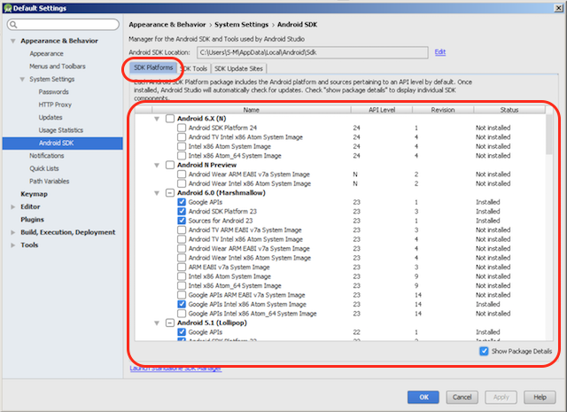
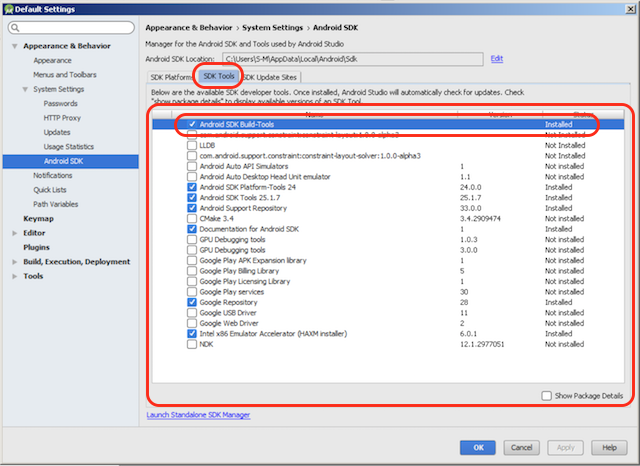

# Android Studio Installation and Setup

## Prerequisites
* A supported environment. See **[Installation Prerequisites](A/index.html)**

* Completed the **[Android Command-Line Instructions](Android-terminal/index.html)**

* Cocos2d-x v3.x [http://cocos2d-x.org/download](http://cocos2d-x.org/download)

## Setup
* unzip the __Android Studio Bundle__

* launch __Android Studio__

## Compiling `cpp-tests`
* import the `cpp-tests` project from __cocos2d-x root/tests/cpp-tests/proj.android-studio__
in __Android Studio__. __Android Studio__ will do everything required. You can run
`cpp-tests` but clicking on the __play__ button.

    

## Installing new SDK versions and build tools
* use the built in __SDK Manager__ to install the __SDK versions__ and __build tools__
that you are targetting.

    

    

    

  Note: It is important to note that __Android Studio__ uses a location to install
  __SDK versions__ and __build tools__ that is not the same as if you were doing
	command-line development. Double check that you have everything you need installed
	from inside __Android Studio__.

## Starting a new project
Once everything above works, you can start a new project! To do this, read our
document on the **[Cocos Command-line tool](../editors_and_tools/cocosCLTool/)**.
