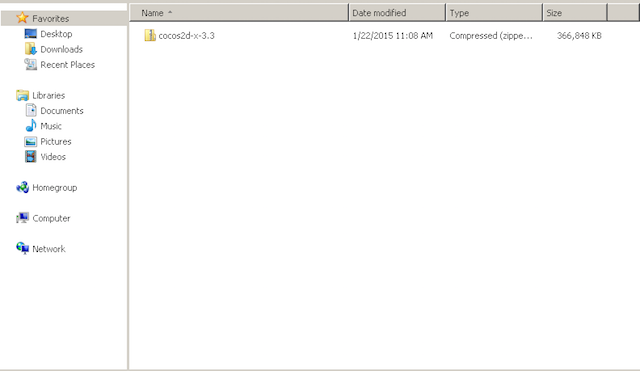
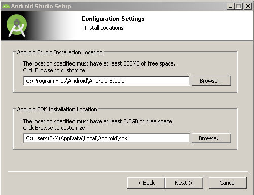
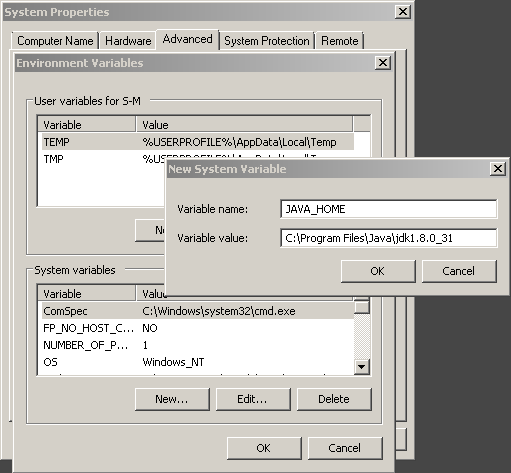
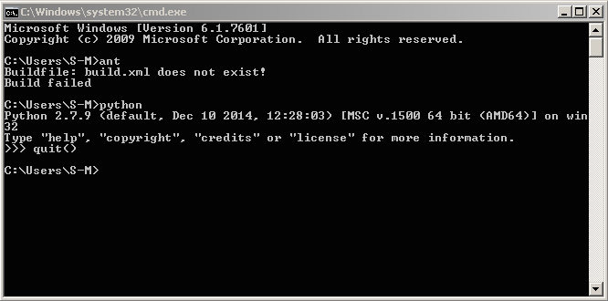
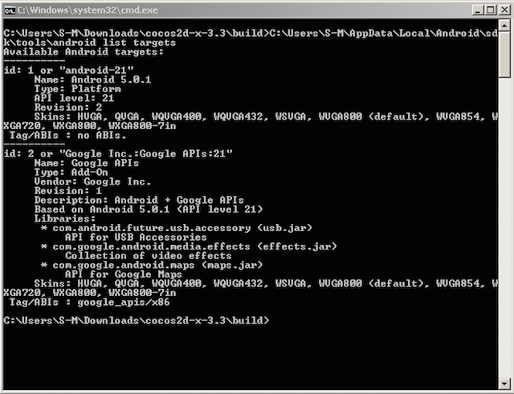
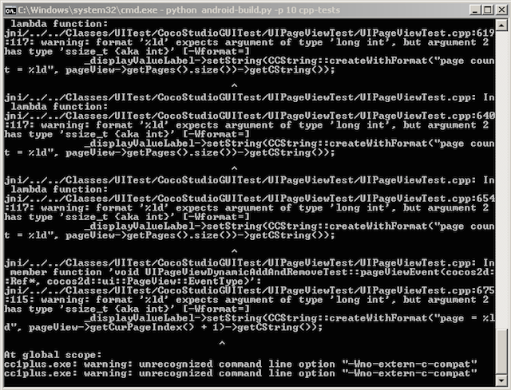
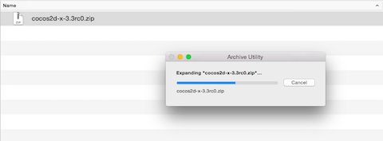
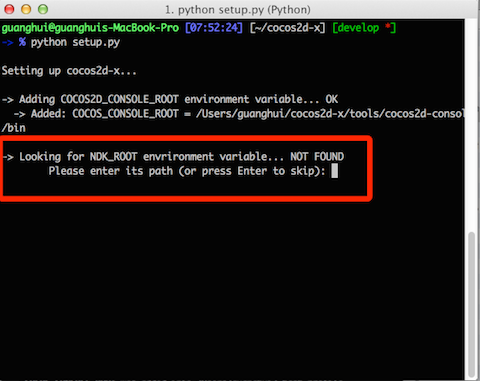

# Android with Command-line Installation and Setup

## Environment Requirements
* A Supported OS. See **[Installation Prerequisites](A/index.html)**

* Cocos2d-x v3.x [http://cocos2d-x.org/download](http://cocos2d-x.org/download "Cocos2d-x")

* JDK/SDK 1.6+ [http://www.oracle.com/technetwork/java/javase/downloads/index.html](http://www.oracle.com/technetwork/java/javase/downloads/index.html)

* Android Studio Bundle [http://developer.android.com/sdk/index.html](http://developer.android.com/sdk/index.html)

* NDK r10c [https://developer.android.com/tools/sdk/ndk/index.html](https://developer.android.com/tools/sdk/ndk/index.html)

* Apache Ant [http://ant.apache.org/bindownload.cgi](http://ant.apache.org/bindownload.cgi)

* Python 2.7.5 [https://www.python.org/downloads/](https://www.python.org/downloads/)

## Prerequisites
* Download **Cocos2d-x**

* Download the **JDK**

* Download the **Android Studio Bundle**

* Download the **NDK**

* Download **Apache Ant**

* Download **Python**

## Windows Instructions
* unzip __Cocos2d-x__

    

    

    

* install the **JDK** and verify it works

    

* install the **Android Studio Bundle** taking note of where you specify the
__Android SDK Installation Location__

    

* unzip the **Android NDK** to the same location as the __Android SDK Installation Location__
used from above.

    

* extract **Apache Ant** and place the entire folder where you wish to keep it.
Take note of where you placed it.

* install **Python** and take note of where you placed it.

* add the paths for **Apache Ant** and **Python** to your __PATH__ variable.

    

* at the same time create a new variable called: __JAVA_HOME__ and give it the
path to where you installed the JDK above.

    

* reboot

* now, test your environment before continuing. Launch a __command prompt__ and execute:

		> ant

		> python

    

* if everything works it is time to run __setup.py__ to configure your Android
development environment. This will set the necessary environment variables needed.
If you haven't configured this environment before, you will be prompted to enter
paths for variables that are not found. You run __setup.py__ from the directory
Cocos2d-x is in.

		> setup.py

* enter the paths that you are asked for.

* restart your command prompt for these settings to take effect

* to build __cpp-tests__, __cd__ to where you are keeping Cocos2d-x and enter the
__build__ directory

* run __android list targets__ from __sdk/tools__ to see what targets you have
available to build for:

    

* run: __python android-build.py -p (a target from above) cpp-tests__, using the
screenshot above, as an example, run:

		> python android-build.py -p 21 cpp-tests

* this will take a while and you will see a lot of source files compiling.

    

* once complete you will get a __success__ message!

    

## OS X, Linux Instructions
* unzip Cocos2d-x

    

    

    

* install the __JDK__ if your platform requires it.

* unzip the __Android SDK and NDK__ to the same root location.
(maybe: ~/AndroidDev)

* verify that __Python 2.7__ is installed and is accessible.

* install __Apache Ant__ and verify that it works.

* in your __Cocos2d-x__ directory run: __python setup.py__

	__caution__: You must **not** use the `~` sign. Use the full path to your **home**
directory. Otherwise, the scripts will fail due to error path value.

* after setting the environment variables run:

		> source ~/.bash_profile

    

    

    

* change your directory to the where the __android-build.py__ script is located.
(usually __Cocos2d-x/build__)

* to see what targets are available. run:

		> android list targets

    

* execute:

		> python android-build.py -p <target # from above> cpp-tests

* everything should build successfully:

    

## How to deploy it on your Android phone via command line

* enable **[USB Debugging](http://stackoverflow.com/questions/16707137/how-to-find-and-turn-on-usb-debugging-mode-on-nexus-4)**
on your phone and then connect your phone via USB.

* change your directory to the the **bin** directory of your android project

* use `adb` to install the __.apk__ to your Android phone by executing:

		> adb install TestsDemo-debug.apk
