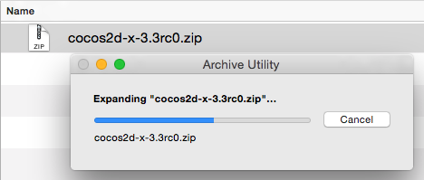

# iOS Installation and Setup

## Prerequisites
* A supported environment. See **[Installation Prerequisites](A/index.html)**

* Cocos2d-x v3.x [http://cocos2d-x.org/download](http://cocos2d-x.org/download)

## Setting up Cocos2d-x
* Download Cocos2d-x and unzip it. (maybe: ~/)

    

    

* Make sure you have a working environment see __Prerequisites__ above. This means
a working __Python__, having run __<cocos2d-x root>/setup.py>__, updated your
__$PATH__ and run __source ~/.bash_profile__.

## Build and Run
* Enter __<cocos2d-x root>/build__ and open __cocos2d_tests.xcodeproj__
* Choose __cpp-tests iOS__ from targets drop-down box
* Click __run__ to compile and run __cpp-tests__

## Running on an iOS Device
* In order to run on iOS Device an iOS Developer Program membership is needed.
You can purchase one from Apple: [https://developer.apple.com/programs/ios/](https://developer.apple.com/programs/ios/)
. The steps to run on iOS device are the same as running in a simulator except
you select you device from the device list.

## Starting a new project
Once everything above works, you can start a new project! To do this, read our
document on the **[Cocos Command-line tool](../editors_and_tools/cocosCLTool/)**.
