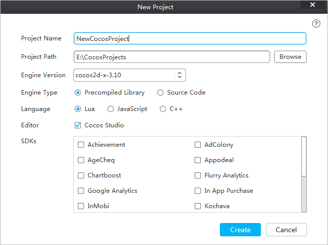
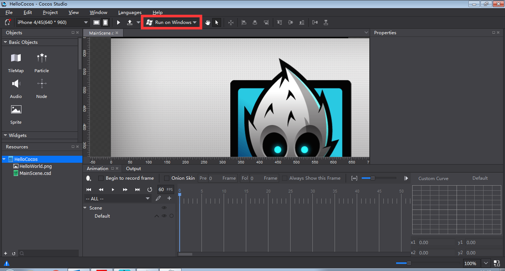
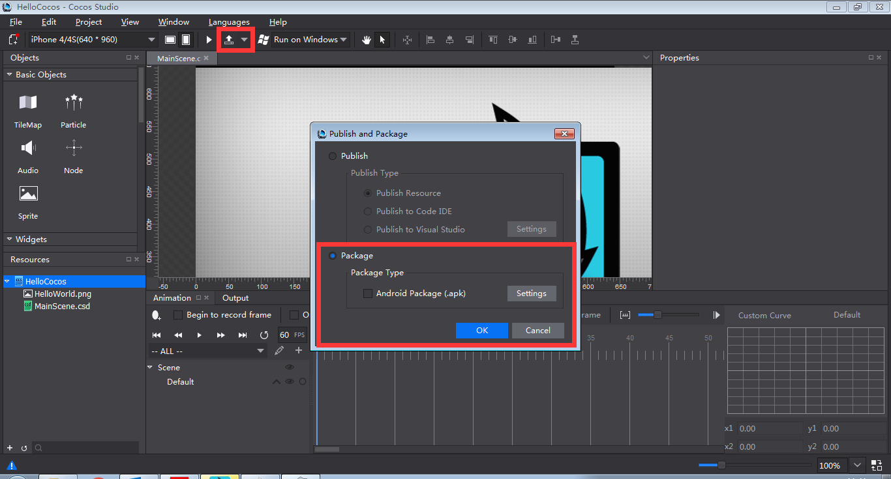
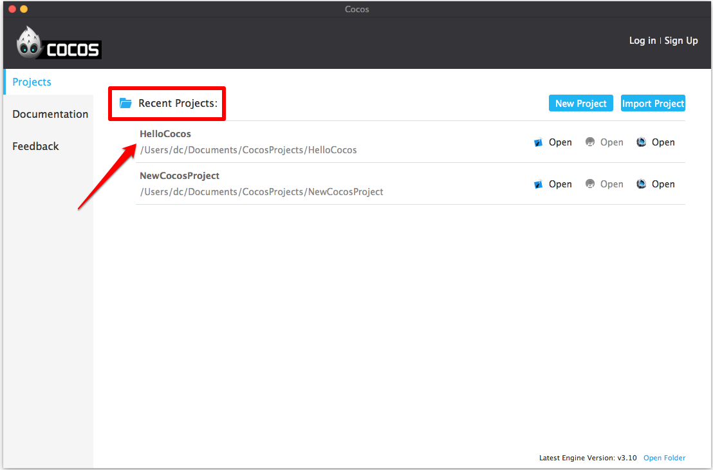
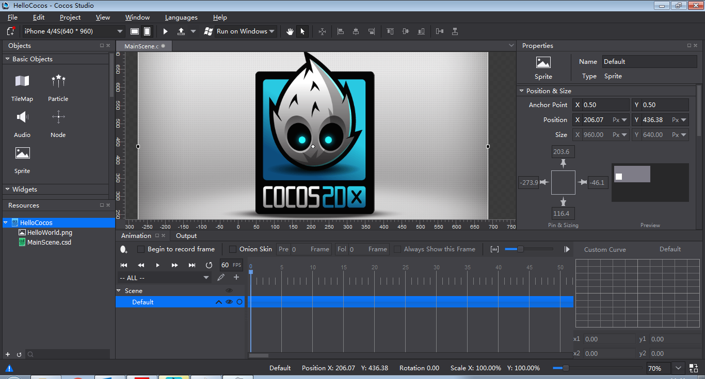

# Create a Game #

### 1. Project Overview ###

Cocos is an all-in-one solution for all your needs in developing games, covering functions of editing resources, coding, running on real devices and packaging. In the following section, we will introduce you how to build a perfect game with cocos. 

**New Project** The  first step is to create a game project，as the following picture shows:

&emsp;&emsp;&emsp;&emsp;&emsp;&emsp;&emsp;&emsp;&emsp;&emsp;&emsp;&emsp;&emsp;&emsp;&emsp;&emsp;**Cocos Project**

**Edit** With cocos, you can create and edit UI, 2D/ 3D scenes, Keyframe Animations, SpriteSheet Animations and Skeletal Animations. Cocos supports files exported from the following software.  

- *.plist* file exported from **TexturePacker**;
- animation files exported from **Flash**;
- Particle files exported from **Particle Designer** and **Particle Universe**; 
- 3D models and animations from **3DMax**, etc. 

**Code** Cocos supports editing and debugging Lua, JavaScript and C++ with Visual Studio, XCode.

**Run on real devices** You can run projects on real devices, for example mobile phones (Android, iOS), PC (Windows, Mac), and browsers, as Figure 2 shows:

&emsp;&emsp;&emsp;&emsp;&emsp;&emsp;&emsp;&emsp;&emsp;&emsp;&emsp;&emsp;&emsp;&emsp;&emsp;&emsp;**Run on real devices**

**Package** Cocos can be widely used to build mobile games and apps on platforms of Android, iOS and HTML5, as Figure 3 shows:

&emsp;&emsp;&emsp;&emsp;&emsp;&emsp;&emsp;&emsp;&emsp;&emsp;&emsp;&emsp;&emsp;&emsp;&emsp;&emsp;**Package**

### 2. New Project###
 
Follow the steps below to create a project. 

- Open cocos launcher
- Click **New Project**
- Specify your project settings
- Click **Create**

**Project Name**：the name of the project to be created.

**Project Path**：the folder in which your projects are located.

**Engine Version**：version of cocos2d-x you use to create projects. 

**Engine Type**：

- Precompiled Library: a static library of the cocos2d-x source code. This would speed up compile times as there is no need to continually build the engine's source.

- Source Code: cocos2d-x source code. 

**Project Language**：

- Lua：based on cocos2d-x Lua binding. It can run on Android, iOS, Windows Phone, Windows, Mac. 

- JavaScript：based on cocos2d-js, also includes cocos2d-x JavaScript bindings. The JavaScript bindings are compatible with HTML5. You can run code in cocos2d-x runtime and HTML5 native engine. The default settings will be JavaScript bindings if the projects are built for running on Android, iOS, Windows Phone, Windows and Mac. The default settings will be cocos2d-js if the projects are for HTML5.

- C++：based on cocos2d-x, It can run on Android, iOS, Windows Phone, Windows, Mac. 

**Editor**：whether or not to create a project of cocos, the official editor of cocos2d-x. 

**SDK**：select SDKs to be integrated with. 

### 3. Recent Projects ###

Newly created projects are added to the **Recent Projects** list. 

&emsp;&emsp;&emsp;&emsp;&emsp;&emsp;&emsp;&emsp;&emsp;&emsp;&emsp;&emsp;&emsp;&emsp;&emsp;&emsp;