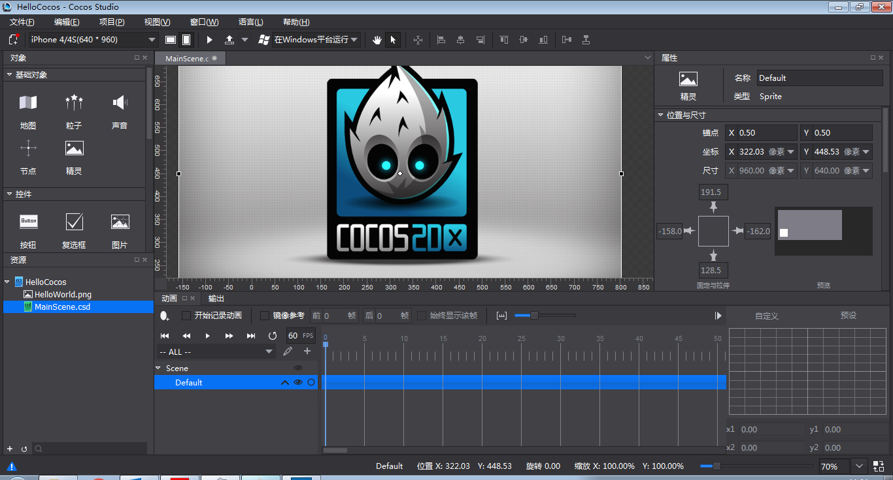

# Create a Game #

### Project Overview ###

Cocos covers functions of editing resources, coding, running on real devices and packaging. 

**Edit** With cocos, you can create and edit UI, 2D/ 3D scenes, key frame animations, spritesheet animations and skeletal animations. Cocos supports files exported from the following software: 

- *.plist* file exported from TexturePacker;
- animation files exported from Flash;
- Particle files exported from Particle Designer and Particle Universe; 
- 3D models and animations from 3DMax, etc. 

You can download these popular tools in Cocos Store as shown below.

**Code** Cocos supports editing and debugging Lua, JavaScript and C++ with Visual Studio, XCode and CodeIDE. Cocos Code IDE is a complete toolkit for developing, debugging, publishing Lua & JavaScript games. 

**Run on real devices** You can run projects on real devices, for example mobile phones (Android, iOS), PC (Windows, Mac), and browsers.

**Package** Cocos can be widely used to build mobile game apps on platforms of Android, iOS and HTML5.
 

### Project Settings###
 
Projects settings include: Project Name, Project Path, Orientation, Engine Version and Project Language, etc. 

- Project Name: the name of a game project. 

- Project Path: the location of a game project. 

- Orientation: a game's orientation, horizontal or vertical. 

- Cocos Framework is not necessary for JavaScript and Lua projects, but necessary for C++ projects.  You can download Cocos Framework in Cocos Store. We can see from the above picture that Cocos Framework 3.5 has been installed, otherwise **None** will be displayed in the Engine Version drop-down list. 

- Supported scripting languages

     - Lua: based on Cocos 2d-x Lua binding. It can run on Windows, Mac, Android, iOS. 

    - C++: based on Cocos 2d-x. It can run on Windows, Mac, Android and iOS. Cocos Framework is necessary for a new C++ project. 

    - JavaScript: based on Cocos 2d-jx. It includes Cocos 2d-x JS binding and Cocos 2d HTML5. Interface of JS binding is compatible with that of HTML5. Game codes can run in Cocos2d-x and HTML5 native engine. When packaging projects to Win32, Mac, iOS and Android, the default setting is JS bingding. When packaging projects to HTML5, the default setting is Cocos 2d-x. 

- Extra: If you want to create a game that can run on x86-based Android devices, select **support x86 architecture CPU** checkbox.

- Click "Finished". A cocos project is successfully created. 

