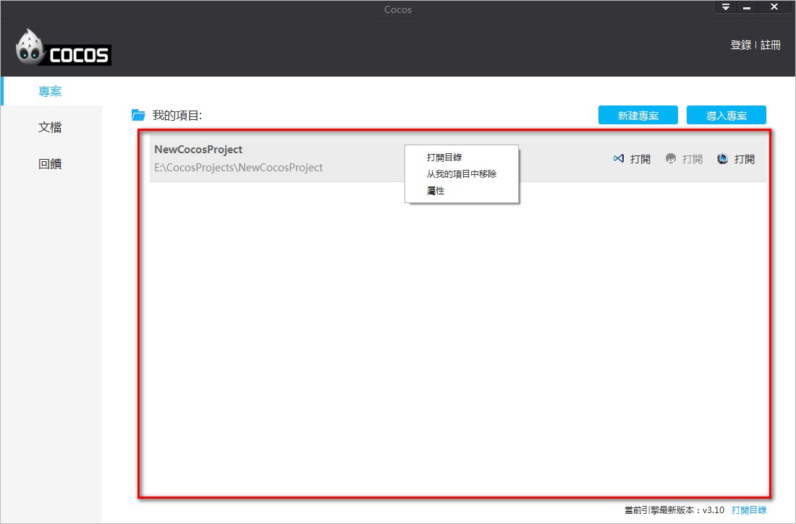
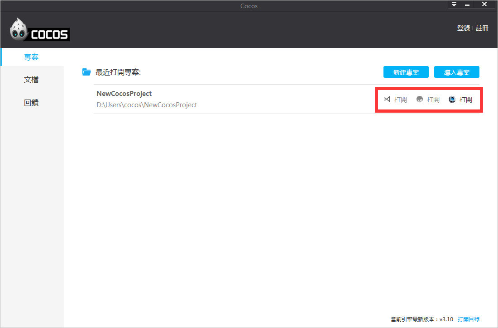
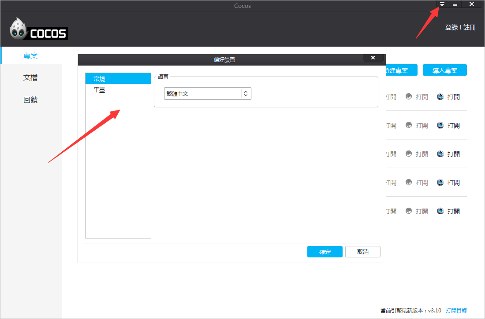
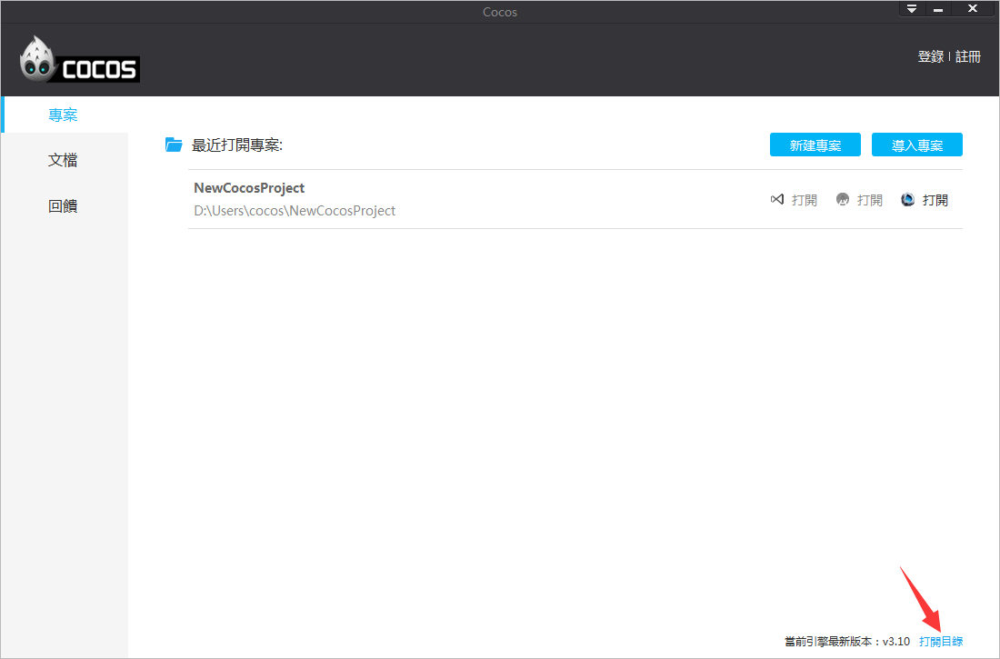
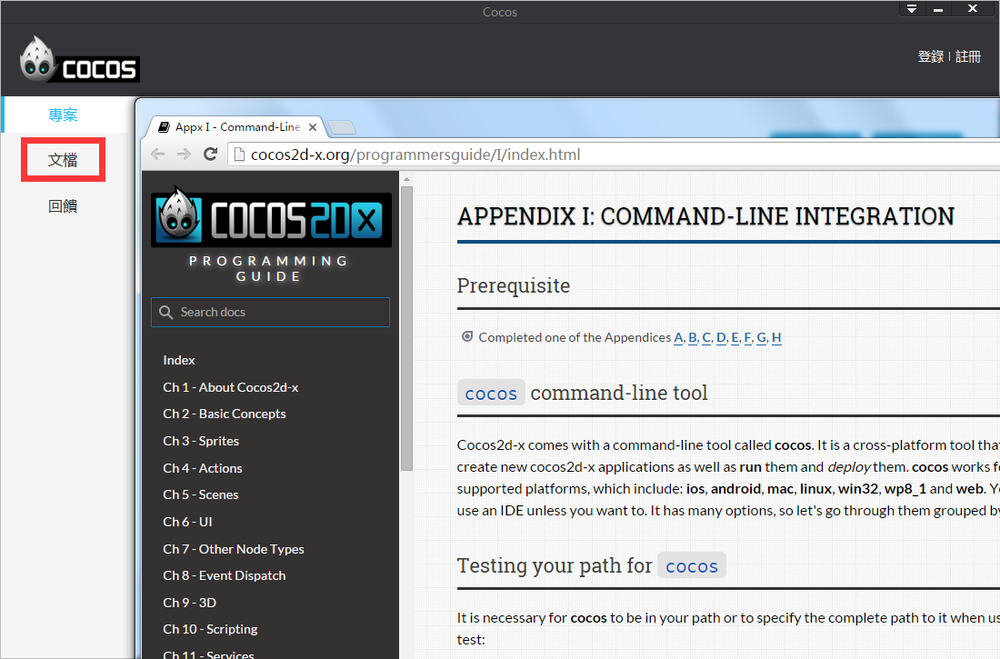
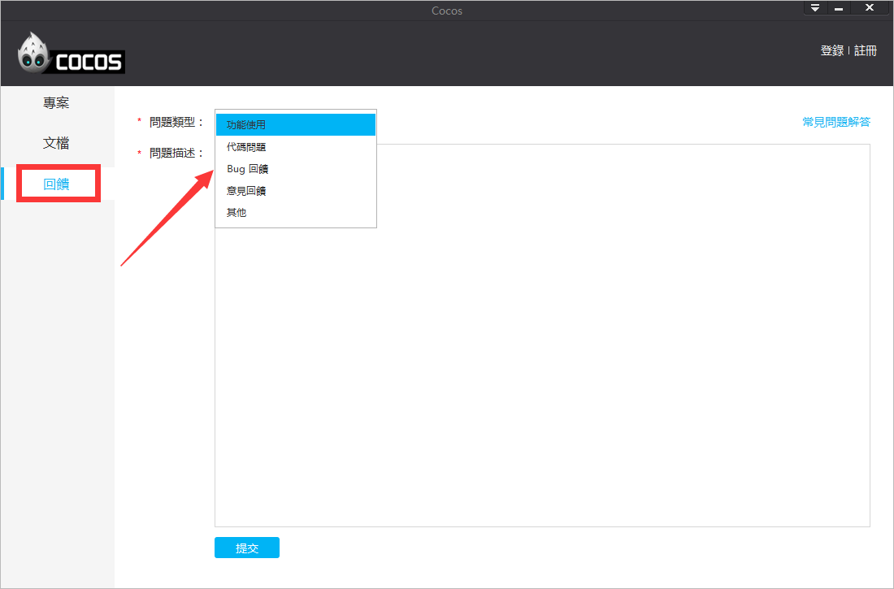

#認識cocos

使用cocos啟動器，您將可以快速新建項目、導入項目。

### 1.新建項目 ###

打開啟動器，在面板右上角的位置，您可以看到“新建專案”的按鈕，點擊此按鈕，在彈出的“新建專案”對話方塊中，按照提示填寫專案名稱、專案專案路徑、引擎版本、引擎類型、專案語言、編輯器、SDK接入，然後點擊“完成”即可創建一個新項目。如圖1：

&emsp;&emsp;&emsp;&emsp;&emsp;&emsp;&emsp;&emsp;&emsp;&emsp;&emsp;&emsp;&emsp;&emsp;&emsp;&emsp;&emsp;&emsp;&emsp;&emsp;&emsp;&emsp;&emsp;&emsp;&emsp;&emsp;&emsp;&emsp;&emsp;**圖1. 新建專案介面**

&emsp;&emsp;**項目名稱**：遊戲項目名稱。

&emsp;&emsp;**專案路徑**：遊戲專案所在的路徑。

&emsp;&emsp;**引擎版本**：選擇基於哪個cocos2d-x的版本創建項目。

&emsp;&emsp;**引擎類型**：
         
&emsp;&emsp;&emsp;&emsp;&emsp;&emsp;預編譯庫：基於cocos2d-x原始程式碼編譯而成的二進位庫。

&emsp;&emsp;&emsp;&emsp;&emsp;&emsp;原始程式碼：基於cocos2d-x原始程式碼。

&emsp;&emsp;**專案語言**：

&emsp;&emsp;&emsp;&emsp;&emsp;&emsp;Lua：指令碼語言，基於cocos2d-x luabinding（將cocos2d-x介面綁定到lua層並加入Quick Lua框架），可以運行在Android、iOS、Windows Phone、Windows、Mac。

&emsp;&emsp;&emsp;&emsp;&emsp;&emsp;JavaScript：指令碼語言，基於cocos2d-js引擎，cocos2d-js引擎包含cocos2d-x JavaScript binding（將cocos2d-x的介面綁定到JavaScript層）和cocos2d-js（純JavaScript引擎），JavaScript binding和Html5介面相容，同一套JavaScript遊戲邏輯代碼既可以驅動cocos2d-x runtime，也可以驅動Html5原生引擎，當打包到Android、iOS、Windows Phone、Windows、Mac平臺的時候默認基於JavaScript binding，打包到HTML5基於cocos2d-js引擎。

&emsp;&emsp;&emsp;&emsp;&emsp;&emsp;C++：編譯型語言，基於cocos2d-x引擎，可以運行在Android、iOS、Windows Phone、Windows、Mac。

&emsp;&emsp;**編輯器**：是否創建cocos2d-x官方編輯器Cocos Studio專案檔案。

&emsp;&emsp;**SDK接入**：下载并选择需要接入的SDK。

### 2.我的項目 ###

&emsp;&emsp;根據需求選擇參數設置，點擊“完成”，cocos項目就創建成功了。新創建的cocos項目將被添加到“最近打開專案”，如圖2：

&emsp;&emsp;&emsp;&emsp;&emsp;&emsp;&emsp;&emsp;&emsp;&emsp;&emsp;&emsp;&emsp;&emsp;&emsp;&emsp;&emsp;&emsp;&emsp;&emsp;&emsp;&emsp;&emsp;&emsp;&emsp;&emsp;&emsp;&emsp;&emsp;&emsp;**圖2. 我的項目** 

### 3.導入項目 ###

在啟動器面板，點擊右上角的“導入專案”按鈕，進入專案導入介面，選擇要導入的cocos專案檔案，點擊“選擇資料夾”按鈕，完成專案導入，如圖3：
    

&emsp;&emsp;&emsp;&emsp;&emsp;&emsp;&emsp;&emsp;&emsp;&emsp;&emsp;&emsp;&emsp;&emsp;&emsp;&emsp;&emsp;&emsp;&emsp;&emsp;&emsp;&emsp;&emsp;&emsp;&emsp;&emsp;&emsp;&emsp;&emsp;&emsp;**圖3. 導入項目** 

### 4.打開文件 ###
在“我的專案”的專案路徑右側，有三個"打開"按鈕。按一下相應的圖示或文字，分別在“Visual Studio”、“Android Studio”和“Cocos”中打開專案檔案。滑鼠懸停在圖示或者“打開”上，將會出現相應的提示資訊。如圖4：

&emsp;&emsp;&emsp;&emsp;&emsp;&emsp;&emsp;&emsp;&emsp;&emsp;&emsp;&emsp;&emsp;&emsp;&emsp;&emsp;&emsp;&emsp;&emsp;&emsp;&emsp;&emsp;&emsp;&emsp;&emsp;&emsp;&emsp;&emsp;&emsp;&emsp;**圖4. 打開文件** 

### 5.設置 ###
在啟動器面板，點擊右上角的三角圖示，彈出3個選項，點擊“偏好設置”，您將看到如圖6所示介面。可設置是否開機啟動，設置cocos和啟動器的顯示語言。目前有簡體中文，繁體中文和英文可供選擇，如圖5：

&emsp;&emsp;&emsp;&emsp;&emsp;&emsp;&emsp;&emsp;&emsp;&emsp;&emsp;&emsp;&emsp;&emsp;&emsp;&emsp;&emsp;&emsp;&emsp;&emsp;&emsp;&emsp;&emsp;&emsp;&emsp;&emsp;&emsp;&emsp;&emsp;&emsp;**圖5. 偏好設置** 

### 6.打開目錄 ###

點擊啟動器右下角“打開目錄”按鈕，將打開cocos安裝目錄，cocos2d-x引擎原始程式碼以及cocos啟動器套裝程式含其中，如圖6：

&emsp;&emsp;&emsp;&emsp;&emsp;&emsp;&emsp;&emsp;&emsp;&emsp;&emsp;&emsp;&emsp;&emsp;&emsp;&emsp;&emsp;&emsp;&emsp;&emsp;&emsp;&emsp;&emsp;&emsp;&emsp;&emsp;&emsp;&emsp;&emsp;&emsp;**圖6. 打開目錄** 

### 7.其他側邊欄標籤 ###

啟動器左側有3個標籤，分別為項目、文檔和回饋。

### 文檔 ###

打開啟動器，點擊左側“文檔”標籤，您將看到cocos幫助手冊與cocos2d-x API文檔，如圖7：

&emsp;&emsp;&emsp;&emsp;&emsp;&emsp;&emsp;&emsp;&emsp;&emsp;&emsp;&emsp;&emsp;&emsp;&emsp;&emsp;&emsp;&emsp;&emsp;&emsp;&emsp;&emsp;&emsp;&emsp;&emsp;&emsp;&emsp;&emsp;&emsp;&emsp;**圖7. 文檔** 

### 回饋 ###

開發者可以在回饋介面提交建議及問題，cocos技術支持團隊將通過郵件回復您。如圖8：

&emsp;&emsp;&emsp;&emsp;&emsp;&emsp;&emsp;&emsp;&emsp;&emsp;&emsp;&emsp;&emsp;&emsp;&emsp;&emsp;&emsp;&emsp;&emsp;&emsp;&emsp;&emsp;&emsp;&emsp;&emsp;&emsp;&emsp;&emsp;&emsp;&emsp;**圖8. 回饋**
