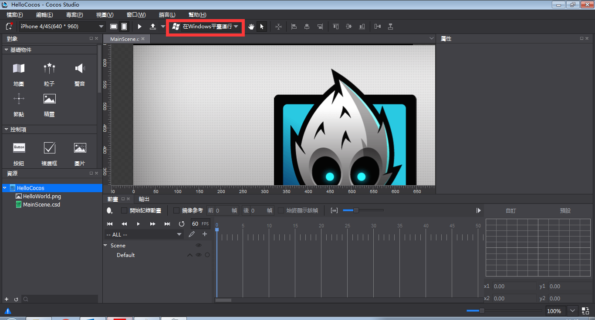
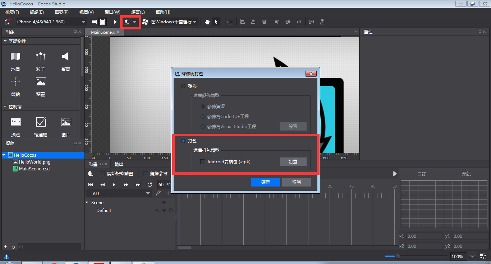
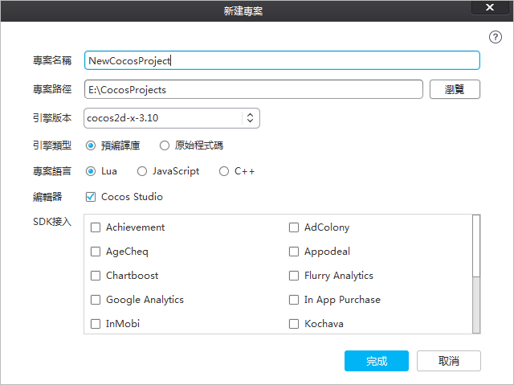
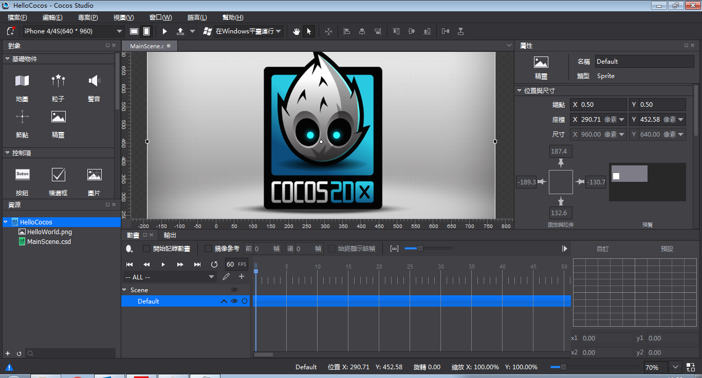

#創建新遊戲
###一、認識cocos專案

&emsp;&emsp;&emsp;&emsp;&emsp;&emsp;&emsp;&emsp;&emsp;&emsp;&emsp;&emsp;&emsp;&emsp;&emsp;&emsp;&emsp;&emsp;**圖1.cocos專案**

&emsp;&emsp;Cocos項目整合了資源編輯、代碼編寫調試，真機運行以及遊戲打包的功能：

&emsp;&emsp;資源編輯：通過cocos可以直接進行2D/3D場景、遊戲介面（UI）、關鍵幀動畫、序列幀動畫，骨骼動畫的編輯，同時支援國內外最優秀工具產出的資料，比如：支援TexturePacker產出的plist合圖資料，支援Particle Designer以及Particle Universe產出的粒子資料，支援3DMax產出的3D模型/動畫資料等等。

&emsp;&emsp;代碼編輯：Cocos專案支援lua、js、C++三種語言，支援Visual Studio、Xcode遊戲代碼編寫與調試，Visual Studio、Xcode分別是Windows和Mac系統上最強的代碼IDE。

&emsp;&emsp;真機運行：在遊戲開發過程中，Cocos支援運行專案在Android、iOS手機上，Windows和Mac作業系統以及流覽器上， 如圖2：

&emsp;&emsp;&emsp;&emsp;&emsp;&emsp;&emsp;&emsp;&emsp;&emsp;&emsp;&emsp;&emsp;&emsp;&emsp;&emsp;&emsp;&emsp;**圖2. 運行到各平臺**

&emsp;&emsp;遊戲打包：當遊戲開發完畢之後，可以通過才cocos生成遊戲App，支持Android、iOS、HTML5 App的生成，如圖3：
 

&emsp;&emsp;&emsp;&emsp;&emsp;&emsp;&emsp;&emsp;&emsp;&emsp;&emsp;&emsp;&emsp;&emsp;&emsp;&emsp;&emsp;&emsp;**圖3. 生成遊戲App**

###二、新建cocos項目

打開啟動器，在面板右上角的位置，您可以看到“新建專案”的按鈕，點擊此按鈕，在彈出的“新建專案”對話方塊中，按照提示填寫專案名稱、專案專案路徑、引擎版本、引擎類型、專案語言、編輯器、SDK接入，然後點擊“完成”即可創建一個新項目。如圖4：

&emsp;&emsp;&emsp;&emsp;&emsp;&emsp;&emsp;&emsp;&emsp;&emsp;&emsp;&emsp;&emsp;&emsp;&emsp;&emsp;&emsp;&emsp;&emsp;&emsp;&emsp;&emsp;&emsp;&emsp;&emsp;&emsp;&emsp;&emsp;&emsp;**圖4. 新建專案介面**

&emsp;&emsp;**項目名稱**：遊戲項目名稱。

&emsp;&emsp;**專案路徑**：遊戲專案所在的路徑。

&emsp;&emsp;**引擎版本**：選擇基於哪個cocos2d-x的版本創建項目。

&emsp;&emsp;**引擎類型**：
         
&emsp;&emsp;&emsp;&emsp;&emsp;&emsp;預編譯庫：基於cocos2d-x原始程式碼編譯而成的二進位庫。

&emsp;&emsp;&emsp;&emsp;&emsp;&emsp;原始程式碼：基於cocos2d-x原始程式碼。

&emsp;&emsp;**專案語言**：

&emsp;&emsp;&emsp;&emsp;&emsp;&emsp;Lua：指令碼語言，基於cocos2d-x luabinding（將cocos2d-x介面綁定到lua層並加入Quick Lua框架），可以運行在Android、iOS、Windows Phone、Windows、Mac。

&emsp;&emsp;&emsp;&emsp;&emsp;&emsp;JavaScript：指令碼語言，基於cocos2d-js引擎，cocos2d-js引擎包含cocos2d-x JavaScript binding（將cocos2d-x的介面綁定到JavaScript層）和cocos2d-js（純JavaScript引擎），JavaScript binding和Html5介面相容，同一套JavaScript遊戲邏輯代碼既可以驅動cocos2d-x runtime，也可以驅動Html5原生引擎，當打包到Android、iOS、Windows Phone、Windows、Mac平臺的時候默認基於JavaScript binding，打包到HTML5基於cocos2d-js引擎。

&emsp;&emsp;&emsp;&emsp;&emsp;&emsp;C++：編譯型語言，基於cocos2d-x引擎，可以運行在Android、iOS、Windows Phone、Windows、Mac。

&emsp;&emsp;**編輯器**：是否創建cocos2d-x官方編輯器Cocos Studio專案檔案。

&emsp;&emsp;**SDK接入**：下载并选择需要接入的SDK。

### 三、我的項目 ###

&emsp;&emsp;根據需求選擇參數設置，點擊“完成”，cocos項目就創建成功了。新創建的cocos項目將被添加到“最近打開專案”，如圖5：

&emsp;&emsp;&emsp;&emsp;&emsp;&emsp;&emsp;&emsp;&emsp;&emsp;&emsp;&emsp;&emsp;&emsp;&emsp;&emsp;&emsp;&emsp;&emsp;&emsp;&emsp;&emsp;&emsp;&emsp;&emsp;&emsp;&emsp;&emsp;&emsp;&emsp;**圖5. 我的項目** 

&emsp;&emsp;&emsp;&emsp;&emsp;&emsp;&emsp;&emsp;&emsp;&emsp;&emsp;&emsp;&emsp;&emsp;&emsp;&emsp;&emsp;&emsp;**圖6. HelloCocos** 