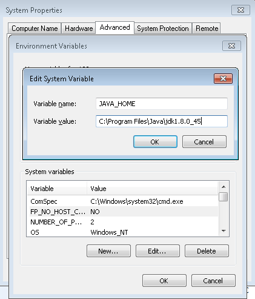
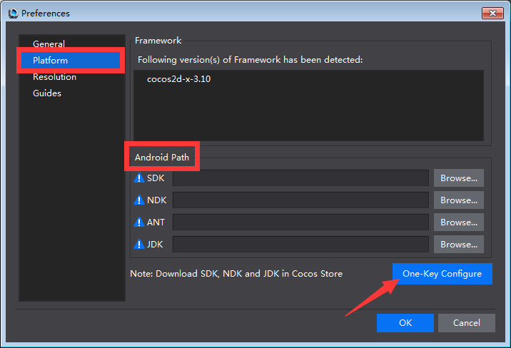
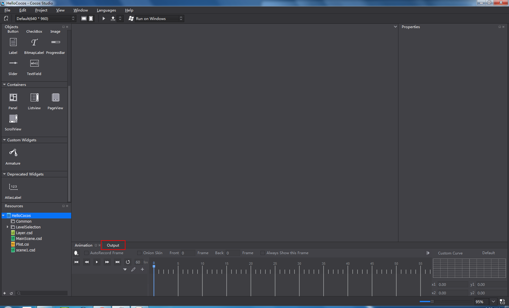
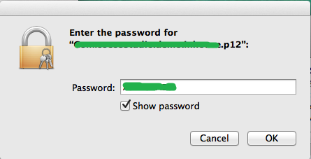
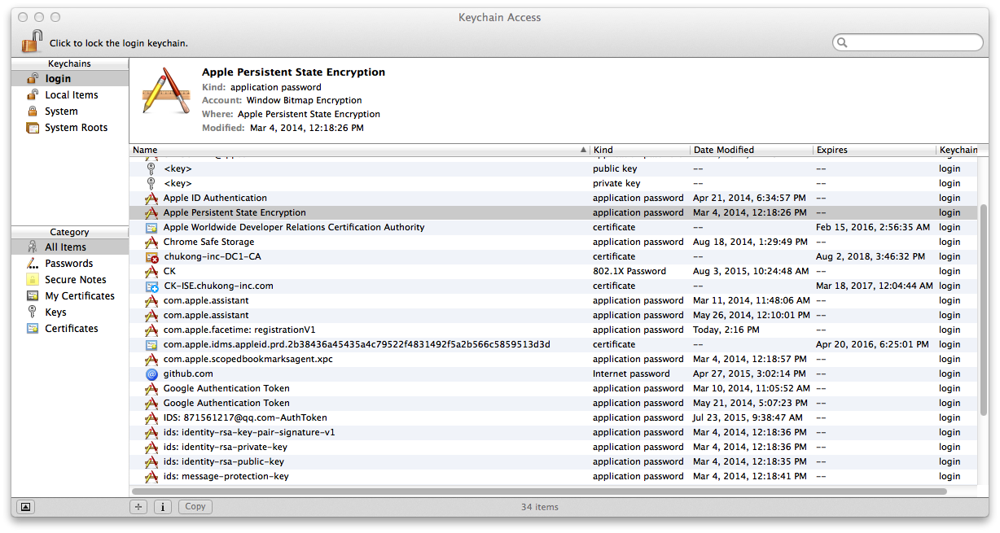
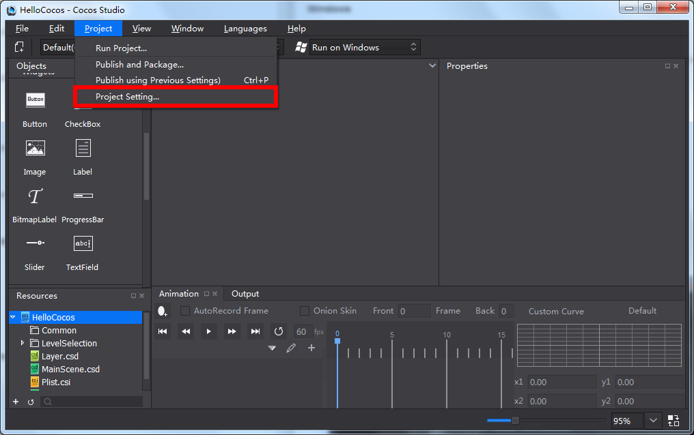
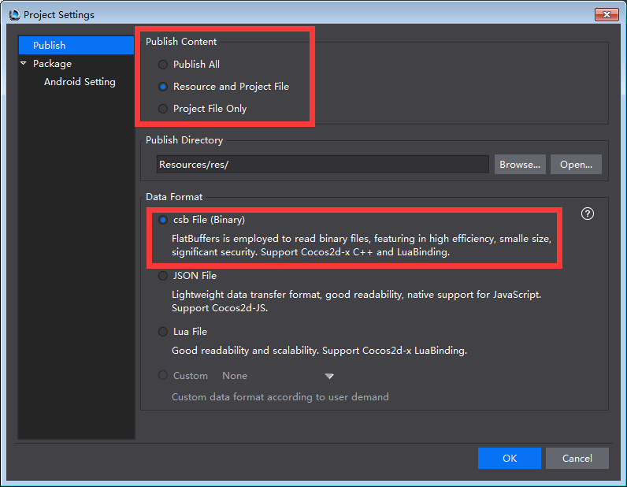
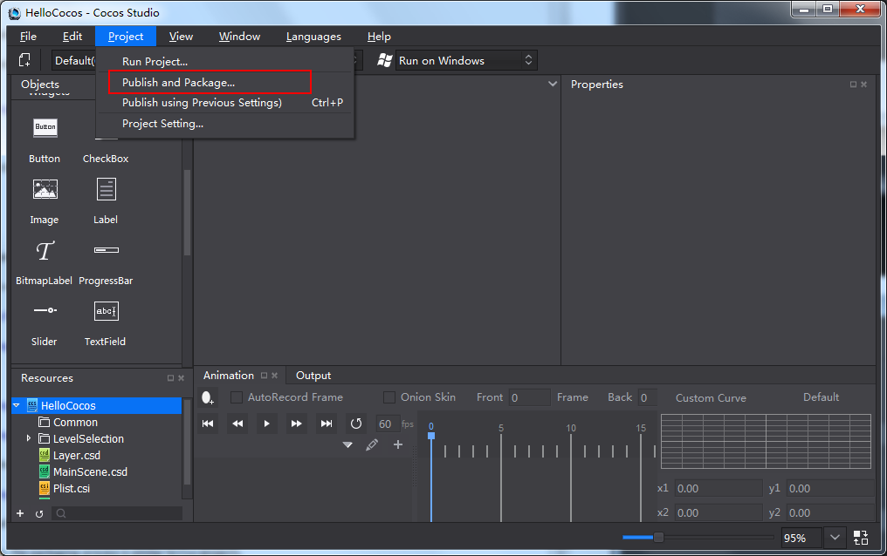
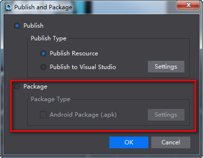
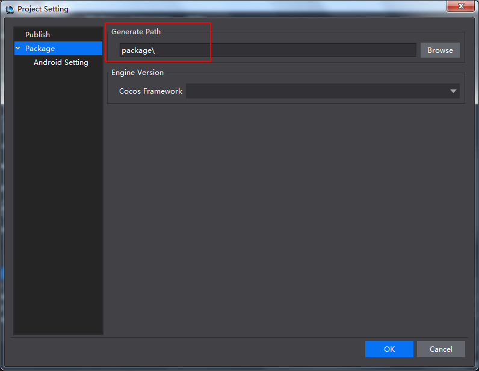

#Package and Runtime Environment Settings 

To activate the package function in Cocos Studio, you need to do the following,  

- Environment Settings (Win/Mac)

- Publish and Package Settings

### Environment and package settings

### Windows ###

***Note** You need to set installation paths for JDK/ NDK/ SDK/ Framework and set environment variables in Windows properly. Any mistake will lead to a failure.* 

**1 JDK**

- Download JDK at Cocos Store.

- Install it in a directory supporting English language. Installation in a directory supporting non-English languages may cause errors when packaging. 

- In Java directory there will be two folders with the name starting with jdk and jre respectively. Add bin directory of the two folders to Environment Variable.  

- Add new variable name as JAVA_HOME, and variable value as folder path where JDK is installed. 

&emsp;&emsp;
 
- Set variable Path, and append the location of the bin folder where the JRE is installed. You need to use a semicolon in English half-angle state, and then add the location of bin. For example, C:\Program Files\Java\jre1.8.0_45\bin.

&emsp;&emsp;

**2 NDK**

- Download NDK at Cocos Store

- Double click **android-ndk-r10d-windows-x86_64.exe**, and install it in a directory supporting English language. Installation in a directory supporting non-English languages may cause errors when packaging. Following is a screenshot of the installation directory: 

&emsp;&emsp;

- Set variable Path, and append the location of android-ndk-r10d, build and platform after Path value (use a semicolon in English half-angle state to separate them). For example, `;D:\Studiowork\sdk\android-ndk-r10d\build\tools;D:\Studiowork\sdk\android-ndk-r10d;D:\Studiowork\sdk\android-ndk-r10d\platforms`.

**3 SDK**

- Download SDK at Cocos Store.

-  Install it in a directory supporting English language. Installation in a directory supporting non-English languages may cause errors when packaging. 

- Set variable Path, and append the location of platforms, platform-tools and tools after Path value (use a semicolon in English half-angle state to separate them). For example, `;D:\Studiowork\sdk\sdk\platforms;D:\Studiowork\sdk\sdk\platform-tools;D:\Studiowork\sdk\sdk\tools`

**4 Framework**

- Download Framework at Cocos Store. 

- Install it in a directory supporting English language. Installation in a directory supporting non-English languages may cause errors when packaging. 

**5 Package Settings**

Create a cocos project, and at the same time select a Framework version. Click Edit at the Toolbar -> Preferences -> Platform.

**Note** Please make sure the following directory must be correct, otherwise there will be errors during the process of packaging. 

- SDK path: set folders for SDK (include folders of platforms, platform-tools and tools).

- NDK path: set folders for NDK (include folders of build and platform).

- ANT path: folders for bin of ANT under Framework directory. If multiple versions of Framework have been installed, please choose the bin folder of the Framework which is used for packaging.   

- JDK path: bin folder of JDK. 

&emsp;&emsp;
 
**6 Check**

Click Project at the toolbar -> Publish and Package. When finish packaging, click Output panel at the bottom of Cocos Studio. The message "project packaged" will appear at the Output panel, which indicates the environment variables are set right. Otherwise, you need to  check the settings and try again. 

**7 Possible errors and analysis**

- The installed tool is outdated. 
 
    Solution: uninstall tools that cause problems -> remove the leftover files -> *** -> download this tool at Cocos Store ->  follow the setting tutorials and try again.  

- Non-English languages exist in the installation directory. 

    Solution: see previous solution. 

- Environment variables errors. 

    Solution: check carefully if all the variables are set correctly, if set different path for one tool; if multiple paths of variables are not separated by a semicolon in English half-angle state. (You need to check the  variables one by one.)

-  Ant path is set incorrectly. 

    Solution: check if multiple versions of Framework are installed; if the ant path is same with Framework version for packaging.  

### Mac ###

Installation of various tools on Mac is relatively simple, users do not need to modify environment variables. 

- For Android device, install JDK, SDK and NDK. 

- iOS package settings

**Note** Apple developer certificate (* .p12) and identities (* .cer) are necessary. 

1

- Set preferences for Apple developer certificate, double click *.p12, you can see the page as the following picture shows. 

&emsp;&emsp;

- Enter password, and then click "OK". Now you can see the following page. 

&emsp;&emsp;

- Drag and drop *.cer here. 

2

- Verify that the identities are valid. 

- Run this command: security find-identity -v -p codesigning. The identities are valid if you can see the information as the following picture shows. 

&emsp;&emsp;

### Package  ###

After configuring the environment, you need to specify Package and Publish settings. 

**Windows**

1  C++ package

If you need to publish a C++ project to csb format, and then package it to an APK file. Do the following: 

- Go to the publish settings for C++ projects.
 
&emsp;&emsp;

&emsp;&emsp; 

- Publish and package. 
 
&emsp;&emsp; 

&emsp;&emsp;  

&emsp;&emsp;Apk package is located in：

&emsp;&emsp;  

&emsp;&emsp;It is a relative path in project directory. 

2 The package process of Lua and JavaScript projects is similar to that of C++ projects. 
 
**Mac**

Android Package: same as on Windows. 

iOS Package, do the following: 
         
- Create a cocos project (select an Engine version). 

- Import project resources. 

- Publish the project to Xcode, and modify the name and identities.

    - Click the project on the left column, then select General. Use the name of **.p12* as Bundle Identifier's value. In this tutorial, we use "Com.cocosstudio.demo.inhouse" as the file name. 

    - Click “Build Settings”->Code Signing->Code Signing Identity，select password. 
    
        “Build Settings”->Code Signing->Provisioning Profile，select "cocosstudioDemoInhouse". 

&emsp;&emsp; 

&emsp;&emsp; 

- Package in Cocos Studio. Toolbar -> Project -> Package Project, select iOS or Android. 

- Install the project on mobile devices to check effects.  

###Run Project

Run project settings are similar to package settings. "Run" function supports pushing and previewing projects directly when an Android device is connected to PC or Mac.   