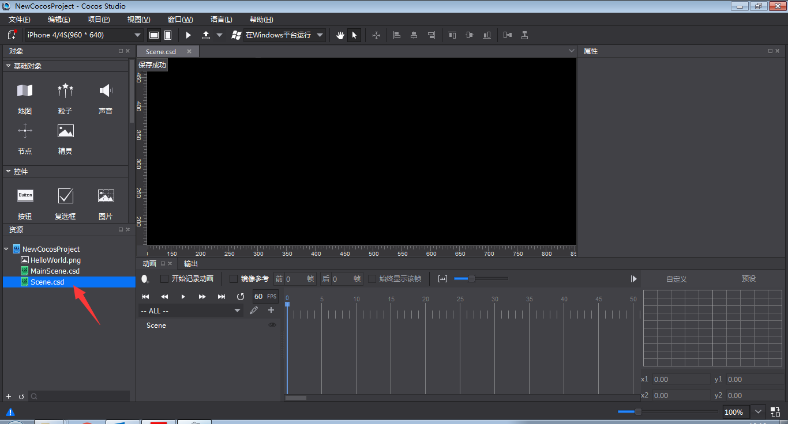
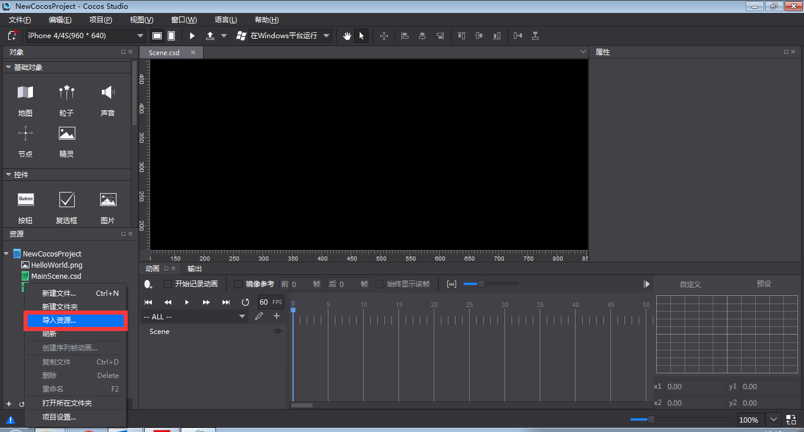
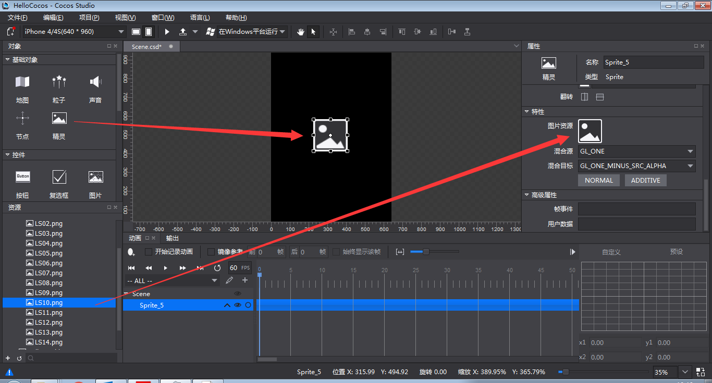
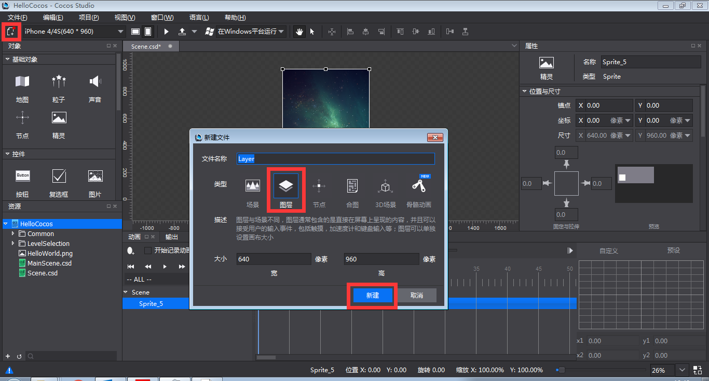

# Scenes and UI #

### [Workspace Overview](../../chapter3/Editor/UIOverview/en.md) ###

### Create a Scene ###

1 Create a project and name it **HelloCocos**. Do the following: 

- Select **File** -> **New Project** -> **Cocos Project**, and click **Next**. 

- Name the project Hello Cocos, and click **Finish**. 

2 Create a scene and name it **Scene1**. Do the following: 

- Select **File** -> **New File** -> name the  file **Scene1** -> select file type **Scene** -> click **New**. 
 

 
3 Right click on **Resources** panel, select **Import Resources**, and then select files to import.
  

4 Import two resources folders: Common and LevelSelection.

 
5 Click **Vertical Screen**  to modify the screen resolution from the default setting 960 * 640* to 640 * 960. 

6 Drag and drop a Sprite from **Basic Objects** to **Canvas**; drag and drop LS10.png from **Resources** panel to the Sprite and modify its position as tile (640 * 960).  

 
In Cocos Studio, the procedures of creating Scenes, UI and animations are similar. 

### Create a Layer ###

1 Click New File button and select Layer. Name it as "Layer" and click **New**. 

 
2 Drag and drop a Button to Canvas and specify its properties. Put it at center bottom of Canvas. 
 

3 Add "Layer.csd" to "Scene1.csd". Do the following:  

- Double click "Scene1.csd" to open it.
- Drag and drop "Layer.csd" to the rendering section (The layer can be accessed from the Resources section).

4 Click "Preview" button   at the top of the workspace to check the visual effects of the layer. 
 

         

      
        
        
