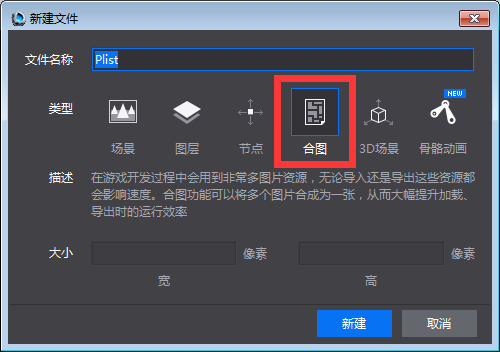
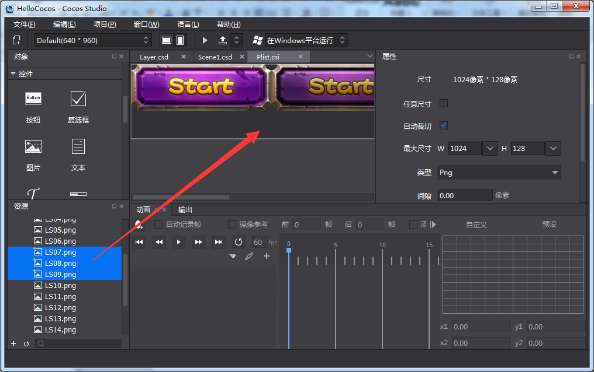
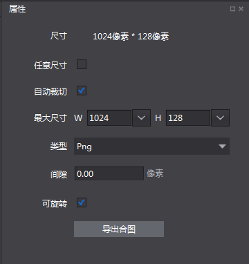

#SpriteSheet 

### Create a SpriteSheet

Do one of the following, 

1 On the toolbar, click New File button.
 
 

2 Select SpriteSheet on the pop up window,   and then click New.  

 

3 Select an image from project manager, drag it to the canvas. Currently Cocos Studio only supports *.png* and *.jpg* file types.

 

### Specify SpriteSheet Properties ###

 
 
**Size**: The size of the current SpriteSheet. Size property  varies with other properties.  

**Customize Size**: If checked, this option will ignore the power of 2 size limit, sprite sheet can be any image size. 

**Trim**: When checked, the editor will automatically trim SpriteSheet to ensure its size minimized.

**Maximum size**: The maximum size that cocos will allow for sprite sheet. If the size of resources exceeds the limit, the sections that exceed will be excluded from the sprite sheet. 

**Type**: File type of SpriteSheet, supporting *.png* and *.jpg* file types.

**Gap**: The gap between resources. Gap can prevent resources from overlapping. 

**Allow Rotation**: When checked,  resources will automatically rotate to the best angle  for a SpriteSheet. 

**Export SpriteSheet**:  Export *.plist* and *.png* files for SpriteSheets. 

