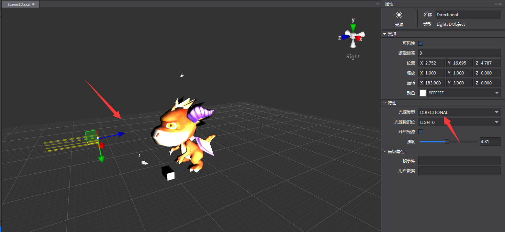
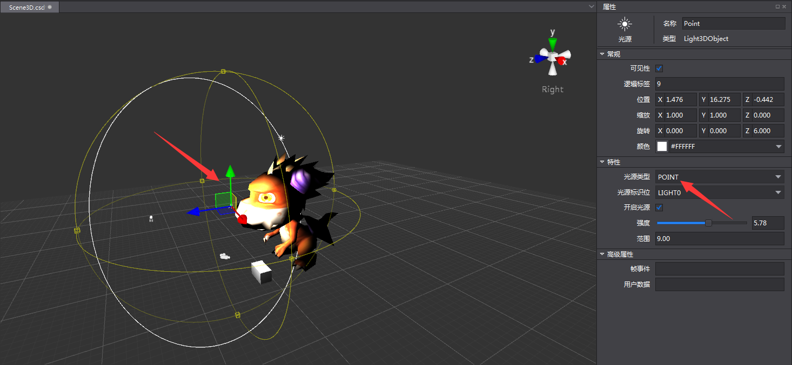
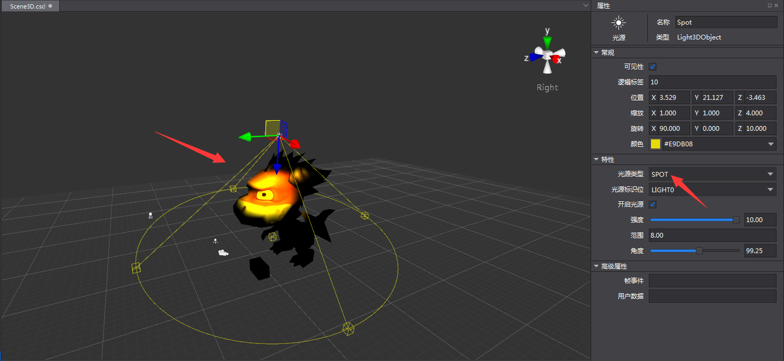
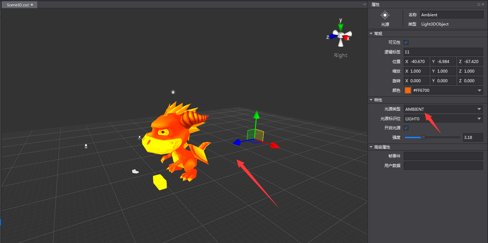
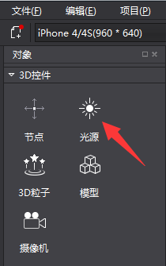
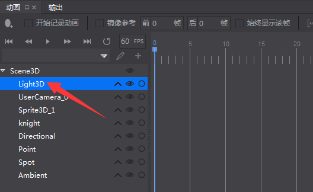
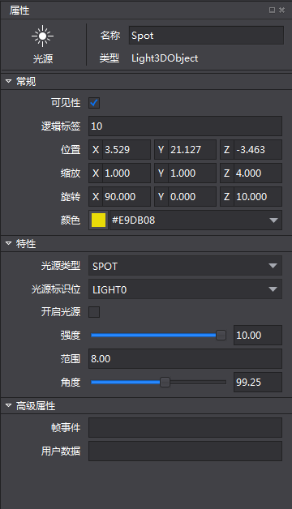
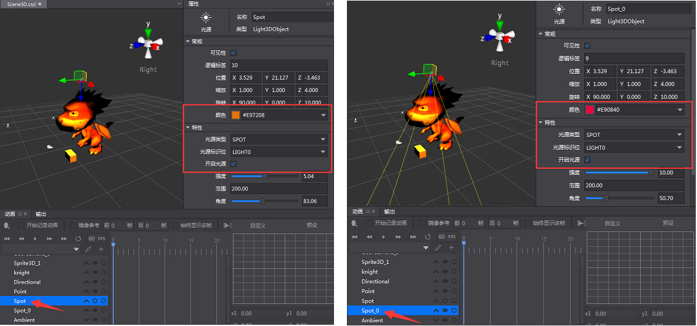

# 3D 灯光简介 #

Cocos 提供了四种光源类型：平行光（Directional），点光源（Point），聚光灯（Spot）和环境光（Ambient）。

平行光：提供平行的照明范围，通常用于模拟方向光。

点光源：以光源位置为圆心的球形光照，在球形半径之内的物体，才会收到其光照影响。

聚光灯：根据角度和范围定义一个圆锥体照射位于椎体内的对象，通常用于模拟路灯，车灯等效果。

环境灯：照亮整个场景的常规光线。这种光具有均匀的强度，并且属于均质漫反射。它不具有可辨别的光源和方向。

### 创建光源 ###

从3D控件区，拖拽光源控件到3D场景。

&emsp;&emsp;&emsp;&emsp;

### 设置光源属性###

在动画面板的结构树中，选中光源。

&emsp;&emsp;&emsp;&emsp;

在属性区对选中的光源参数进行设置修改。

&emsp;&emsp;&emsp;&emsp;

### 灯光属性说明 ###

1. 在常规属性区，调整基本属性值，或者通过在场景中进行自由变换操作，可以改变灯光的位置，缩放，旋转和颜色。

2. 在特性区，可以选择光源类型，修改光源标识位，设置是否开启光源，调整强度，范围以及角度值。

3. 光线强度的调整范围为0-10。

4. 范围值用于调整点光源的球形半径，聚光灯圆锥体的高度。

5. 角度值用于调整聚光灯圆锥体的角度。

6. 场景中物体只会同时被一个平行光，一个点光源，一个聚光灯所影响，环境光叠加多个。

    - 当场景中有多个平行光/点光源/聚光灯，并设置为开启时，物体只会被与它具有相同光源标识位的光源影响。

    - 当场景中同一类型的光源（平行光，点光源或聚光灯）有多个相同的光源标识位时，则按照对象结构树的控件的顺序，被最上面的光源影响。例如在下图所示的情况中，物体被Spot光源影响。 

&emsp;&emsp;