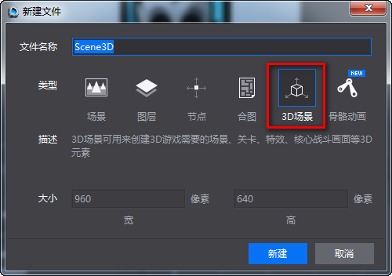
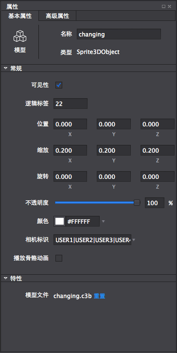
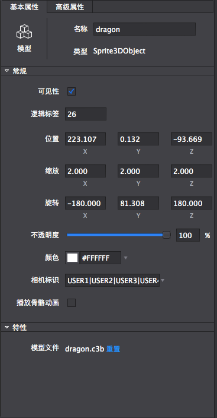
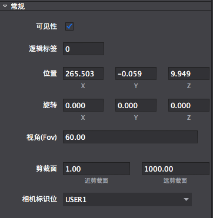

#创建3D场景
1）	创建场景文件

&emsp;&emsp;点击“文件”菜单->新建文件，选择3D场景并输入文件名Testscene。如下图所示：

&emsp;&emsp; 

2）	导入编辑场景需要用到的模型资源

&emsp;&emsp;如下图所示,其中用红色虚线框选的内容为本次场景实例需要用到的素材。如果读者没有这里所述的资源，可以用别的符合要求的模型文件替代，但操作方法相同。

&emsp;&emsp; 

3）	摆放场景资源

&emsp;&emsp;i.	拖入Scene文件夹下的changing.c3b到场景,在选中状态下配置属性信息如下：

&emsp;&emsp; 
 
&emsp;&emsp;ii.	拖入dragon文件夹下的dragon.c3b到场景，然后在选中状态下配置属性信息如下：

&emsp;&emsp; 

&emsp;&emsp;iii.	重复以上两个步骤，放入knight.c3b、mage.c3b和rat.c3b并配置其常规属性，得出如下图的场景。

&emsp;&emsp; 
 
&emsp;&emsp;iv.	创建一个摄像机，并配置摄像机的常规属性如下：

&emsp;&emsp; 
 
&emsp;&emsp;v.	我们通过配置好的摄像机镜头就可以看到一个粗略的游戏场景了，如下图所示：

&emsp;&emsp; 
 
&emsp;&emsp;vi.	把此场景发布到Cocos工程，然后通过增加代码控制就可以实现一个简单的英雄打怪的游戏了。
