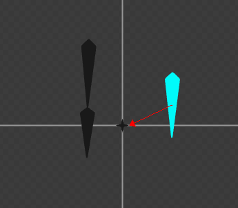
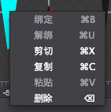
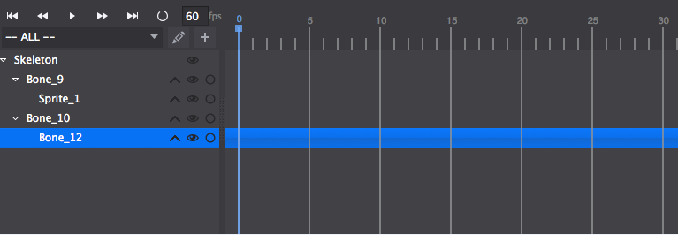

#編輯骨骼動畫
===============
####1.創建骨骼
按下工具列上的骨骼綁定按鈕即可連續創建骨骼,新創建的骨骼作為上一次創建骨骼的子骨骼.再次點擊按鈕或按一下滑鼠右鍵結束創建。如下圖所示：

下次重新點擊工具列上的新創建骨骼，則會創建一個新的掛在根節點的骨骼。

####2.綁定骨骼
點擊快速鍵上的綁定圖示，然後點擊渲染區內的骨骼，這時候滑鼠右下角會有一個小方塊的圖示，再點擊要綁定的父骨骼，則實現了綁定。

骨骼綁定前顯示如圖所示：

骨骼綁定操作後顯示如下圖所示：

用同樣的方法可以實現皮膚綁定到骨骼。

####3.解綁骨骼
用於解除骨骼之間的父子綁定關係。首先在編輯器選中骨骼或者皮膚元件，然後點擊快捷列的解綁，或者通過滑鼠右鍵功能表點擊解綁來實現骨骼的解除綁定關係~。當解綁成功後，被解綁的皮膚或者骨骼會綁定在根節點。

####4.骨骼操作
如右上角的快捷列的按鈕組所示，點擊切換到對應的平移畫布、移動元件、旋轉元件、縮放元件狀態進行對應操作。

1.平移狀態顯示如下圖：

拖動向上的箭頭可以實現僅改變Y軸的座標值，拖動向右的箭頭可以實現僅改變X軸的座標值。拖動紅色方框實現任意位置移動。

也可以通過選中骨骼或皮膚後，改變屬性值的X、Y值進行操作改變位置。

2.旋轉狀態顯示如下圖：

拖動向左的箭頭，實現骨骼圍繞骨骼原點順時針旋轉；拖動向右的箭頭，實現骨骼圍繞骨骼原點逆時針旋轉；

也可以通過改變屬性區的旋轉值來改變旋轉角度；

3.縮放狀態顯示如下圖：

拖動向左的箭頭，實現選中骨骼的X軸方向縮放；拖動向下的箭頭，實現選中骨骼的Y軸方向縮放。

也可以通過所動兩個箭頭中間的三角圖形實現X、Y方向等比例縮放。

####5.骨骼動畫版面
如下圖為骨骼動畫面板，左邊為層級關係，右邊為骨骼動畫時間軸。

骨骼之間的層級關係以及骨骼和皮膚之間的層級關係都會在左邊的層級關係中顯示出來；

骨骼動畫的製作和普通動畫的製作類似，需要在時間軸上創建關鍵幀，然後編輯此關鍵幀上的骨骼樣式。
