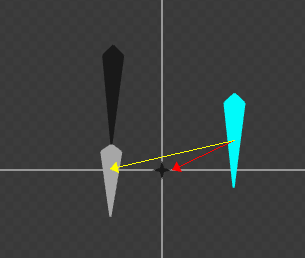
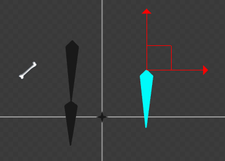
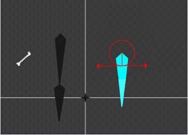

##编辑骨骼动画
===============
####1.创建骨骼
按下工具栏上的骨骼绑定按钮即可连续创建骨骼,新创建的骨骼作为上一次创建骨骼的子骨骼.再次点击按钮或单击鼠标右键结束创建。如下图所示：

下次重新点击工具栏上的新创建骨骼，则会创建一个新的挂在根节点的骨骼。

####2.绑定骨骼
点击快捷键上的绑定图标，然后点击渲染区内的骨骼，这时候鼠标右下角会有一个小方块的图标，再点击要绑定的父骨骼，则实现了绑定。

骨骼绑定前显示如图所示：

骨骼绑定操作后显示如下图所示：

用同样的方法可以实现皮肤绑定到骨骼。

####3.解绑骨骼
用于解除骨骼之间的父子绑定关系。首先在编辑器选中骨骼或者皮肤组件，然后点击快捷工具栏的解绑，或者通过鼠标右键菜单点击解绑来实现骨骼的解除绑定关系~。当解绑成功后，被解绑的皮肤或者骨骼会绑定在根节点。

####4.骨骼操作
如右上角的快捷工具栏的按钮组所示，点击切换到对应的平移画布、移动组件、旋转组件、缩放组件状态进行对应操作。

1.平移状态显示如下图：

拖动向上的箭头可以实现仅改变Y轴的坐标值，拖动向右的箭头可以实现仅改变X轴的坐标值。拖动红色方框实现任意位置移动。

也可以通过选中骨骼或皮肤后，改变属性值的X、Y值进行操作改变位置。

2.旋转状态显示如下图：

拖动向左的箭头，实现骨骼围绕骨骼原点顺时针旋转；拖动向右的箭头，实现骨骼围绕骨骼原点逆时针旋转；

也可以通过改变属性区的旋转值来改变旋转角度；

3.缩放状态显示如下图：

拖动向左的箭头，实现选中骨骼的X轴方向缩放；拖动向下的箭头，实现选中骨骼的Y轴方向缩放。

也可以通过所动两个箭头中间的三角图形实现X、Y方向等比例缩放。

####5.骨骼动画版面
如下图为骨骼动画面板，左边为层级关系，右边为骨骼动画时间轴。

骨骼之间的层级关系以及骨骼和皮肤之间的层级关系都会在左边的层级关系中显示出来；

骨骼动画的制作和普通动画的制作类似，需要在时间轴上创建关键帧，然后编辑此关键帧上的骨骼样式。
