#操作界面
&emsp;&emsp;Cocos Studio的界面主要分为菜单栏、工具栏、对象面板、资源面板、画布面板、属性面板、动画面板、输出窗口、状态栏九部分组成，如下图：
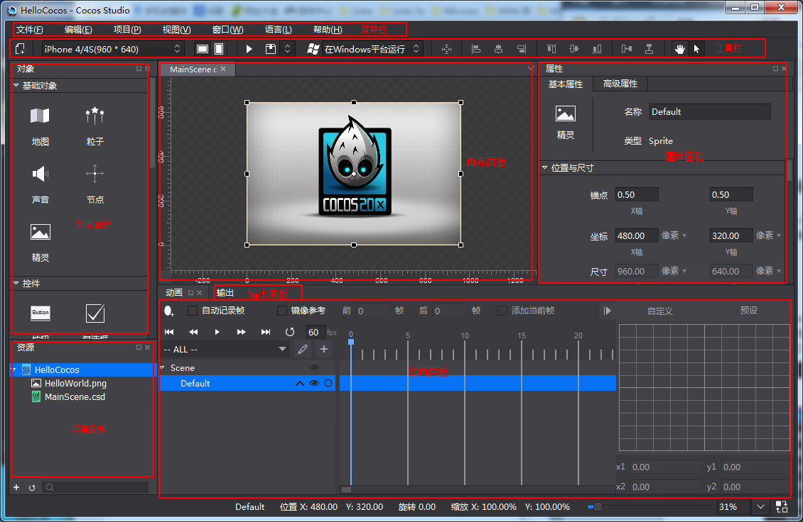
 
###菜单栏
&emsp;&emsp;菜单栏为cocos功能提供了功能入口，它由文件、编辑、视图、项目、窗口、语言、帮助7个命令菜单组成，Mac和Windows菜单项中包含的功能是一样的，只是排序和位置不同而已，下面就以Windows为例对每一个下拉菜单中的菜单项进行介绍

 
####1.文件
 

&emsp;&emsp;新建项目：新建cocos项目，快捷键为Ctrl+Shift+N。

&emsp;&emsp;新建文件：新建场景、图层、节点、合图、3d场景文件，快捷键为Ctrl+N。

&emsp;&emsp;打开项目：打开cocos项目功能，快捷键为Ctrl+O。

&emsp;&emsp;最近打开的项目：最近用cocos编辑的项目路径，最多可显示10个项目，最后打开的项目其项目路径显示在最上面。

&emsp;&emsp;关闭XXXX.csd/csi：关闭当前打开的XXXX.csd/csi项目文件。

&emsp;&emsp;关闭项目：关闭当前打开的cocos项目。

&emsp;&emsp;保存XXXX.csd/csi：保存当前正在编辑的XXXX.csd/csi，快捷键为Ctrl+S。

&emsp;&emsp;全部保存：保存整个项目中所有的项目文件，快捷键为Ctrl+Shift+S。

&emsp;&emsp;另存为：将cocos项目另存到自定义路径下。

&emsp;&emsp;导入->导入资源...：将资源从磁盘导入资源面板。

&emsp;&emsp;导入->导入1.6版本项目...： 将Cocos Studio 1.6的项目文件转换为当前版本的项目文件。

&emsp;&emsp;退出：退出Cocos Studio编辑器，快捷键为Alt+F4。

####2.编辑

 
&emsp;&emsp;撤销：在编辑器中做一些操作之后，返回到上一步的状态，快捷键为Ctrl+Z。

&emsp;&emsp;重做：撤销到上一步后再回撤到修改后的状态，快捷键为Ctrl+Y。

&emsp;&emsp;偏好设置：快捷键为Ctrl+，。

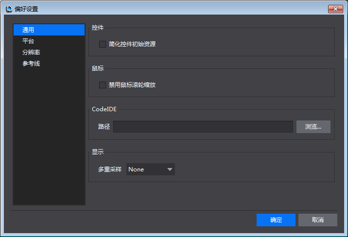
 
&emsp;&emsp;通用：

  &emsp;&emsp;1、控件：是否允许使用过时控件（艺术数字）。

  &emsp;&emsp;2、鼠标：是否禁用鼠标滚轮缩放。

  &emsp;&emsp;3、Code IDE：设置Code IDE的路径。
    

&emsp;&emsp;模拟器：

&emsp;&emsp;1、启动：模拟器启动是否打开命令行窗口，默认隐藏。

&emsp;&emsp;2.平台：

  &emsp;&emsp; Android相关路径：

  &emsp;&emsp; 设置SDK、NDK、ANT、JDK路径，以供后续在项目中打包与运行所用，具体请参考：[打包与运行环境配置](../../../chapter2/PackageAndRun/zh.md)

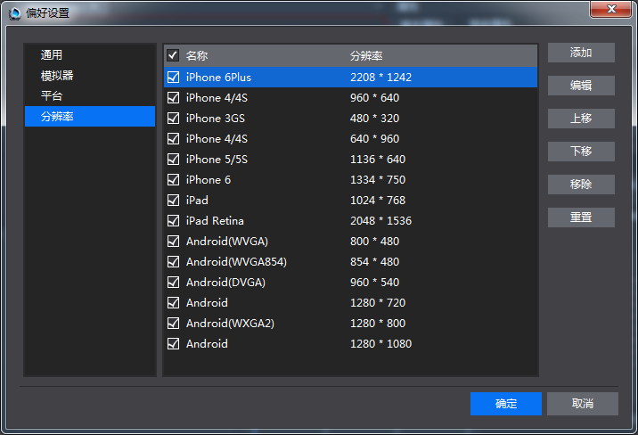

 &emsp;&emsp; 分辨率：

 &emsp;&emsp; 可以对分辨率设置的下拉列表显示状态进行修改，添加、编辑、上移、下移、移除、重置，修改后点击确定，工具栏中的下拉菜单同步刷新。

####3.项目

  &emsp;&emsp;运行项目...：

  &emsp;&emsp;Windows：可以选择在Windows平台上运行，在Android设备上运行，以及浏览器运行（仅JS语言项目支持）。

  &emsp;&emsp;Mac：在iOS设备上运行，Mac平台上运行，Android设备上运行，以及浏览器运行（仅JS语言项目支持）。

  &emsp;&emsp;如何运行在各个平台，具体请参考：[打包与运行环境配置](../../../chapter2/PackageAndRun/zh.md)

  &emsp;&emsp; 发布与打包：

  &emsp;&emsp; 发布 - > 选择发布类型：

   &emsp;&emsp;1）发布资源：把编辑器编辑的资源与项目文件发布为Cocos 2d-x引擎所使用的资源，发布后的资源加载速度快，体积小。

   &emsp;&emsp;2）发布为Code IDE工程：发布资源后并使用Code IDE打开当前项目，方便进一步编码。

   &emsp;&emsp;3）发布为Visual Studio工程：发布资源后并使用Visual Studio打开当前项目，方便进一步编码。

   &emsp;&emsp;打包 - > 选择打包类型：

   &emsp;&emsp;1）Android 安装包（.apk）：将当前项目打包为.apk文件，Windows与Mac运行的cocos都支持，c++、js、lua都支持。

   &emsp;&emsp;2）iOS安装包（.ipa）：将当前项目打包为.ipa文件，仅Mac运行的cocos支持，c++、js、lua项目都支持。

   &emsp;&emsp;3）HTML5： 将当前项目打包为HTML5包，Windows与Mac运行的cocos都支持，仅js项目支持。    
      
  &emsp;&emsp;使用上次设置发布与打包：若上次做的发布操作，则继续使用上次设置发布，若上次做的打包操作，则继续使用上次设置打包

  &emsp;&emsp;项目设置

 
  &emsp;&emsp;  发布：

  &emsp;&emsp; 发布内容：

  &emsp;&emsp; 1）发布资源与项目文件：把编辑所用的资源拷贝到发布路径以及把csd、csi文件发布为Cocos 2d-x所使用的资源。注意：当资源较多的时候，拷贝速度比较慢，建议使用仅发布项目文件。

  &emsp;&emsp; 2）仅发布项目文件：仅把csd、csi文件发布为Cocos 2d-x所使用的资源。

  &emsp;&emsp; 发布路径：可以自定义资源的发布路径，支持绝对与相对路径。
数据格式：csd文件转换为的供引擎加载的数据格式。

  &emsp;&emsp; csb：使用Flatbuffers上输出二进制，解析效率高，体积小，安全性好，适用于c++与lua项目。

  &emsp;&emsp; Json：轻量级的数据交换格式，可读性强，JavaScript原生支持，适用于js项目。

  &emsp;&emsp; 自定义：用户扩展的数据格式放在这里，如何扩展参考[Cocos Studio自定义工程导出](../../Extend/CustomExport/zh.md)

  &emsp;&emsp; 打包：

  &emsp;&emsp; 具体请参考：[打包与运行环境配置](../../../chapter2/PackageAndRun/zh.md)

####4.视图

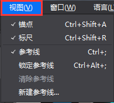

  &emsp;&emsp; 锚点：控制锚点在渲染区的显示与隐藏，快捷键为Ctrl+Shift+A。

  &emsp;&emsp; 标尺：控制标尺的显示与隐藏，快捷键为：Ctrl+Shift+R。

  &emsp;&emsp; 参考线：控制参考线的显示与隐藏，快捷键为：Ctrl+；。

  &emsp;&emsp; 锁定参考线：当点击锁定参考线时，将无法选中或移动参考线；取消锁定参考线时，可以在渲染区选中并移动参考线。快捷键为：Ctrl+Shift+；。

  &emsp;&emsp; 清除参考线：当在渲染区添加参考线后，点击清除参考线，所有参考线将被删除。

  &emsp;&emsp; 新建参考线：添加参考线到渲染区。

####5.窗口

 
  &emsp;&emsp; 对象、资源、动画、输出、属性：控制对象、资源、动画、输出、属性面板的显示与隐藏。

  &emsp;&emsp; 启动Launcher：在编辑器中启动Launcher，若已启动则将Launcher界面置顶。

  &emsp;&emsp; 恢复默认布局：若对编辑器中的窗口布局进行修改后，点击恢复默认布局，可还原成初始状态

####6.语言
 
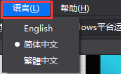

  &emsp;&emsp; 编辑器目前支持中文版、英文版，若切换语言需要重启编辑器后才能生效；

####7.帮助

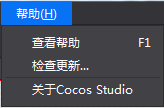
 
  &emsp;&emsp; 查看帮助：Cocos官网教程链接

  &emsp;&emsp; 检查更新：检查用户当前版本是否为最新版本

  &emsp;&emsp; 关于Cocos Studio：Cocos版本及版权信息等，以及官网、微博、论坛入口

###工具栏
 

  &emsp;&emsp; 工具栏包含八个部分：新建文件按钮、分辨率调整工具、预览按钮、发布/打包按钮、平台运行切换工具、对齐排列工具、移动画布控制按钮、鼠标左键状态组。

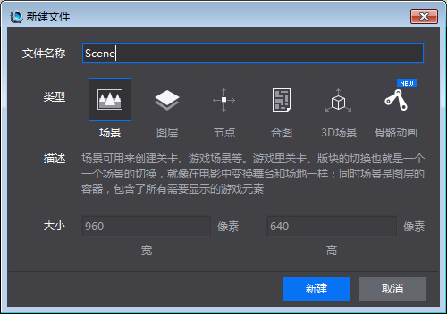

  &emsp;&emsp; 新建文件——用于新建场景、图层、节点、合图、3D场景。

  &emsp;&emsp; 分辨率设置、屏幕方向切换按钮——用于设置当前项目的设计分辨率。

  &emsp;&emsp; 预览按钮——用于在模拟器中预览当前项目文件，目前只有2D/3D场景，动画项目文件支持模拟器预览。

  &emsp;&emsp; 发布与打包按钮——用于发布项目资源或项目工程，打包iOS（.ipa）安装包、Android（.apk）、HTML5 包。

  &emsp;&emsp; 平台运行切换工具——在不同的平台下运行项目

 
  &emsp;&emsp; 对齐、排列——针对画布多选控件时的操作，提供了常用的对齐、排列方式。从左到右依次为中心对齐、左对齐、垂直居中、右对齐、上对齐、水平居中、下对齐、水平分布、垂直分布。
 

  &emsp;&emsp; 移动画布控制按钮——选中手状按钮 ，可在渲染区拖动画布，鼠标状态也变成手型，快捷键为Q。

 
  &emsp;&emsp; 仅出现在编辑场景，图层，节点，合图这四类文件。

  &emsp;&emsp; 选中箭头状按钮 ，鼠标样式切换到默认状态，快捷键为W。

 
  &emsp;&emsp;仅出现在编辑3D场景文件。

   &emsp;&emsp;默认选择“平移“状态，可以通过点击对应x轴，y轴，z轴进行切换，决定在沿着哪个坐标轴进行平移。

   &emsp;&emsp;“旋转”状态下拖拽鼠标，可以通过点击对应x轴，y轴，z轴进行切换，决定将选中物体围绕着哪个坐标轴进行旋转。

   &emsp;&emsp;“缩放”状态下拖拽鼠标，可以通过点击对应x轴，y轴，z轴进行切换，决定将选中物体沿着哪个坐标轴进行缩放。

###对象面板

  &emsp;&emsp; 控件面板会根据编辑项目类型不同显示不同控件

  &emsp;&emsp; 1.编辑场景、图层、节点、合图的时候时，对象面板默认分为基础对象、控件、容器、自定义控件四部分。
显示如下

 
  &emsp;&emsp; 在菜单栏 -> 编辑 -> 偏好设置 -> 通用中，如下提勾选允许使用过时控件选项，点击确定可以将过时的控件——艺术数字显示出来，如下图：

  &emsp;&emsp; 添加控件：左键选中控件，然后拖拽控件到画布面板，然后松开鼠标左键，可以实现添加一个控件的操作。

  &emsp;&emsp; 2.编辑3D场景时。3D状态下的控制面板仅显示3D控件。如：3D摄像机、模型、3D粒子等。如下图所示：

 
  &emsp;&emsp; 无论在2D状态和3D状态下，控件面板中鼠标悬停时在控件图标上会在右上角出现一个“i”按钮，点击按钮会出现有关这个控件的描述信息，并提供一个扩展链接以打开浏览器获取更多关于这个控件的帮助信息。如下图所示。

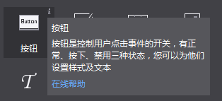
 
###资源面板

  &emsp;&emsp; 资源面板是游戏项目中所有文件的展示面板，实现导入资源、新建、重命名、复制、删除文件等功能。

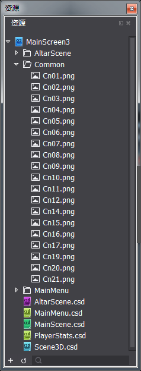
 
  &emsp;&emsp; 在Cocos Studio中可以通过右键菜单“导入资源”功能将资源导入到资源面板，从而进行控件赋值，与资源的管理，也可以将资源通过资源面板拖动到其他区域，以完成资源工作流程。

  &emsp;&emsp; 特别说明：资源面板所展示的文件结构和磁盘上的文件结构是一致的，当您在磁盘上删除一个文件时，已经引用这个资源的控件会显示资源丢失样式。如下图标红文件：
 
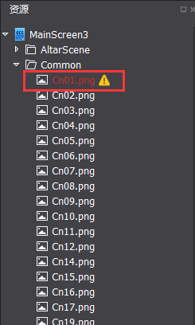

  &emsp;&emsp; Cocos的标准操作流程是：

  &emsp;&emsp; 先把游戏将要用到的资源拖拽到资源面板，然后从对象面板拖拽需要用到的控件到画布面板新建控件，然后从资源面板把资源给新建的控件赋值，然后修改控件的属性，进行界面、场景、动画的编辑。

###画布面板

  &emsp;&emsp; 注意：此面板根据编辑内容不同而动态调整

  &emsp;&emsp; 1）当编辑场景、图层时，显示画布如下：
 

  &emsp;&emsp; 画布面板是Cocos Studio中最常使用的面板，在该面板中可以进行控件的位置、旋转、缩放的调整、对控件锚点的修改、复制、粘贴等操作，在画布面板中可以单选或多选控件，选中后通过右键菜单或属性面板可以对控件进行进一步的设置。

  &emsp;&emsp; 按住空格，鼠标拖动空白处可以对画布进行移动或者按下鼠标中间对画布进行移动。

 
  &emsp;&emsp; 画布面板的黑色区域代表了您所设置的分辨率大小。

  &emsp;&emsp; 2）当编辑节点资源时，显示画布：
    

  &emsp;&emsp; 3）当编辑合图资源，显示画布：
 

  &emsp;&emsp; 4）当编辑3D场景资源时，显示3D画布。
 

###动画面板

  &emsp;&emsp; 动画面板分为六部分，对象结构树、时间轴、缓动界面、动画控制工具、动画编辑工具、动画列表。
 

####时间轴

 
Cocos Studio对每个文件提供一个动画时间轴，在该时间轴上可以添加关键帧，编辑器将自动在两帧之间添加动画曲线，以实现动画效果。

####缓动界面

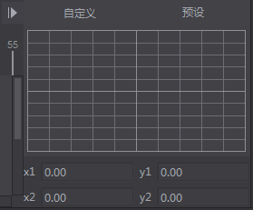
 
  &emsp;&emsp; 动画在两帧之间默认做匀速运动，而当在前一帧添加缓动效果后，动画会从前一帧到后一帧渐进加速或减速运动，它会使您的动画看起来更逼真。
动画控制工具
 

   &emsp;&emsp; 动画控制工具能够控制当前时间轴上的动画：

   &emsp;&emsp; ：移动到第0帧。

   &emsp;&emsp;  ：移动到前一帧。

   &emsp;&emsp; ：播放动画。

   &emsp;&emsp;  ：移动到后一帧。

   &emsp;&emsp;  ：移动到最后一帧。

   &emsp;&emsp; ：是否为循环动画。

   &emsp;&emsp; ：控制动画播放哪个速度。

  &emsp;&emsp; 动画编辑工具
 

  &emsp;&emsp; 动画编辑工具提供了一些编辑动画时常用的操作：

   &emsp;&emsp; ：添加动画帧，点击后会在时间轴上您选中的位置上添加一关键帧。

   &emsp;&emsp; ：点击后您所做的变化会被记录在当前帧，成为关键帧，通过在不同的帧上修改控件的属性，被修改的属性会添加到 ，通过不同属性的变化创造出丰富多彩的动画效果。

   &emsp;&emsp; ：镜像参考又称洋葱皮，能够以当前帧为基础，将当前帧前后的帧通过线框的形式展现出来辅助动画编辑的操作，如下图：

 
   &emsp;&emsp;  动画列表可实现新建动画、删除、重命名等功能。

   &emsp;&emsp; ：新建动画，标识动画的起始帧与结束帧，并把起始帧与结束帧保存下来作为一个动画，比如，如下图：
 

  &emsp;&emsp; 动画名称为：animation0，从第0帧到第16帧。

###对象结构树

 
  &emsp;&emsp; 对象结构树表示当前项目文件中所有控件如按钮、地图、声音、粒子等等的在当前项目文件的结构，它与画布面板中显示的控件一一对应，将对象面板的控件直接拖动到对象结构树中即可添加相应的对象到该位置（同时在画布面板上被渲染），该结构树提供了一个可视化的调整项目文件中的控件挂载结构的方式，通过对象结构树，可以添加控件、删除控件、调整控件渲染顺序、调整控件父子结构的功能。

   &emsp;&emsp; ：点击这个按钮，可以展开控件的动画属性，当前动画影响的控件的哪些属性，比如： ， 表示Panel_InfoBox_3当前只改变倾斜，缩放，坐标这三个属性。

   &emsp;&emsp; ：控制控件在画布面板是否隐藏。

   &emsp;&emsp; ：锁定该控件在画布面板的编辑，不会被点选以及框选。

  &emsp;&emsp; 注意：对象结构树上设置某个控件在画布面板是否隐藏，或锁定该控件在画布面板的编辑，但在对象结构树的面板中不论锁定还是隐藏，都只会影响画布面板的显示或编辑的效果，这个效果不会输出到最终的游戏和模拟器，如果您需要对控件的显隐、是否接受交互在游戏最终效果上有所调整请在属性面板修改控件的属性。

  &emsp;&emsp; 父子结构：Cocos采用父子结构这一概念，使任何对象成为另一对象的子对象，将欲移动的子对象拖动到目标的父对象中即可建立父子关系，子对象会继承父对象的移动、旋转路径，需要注意的是子对象并不会继承父对象的不透明度和颜色叠加属性。

###属性面板

  &emsp;&emsp; 属性面板展示了控件的所有属性，方便您进行调整和修改。

 
  &emsp;&emsp; 顶部是固定的标题区，属性面板有两个页签，包含基本属性和高级属性：

  &emsp;&emsp; 基本属性：分为位置与尺寸、常规、九宫格、特性几个部分。

  &emsp;&emsp; 高级属性：包括帧事件的设置和回调属性的设置。当您在画布面板选中了一个或多个控件时属性面板会出现相应的属性，可以通过输入数值、添加文件等方式调整。

  &emsp;&emsp; 标题区域：标题区域展示了当前选中的控件类型，您可以通过定义的名称在程序中获取当前的控件。

  &emsp;&emsp; 位置与尺寸属性

  &emsp;&emsp; 位置与尺寸属性包含了关于锚点、位置、尺寸的一些常规设置。除此之外，还设置了自适应布局功能，布局功能[UI布局与多分辨率适配](../../UI/Layout/zh.md)

 
  &emsp;&emsp; 常规属性

  &emsp;&emsp; 常规属性包含了一些控件的基础设置，如可见性、旋转角度、倾斜角度、翻转等，大部分控件的常规属性是统一的，但也有一些控件有特殊情况，具体控件的使用方法请参考在线帮助，如下图：

 
  &emsp;&emsp;[ 九宫格](../../UI/9Slice/zh.md)

  &emsp;&emsp; 高级属性：

  &emsp;&emsp; 1，[帧事件](../../Animation/AddFrameEvents/zh.md)

  &emsp;&emsp; 2，[回调特性](../../HowToCode/CallBack/zh.md)

  &emsp;&emsp; 3，[用户数据](../../HowToCode/UserData/zh.md)
     
    

