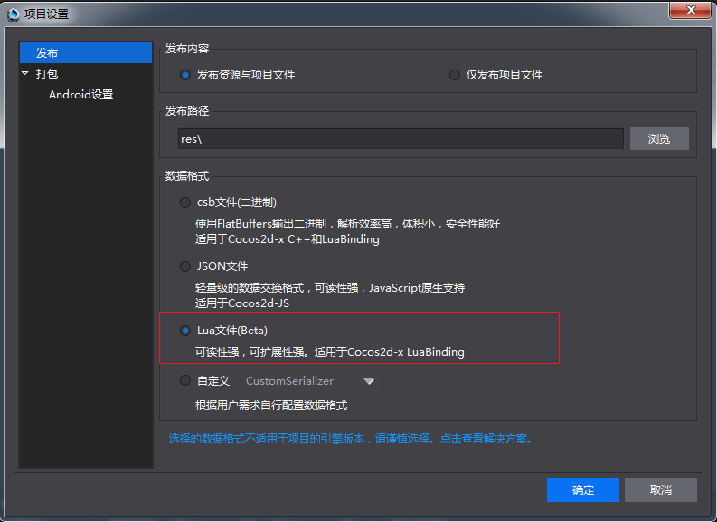
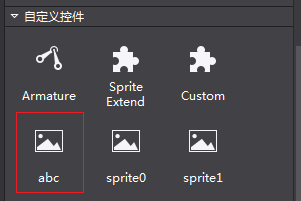
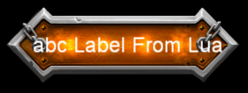
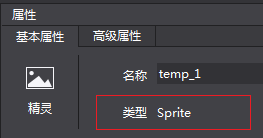
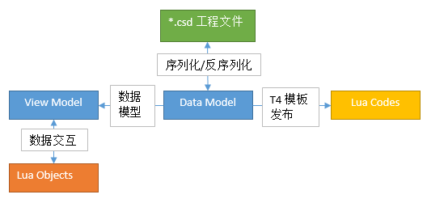
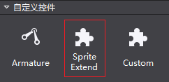
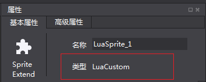
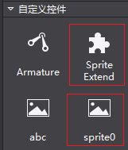

# **控件扩展** #

1.文档要点

&emsp;&emsp;自定义控件相关部分的设计思路及技术细节。包括两种自定义控件的编写方法： 

&emsp;&emsp;A.使用  Lua 脚本编写供 Cocos Studio使用的自定义控件；（基础篇内容）

&emsp;&emsp;B.使用 C# + Lua 来编写供 Cocos Studio 使用的自定义控件；（进阶篇内容）

2.文档的读者

&emsp;&emsp;需要更进一步了解 Cocos Studio, 对 Cocos Studio 有自定义控件需求的用户。

&emsp;&emsp;在此，我们假定读者有以下的知识技能：

&emsp;&emsp;熟悉 Cocos Studio 软件的使用。

&emsp;&emsp;对 Lua 脚本有一定的了解。

&emsp;&emsp;对 cocos2d-x 导出的 Lua 接口比较熟悉。

&emsp;&emsp;对 C# 语言编程有一定的了解。（非必需，不影响基础篇的阅读。进阶篇有此要求）

3.背景知识

&emsp;&emsp;本文档内容会涉及到下列相关的背景知识：

&emsp;&emsp;1)Lua 语言。（详情请参见： [http://www.lua.org/](http://www.lua.org/)）

&emsp;&emsp;2)Cocos 2d-x Lua 绑定。

&emsp;&emsp;3)Mono.Addins。（详情请参见： [http://monoaddins.codeplex.com/](http://monoaddins.codeplex.com/)）

4)T4 模板。

&emsp;&emsp;（详情请参见： [https://msdn.microsoft.com/en-us/library/bb126445.aspx](https://msdn.microsoft.com/en-us/library/bb126445.aspx)）

&emsp;&emsp;通过阅读本文档，你将了解到以上和 Cocos Studio 扩展相关的内容。

4.目录位置

&emsp;&emsp;为方便读者查阅，在此把文档中会用到的几个目录位置在此汇总一下。

&emsp;&emsp;Cocos Studio 的插件目录

&emsp;&emsp;Windows 操作系统上文档位置默认安装时，这个目录是 %userprofile%\Documents\Cocos\CocosStudio2\Addins。文档位置自定义安装时，则在 Cocos Studio 的文档安装目录中的相应位置。例如：文档的安装目录为 D:\CocosDocuments，则该路径为 D:\CocosDocuments\Cocos\CocosStudio2\Addins。在 Mac 上，这个目录为用户目录 ~/Library/Application Support/Cocos/CocosStudio2/Addins 。

&emsp;&emsp;示例工程位置

&emsp;&emsp;Windows 上文档位置默认安装时，这个目录是 %userprofile%\Documents\Cocos\CocosStudio2\Samples\Addins。文档位置自定义安装时，则在 Cocos Studio 的文档安装目录中的相应位置。例如，文档的安装目录为 D:\CocosDocuments，则该路径为 D:\CocosDocuments\Cocos\CocosStudio2\Samples\Addins 。在 Mac 上，这个目录为系统目录 /Library/Application Support/Cocos/CocosStudio2/Samples/Addins。
在不引起混淆的情况的，以下的目录位置都是以在 Windows 操作系统上 Cocos Studio 的默认安装为例。

5.自定义控件

&emsp;&emsp;目前 Cocos Studio支持两种编写自定义控件的方法：

&emsp;&emsp;1) 最基本的自定义控件编写，只写 Lua 代码。这部分适用于对现在的编辑器支持的控件进行自定义渲染。

&emsp;&emsp;2) 更多的定制， 需要同时写 C# 代码和 Lua 代码。适用于需要更进一步的定制控件的情况，可以通过添加属性来动态的调整自定义扩展的控件。

&emsp;&emsp;如果工程中含有用 Lua 实现的自定义控件，在加载场景时就需要使用这些 Lua 文件。为更方便的使用 Lua 扩展来完成场景的构建，此次我们为 Cocos Studio 项目发布添加了 Lua 文件类型，如下图所示：

&emsp;&emsp;在发布带有 Lua 自定义控件的 Cocos Studio 工程时，选择该选项。否则，自定义控件不可展示出来。例如，工程发布为 csb 文件时， 相应的自定义 Lua 控件会被跳过从而不可使用。（在 Cocos Studio 工程不包含 Lua 自定义控件时也可以选择该项来将工程导出为 Lua 文件。）
如果有其它的特殊的发布格式需求，请参考自定义工程导出一节。

&emsp;&emsp;下面针对这两种情况分析介绍：

&emsp;&emsp;1) 基础篇针对基本的自定义控件的编写，用户只需要编写 Lua 代码即可完成操作。

&emsp;&emsp;2) 进阶篇针对的是有更多控制需要的自定义控件的编写，用户需要编写部分辅助的 C# 代码来完成操作。
下面我们来看下如何使用 Lua 脚本编写供 Cocos Studio使用的自定义控件。

6.基础篇

&emsp;&emsp;Cocos Studio启动时，会扫描 Cocos Studio 插件目录下 LuaScript 目录，其中的 Lua 文件（以后缀名 .lua 作为判断）会被认为是一个用 Lua 编写的自定义扩展控件。文件名作为控件名字显示在 Cocos Studio 控件区（参见下面的示例）。

&emsp;&emsp;对于只需要修改或者扩展 Cocos Studio控件的渲染的情况或者给控件属性设置默认值，比如要定制一套控件皮肤或者设置默认的文本字体，可以只编写 Lua 代码来完成操作。在这种情况下，用户根据我们规定的格式来编写 Lua 代码，在 Lua 代码中指定所扩展的 Cocos Studio 预定义控件的类型（这也就是下面会提到的 GetBaseType 的作用。由于这里是对 Cocos Studio 预定义类型的扩展，所以除 Lua 所扩展的部分之外，其它控件部分的初始化依然是由 Cocos Studio 来完成。这也是基础篇里对控件的扩展可以只写 Lua 代码而不需要 C# 代码来完成的原因。）， 完成所扩展的控件的自定义构建，放在Cocos Studio 插件目录下 LuaScript 目录内， Cocos Studio 的启动时便会加载它。要完成这个操作只需要以下两步：

&emsp;&emsp;1） 编写自定义控件 Lua 脚本代码。

&emsp;&emsp;2） 将上一步编写好的 Lua 脚本代码放置在Cocos Studio 插件目录下 LuaScript 目录内。 

&emsp;&emsp;下面来看一个示例：一个自定义的带文本的精灵控件。
请在示例工程位置处找到 Addins.sln， 可以在 Visual Studio 2013 中打开它，下面的示例是位于 LuaScript 目录里的 abc.lua 文件。

7.示例

&emsp;&emsp;一个自定义带文本的精灵控件：即在一个精灵上显示一行文字。

&emsp;&emsp;abc.lua 代码内容如下（其中的注释部分包含了代码的解释和一些注意事项）。

&emsp;&emsp;片段如下：
--[[
一个简单的示例，新建一个精灵，并在精灵上放置了一个文本。
当调用 CreateCustomNode 时，会生成这个精灵并返回。
]]

    -- 新建一个 table，包含 CreateCustomNode 和 GetBaseType 方法。
    local container = {}

    -- 新建根节点 Node，目前这个方法的名字为固定的，必须为 CreateCustomNode。
    -- 方法的最后一句必须是一个 return 语句，把新建的结点返回。
    function container.CreateCustomNode()
	    -- 新建一个精灵。
	    local rootNode = cc.Sprite:create('temp.png') -- 图片资源位于本文件所在目录
	
	    -- 新建一个 Label。
	    local label = cc.Label:create()
	    label:setString('abc Label From Lua') -- 设置 label 的文本内容。
	    label:setSystemFontSize(24) -- 设置 label 字体大小。
	    label:setPosition(140, 50) -- 设置 label 的位置。
	    label:setName('labelName')  -- 设置 label 的名字。
	    label:retain()              -- 保留，以回避垃圾回收。
	
	    rootNode:addChild(label)
	    return rootNode
    end

-- 返回该插件所扩展的基础类型。
function container.GetBaseType()
    return 'Sprite'
end

-- 返回这个包含 CreateCustomNode 和 GetBaseType 方法的表。
return container
-- 片段到这里结束

&emsp;&emsp;分析：
上面的代码是一个完整的 Lua 模块。加载它时会返回一个 Lua Table，也就是代码片段最后的那个 container 表。
方法GetBaseType用以返回这个 Lua 代码所扩展的自定义控件的根节点基础类型，这里返回一个字符串 ‘Sprite’, 表示自定义扩展的控件是一个精灵。GetBaseType 的具体可用的返回值见下一节中关于GetBaseType方法的描述。
方法CreateCustomNode 用以返回一个结点，这里就是一个扩展的精灵。
假设上面的 Lua 代码文件 abc.lua 已经放置Cocos Studio 插件目录下 LuaScript 目录内，同时目录中有图片 temp.png。
运行 Cocos Studio ，可以在控件面板 “自定义控件” 分组中看到这个自定义控件，控件的名字即 Lua 文件名 “abc”：

&emsp;&emsp;由于这个自定义控件是扩展的精灵，所以它在控件面板中显示的图标和精灵一样。

&emsp;&emsp;拖动 abc 图标到渲染可以看到如下内容（注： 背景图片为temp.png 图片。）：

&emsp;&emsp;在渲染区选中它，可以看到它的类型仍然为 Sprite。

&emsp;&emsp;Lua 代码编写中的常见问题和注意事项，请参考下节。

&emsp;&emsp;8.常见问题和注意事项

&emsp;&emsp;使用 Lua 代码编写自定义控件的一些常见问题及注意事项：

&emsp;&emsp;1)在自定义控件栏无法看到所扩展的控件：代码文件需要放置在Cocos Studio 插件目录下 LuaScript 目录内，同时目录中有图片 temp.png。写好的 Lua 代码文件必须放置在这个目录内，否则的话，Cocos Studio 启动时将找不到该 Lua 文件从而无法加载它。（例如，为了运行上面的示例，可以把示例工程位置中的 LuaScript 目录拷贝到 Cocos Studio 插件目录下，启动 Cocos Studio 以观察效果。）。
如果要从另外的地方加载 Lua 文件，则需要修改 C# 代码，这部分请参考进阶篇。

&emsp;&emsp;2)在 Lua 代码中需要用到的资源也应该放到这个目录中去（例如上面示例中的 temp.png 图片也是放置在 LuaScript 目录内），以相对路径加载它。LuaScript 目录是加载 Lua 代码文件时的工作目录。在发布的时候，LuaScript 目录会被整个拷贝到 Cocos Studio的工程发布目录。

&emsp;&emsp;3)一个 Lua 代码文件是一个完整的自定义模块。Lua 代码最后会返回一个 Lua Table。

&emsp;&emsp;4)Lua Table 必须有一个名为 CreateCustomNode 的方法，调用它时可以生成自定义控件并返回。

&emsp;&emsp;5)Lua Table 必须有一个名为 GetBaseType 的方法， 以返回该自定义控件的根节点，这是一个字符串。Cocos Studio所包含的控件及其名字如下所示 （控件名一列的英文部分表示该控件在引擎中的名字，即在渲染区选中相应的控件时在属性区中的类型显示；括号中的中文名字表示其在控件面板中的中文名字。 GetBaseType 返回列表示在 Lua 代码中应该返回的字符串。）:

          控件名	           GetBaseType返回
       Sprite（精灵）	          Sprite
    ParticleSystemQuad（粒子）    Particle
     TMXTiledMap（地图）	      GameMap
       ComAudio（声音）	        SimpleAudio
        Node（节点）	            Node
       Button（按钮）	           Button
	  CheckBox（复选框）       	  CheckBox
	  ImageView（图片）	          ImageView
	  TextBMFont（FNT 字体）	  TextBMFont
	  LoadingBar（进度条）	     LoadingBar
	  Slider（滑动条）	          Slider
	  Text（文本）	                Text
	  TextField（输入框）      	 TextField
	  ScrollView（滚动容器）	     ScrollView
	  ListView（列表容器）	     ListView
	  PageView（翻页容器）	     PageView
	 Particle3D（3D 粒子）	     Particle3D
	   Sprite3D（模型）	          Sprite3D										
     UserCamera（摄像机）	     UserCamera

&emsp;&emsp;6) 如何在自定义控件的 Lua 脚本中调用第三方 Lua 代码库? 

&emsp;&emsp;目前 Cocos Studio的 Lua 运行时只支持从 Cocos 2d-x 导出的接口，默认没有加载其它接口。如果需要，请在 Lua 代码中自行加载。例如，如果需要用到 Quick-cocos2d-x 提供的 Lua 扩展接口，请在代码中自行加载相关的库（这部分可以参考 Code IDE 的生成代码，即在需要用到 Lua 扩展的接口的时候 require 相应的 Lua 模块）。

&emsp;&emsp;7) 只写 Lua 代码的话，可以自定义渲染，对相应的控件定制渲染。如果需要更深入的控件（例如需要扩展属性区），需要写配对的 C#　代码。

&emsp;&emsp;8) 一个自定义控件应该只有一个 Lua 文件来定义。同时，一个 Lua 文件只应该生成一个自定义控件。目前 Cocos Studio 会加载所有的位于 LuaScript 目录中的 Lua 文件。每个 Lua 文件对应于控件区的一个控件图标，图标显示的名字就是文件名（不带后缀的部分）。

&emsp;&emsp;9) 对于打开一个已经保存的有 Lua 扩展控件的工程，如果在打开工程前修改过相应的Lua 脚本文件的内容，则加载的为新的脚本内容。如果加载过程出错，则不显示相应的自定义控件。

&emsp;&emsp;最佳实践：在 Cocos Studio 中编辑所需控件，编辑结束后，把工程发布为 Lua 文件。基于相应的代码片段进行修改，可以减少手动编写代码的工作量。

&emsp;&emsp;基础篇到此结束，对于只使用 Lua 代码目前只能完成一个简单的自定义控件（即扩展 Cocos Studio 预定义控件），如果需要更进一步的扩展，请参见以下几节。

&emsp;&emsp;9.进阶篇

&emsp;&emsp;对于需要更多定制的情况，比如要添加属性的修改，就需要用到 Cocos Studio 所提供的扩展功能，编写相应的 C# 代码来完成。这里先简单的介绍下这个过程（更详细的细节请参见下面各节），Cocos Studio 是基于 Mono.Addins 来构建的插件系统，在需要对扩展更进一步的定制时，我们就需要使用这个插件系统（配置程序集）。为了扩展属性，需要对所扩展类型时行 C# 扩展（视图模型的扩展，即从 ViewModel 派生一个子类，并添加属性。由于 ViewModel 的扩展，从而 DataModel 也需要相应的扩展。）。扩展的 C# 属性需要和 Lua 脚本进行数据交互（通过运行时从 Lua 代码读写数据，所以要修改相应的 Lua 脚本，并在 C# 里调用 Cocos Studio 提供的接口来与 Lua 脚本时行数据交互）。扩展的控件需要导出到 Lua 文件（通过添加 Lua 代码生成模板），相应的 Lua 代码生成模板虽然被添加到 Cocos Studio 的插件系统从而在工程发布可被应用（添加 Lua 代码生成模板的导出）。在此过程中的几个概念的关系如下图所示：

&emsp;&emsp;（说明：Lua Objects 为自定义控件的 Lua 脚本代码。 Lua Codes 从 DataModel生成的 Lua 文件代码。）
一般来说，完成这个操作需要以下几步：

&emsp;&emsp;1） 编写自定义控件 Lua 脚本代码。

&emsp;&emsp;2） 将上一步编写好的 Lua 脚本代码放置在 Cocos Studio 的插件目录。 

&emsp;&emsp;4） 配置插件 AddinConfig.cs。 

&emsp;&emsp;5） 添加 ViewModel 和 DataModels。 

&emsp;&emsp;6） 添加 Lua 代码生成模板。

&emsp;&emsp;下面来看一个示例：一个自定义的带文本的精灵控件，该自定义控件在渲染区选中时，可以通过属性区修改文本的内容和字体大小。
这里我们已经提供了一个配置好的 Visual Studio 2013 项目工程，请在示例工程位置处找到 Addins.sln， 可以在 Visual Studio 2013 中打开它，下面的内容都是基于该示例工程（示例工程的其它介绍请参见示例工程一节）。

&emsp;&emsp;自定义控件部分主要位于 Lua 目录下的 LuaScript 子目录内。

&emsp;&emsp;10.示例

&emsp;&emsp;因为要控件精灵上文本的内容和字体大小，先在 Lua 代码中添加处理文本内容和字体大小的方法。如下所示：

&emsp;&emsp;Lua 代码

&emsp;&emsp;LuaScript 目录中一个可用的 sprite0.lua 代码如下所示（其中的注释部分包含了代码的解释和一些注意事项）。

&emsp;&emsp;片段如下：
--[[
一个简单的示例，新建一个精灵，并在精灵上放置了一个文本。
当调用 CreateCustomNode 时，会生成这个精灵并返回。
]]
		
	-- 新建一个精灵。
	-- 新建精灵时传入了一个图片路径作为参数。
	local function CreateSprite()
		return cc.Sprite:create('temp.png') --图片资源请放在本文件所在目录 (LuaScript 目录)
	end
	
	-- 新建一个 Label，用以显示文字
	local function CreateLabel()
		local label = cc.Label:create()
		label:setString('sprite0 Label from Lua')
		label:setSystemFontSize(24)
		label:setPosition(140, 50)
		label:setName('labelName') --设置 label 的名字，这个 label 的名字在下面会用到。
		label:retain()
		return label
	end

	-- 新建一个 table，避免全局变量污染。用以包括脚本中所定义的所有的全局方法。
	local container = {}
	-- 新建根节点 Node，目前这个方法的名字为固定的，必须为 CreateCustomNode。
	-- 方法的最后一句必须是一个 return 语句，把新建的结点返回。
	function container.CreateCustomNode()
		local rootNode = CreateSprite()
		rootNode:addChild(CreateLabel())
		return rootNode
	end

	-- 返回该插件所扩展的基础类型。
	function container.GetBaseType()
	    return 'Sprite'
	end

	-- 取得精灵上文本的内容。
	-- root 参数即为调用 CreateCustomNode 时返回的根结点。
	function container.GetLabelText(root)
	    -- 在父控件中查找名字为 'labelName' 的子控件。
	    local child = root:getChildByName('labelName')
	    return child:getString()
	end

	-- 设置精灵上文本的内容。
	-- root 参数即为调用 CreateCustomNode 时返回的根结点。
	-- value 所赋的字符串的值。
	function container.SetLabelText(root, value)
	    -- 在父控件中查找名字为 'labelName' 的子控件。
	    local child = root:getChildByName('labelName')
	    child:setString(value)
	end

	-- 取得精灵上文本的字体大小。
	function container.GetLabelFont(root)
	    local child = root:getChildByName('labelName')
	    return child:getSystemFontSize()
	end
	
	-- 设置精灵上文本的字体大小。
	function container.SetLabelFont(root, value)
	    local child = root:getChildByName('labelName')
	    child:setSystemFontSize(value)
	end
	
	-- 返回这个包含所有全局方法的表
	return container

-- 片段到这里结束

&emsp;&emsp;分析：
新建精灵部分在上一个示例中已经描述。这里看下它新添加的两对 Set/Get 方法：
GetLabelText/SetLabelText（获取/设置精灵上文本的内容）， GetLabelFont/SetLabelFont（获取/设置精灵上文本字体的大小）。注意这里的方法名，在下面的 C# 代码中会用到。
这里可以看到，在方法内部，是通过  Cocos 2d-x 导出的 Lua 接口完成相应的操作。 

&emsp;&emsp;为了在 Cocos Studio 中可以生成它，使它可以展示在渲染区，为它添加 ViewModel。如下所示：

&emsp;&emsp;视图模型

&emsp;&emsp;LuaCustomObject 视图模型的代码片段如下：

    [DisplayName("Sprite Extend")]
    [ModelExtension(2)]
    [Catagory("Control_Custom", 2)]
    [EngineClassName("LuaCustom")]
    public class LuaCustomObject : SpriteObject
    {
        public LuaCustomObject()
            : base(GetScriptFileData())
        {
            if (System.IO.File.Exists(luaFile))
                luaValueConverter = new LuaValueConverter(new CSLuaNode(luaFile, innerNode));
            else
                throw new System.IO.FileNotFoundException(luaFile + " not found!");
        }

        private LuaValueConverter luaValueConverter;

        // make sure luaFile exists, if not, please copy it from the output folder to target folder.
        // it will be in folder Output path/lua/LuaScript, or you can just copy it from source.
        private static string luaFile = System.IO.Path.Combine(Option.LuaScriptFolder, "sprite0.lua");

        private static ScriptFileData GetScriptFileData()
        {
            if (System.IO.File.Exists(luaFile))
            {
                CSCocosHelp.AddSearchPath(Option.LuaScriptFolder);
                return new ScriptFileData(luaFile, ScriptType.Lua);
            }

            LogConfig.Output.Info(luaFile + " not exist!");
            return null;
        }

        protected internal override string InitNamePrefix()
        {
            return "LuaSprite_";
        }

        [UndoPropertyAttribute]
        [DefaultValue("abc")]
        [DisplayName("Label Text")]
        [Category("Group_Feature")]
        [Browsable(true)]
        [PropertyOrder(0)]
        public string LabelText
        {
            get
            {
                return luaValueConverter.GetStringValue("GetLabelText");
            }
            set
            {
                luaValueConverter.SetStringValue("SetLabelText", value);
                this.RaisePropertyChanged(() => this.LabelText);
            }
        }

        [UndoPropertyAttribute]
        [DisplayName("Label Font")]
        [Category("Group_Feature")]
        [Description("Int value description")]
        [PropertyOrder(1)]
        [Browsable(true)]
        public int LabelFont
        {
            get
            {
                return luaValueConverter.GetIntValue("GetLabelFont");
            }
            set
            {
                luaValueConverter.SetIntValue("SetLabelFont", value);
                this.RaisePropertyChanged(() => this.LabelFont);
            }
        }

        #region methods for clone

        // set value to the object, used in clone.
        protected override void SetValue(object cObject)
        {
            base.SetValue(cObject);

            LuaCustomObject nObject = cObject as LuaCustomObject;
            if (nObject == null)
                return;
            nObject.LabelText = this.LabelText;
            nObject.LabelFont = this.LabelFont;
            nObject.LabelVisible = this.LabelVisible;
            nObject.MixedColor = this.MixedColor;
            nObject.TextureResource = this.TextureResource;
        }

        #endregion methods for clone
    }
&emsp;&emsp;分析：
由于该自定义控件扩展的是精灵，所以，它继承自 SpriteObject。
DisplayName 特性：在 Cocos Studio 控件栏里显示的自定义控件的名字，这里显示为 "Sprite Extend"。
ModelExtension 特性：导出这个自定义的 ViewModel 类型，其参数为类型导出顺序，由于添加了这个特性，这个控件就在 Cocos Studio 的自定义控件组中显示出来，如下所示：

&emsp;&emsp;（这个自定义控件的名字即为 DisplayName 所指定的 "Sprite Extend"。）

&emsp;&emsp;如果所扩展的为 3D 控件，这里使用 ModelExtension 里需要多一个表示 3D 的参数，如下所示（详见示例工程中的 3D 扩展）：

    [ModelExtension(2, EnumModelType.ThreeDimensional)]

&emsp;&emsp;Category 特性：
分组，以及控件在分组中的顺序。这里因为给它指定的是名字是 "Control_Custom", 所示该控件在控件区显示在“自定义控件”分组中，（注意， 这里用字段"Control_Custom" 而实际显示为“自定义控件”是因为 Cocos Studio 里有特殊的处理，如果使用其它的字段，则会显示会字段的名字。）

&emsp;&emsp;EngineClassName：控件名，其名字会显示在属性面板的类型处。Cocos Studio 的控件此处显示的是是它在 Cocos 2d-x 中类型。自定义控件没有对应的引擎类型，所以此处以自己能清晰的分辨所选择类型为准。

&emsp;&emsp;由于其中添加了 LabelText 和 LabelFont 扩展属性，所以它们在属性区展示如下：

&emsp;&emsp;（注意属性的名字和 ViewModel 属性上的 DisplayName 的对应关系。）
属性区扩展及属性区编辑控件的扩展，请参考属性区扩展一节。

&emsp;&emsp;ViewModel 的其它细节请参见DataModel 和 ViewModel 一节。

&emsp;&emsp;在 Cocos Studio 中，每个 ViewModel 对应一个数据模型 DataModel 用来作数据的持久化，例如保存工程时会将 DataModel 进行序列化保存到 Cocos Studio 的工程文件 .csd 文件中。所以，为这个 ViewModel 建立一个对应的 DataModel。

&emsp;&emsp;数据模型

&emsp;&emsp;LuaCustomObjectData 数据模型的代码片段如下：

	[DataModelExtension(typeof(LuaCustomObject))]
	public class LuaCustomObjectData : SpriteObjectData
	{
	    [ItemProperty]
	    [JsonProperty]
	    public string LabelText { get; set; }
	
	    [ItemProperty]
	    [JsonProperty]
	    public int LabelFont { get; set; }
	}

&emsp;&emsp;分析：

&emsp;&emsp;由于该自定义控件扩展的是精灵，所以，它继承自 SpriteObjectData。
添加DataModelExtension 特性，其值为相对应的 ViewModel 的类型 LuaCustomObject。
DataModel 中属性为需要进行保存的所对应的 ViewModel 中的字段。
注意， DataModel 中的属性名字需要和 ViewModel 相应的属性名字保持一致，比如上面的 LabelText，就是对应于 ViewModel 中的 LabelText。
DataModel的其它细节请参见DataModel 和 ViewModel 一节。

&emsp;&emsp;接着，实现 ViewModel 中所扩展的属性和 Lua 代码的交互。相关的 C# 代码如下所示：

&emsp;&emsp;数据交互
&emsp;&emsp;与上面的 Lua 代码相对应的 C# 代码片段如下所示：

    [UndoPropertyAttribute]
    [DefaultValue("abc")]
    [DisplayName("Label Text")]
    [Category("Group_Feature")]
    [Browsable(true)]
    [PropertyOrder(0)]
    public string LabelText
    {
        get
        {
            return luaValueConverter.GetStringValue("GetLabelText");
        }
        set
        {
            luaValueConverter.SetStringValue("SetLabelText", value);
            this.RaisePropertyChanged(() => this.LabelText);
        }
    }

    [UndoPropertyAttribute]
    [DisplayName("Label Font")]
    [Category("Group_Feature")]
    [Description("Int value description")]
    [PropertyOrder(1)]
    [Browsable(true)]
    public int LabelFont
    {
        get
        {
            return luaValueConverter.GetIntValue("GetLabelFont");
        }
        set
        {
            luaValueConverter.SetIntValue("SetLabelFont", value);
            this.RaisePropertyChanged(() => this.LabelFont);
        }
    }

&emsp;&emsp;分析：

&emsp;&emsp;其中luaValueConverter.GetStringValue即为从 Lua 代码中取得一个字符串值，这里由于传入的参数为"GetLabelFont" ，从上面的 Lua 代码示例中取得精灵上的文本内容。注意这里的传入方法名和 Lua 代码的对应关系。其它几个数据交互调用与之类似。
属性的 set 最后调用 this.RaisePropertyChanged 是通知这里的属性值发生了改变，实现属性区界面刷新。
数据交互部分的其它细节请参见数据交互一节。

&emsp;&emsp;接着，为了让这个扩展能被 Cocos Studio 加载起来。将工程所编译生成的Addins.Sample.dll 拷贝到Cocos Studio插件目录里。由于 Cocos Studio 所使用的插件方案的约定，需要给生成的程序集添加以特性：

&emsp;&emsp;添加 AddinConfig.cs

&emsp;&emsp;给工程添加 AddinConfig.cs 文件，内容如下：

	[assembly: Addin("Addins.Sample", Option.MainVersion, Namespace = Option.AddinNamespace)]
	[assembly: AddinDependency("CocoStudio.Core", Option.MainVersion)]
	[assembly: AddinDependency("CocoStudio.Projects", Option.MainVersion)]
	[assembly: AddinDependency("CocoStudio.Model", Option.MainVersion)]
	[assembly: AddinDependency("CocoStudio.ResourcePanel", Option.MainVersion)]
	[assembly: AddinDependency("CocoStudio.Model.Lua", Option.MainVersion)]
	[assembly: AddinDependency("Addins.LuaExtend", Option.MainVersion)]

&emsp;&emsp;分析：

&emsp;&emsp;设置插件导出以及插件的依赖。
具体的细节请参见插件技术方案一节。

&emsp;&emsp;自定义控件是由 Lua 生成，我们为了将自定义的扩展属性导出到 Lua，需要把 DataModel 转化为 Lua 代码，如下所示。

&emsp;&emsp;Lua 代码生成模板

&emsp;&emsp;在 Cocos Studio 工程中，使用 T4 模板技术来从 DataModel 生成 Lua 代码。

&emsp;&emsp;T4 模板的代码如下所示：

	<#@ template debug="false" inherits="LuaSpriteObject" language="C#" linePragmas="false"#>
	<#@ assembly name="System.Core" #>
	<#@ import namespace="System.Linq" #>
	<#@ import namespace="System.Text" #>
	<#@ import namespace="System.Collections.Generic" #>
	<#@ import namespace="CocoStudio.Model.DataModel" #>
	<#@ import namespace="Addins.Sample.Lua.DataModel"#>
	<#@ import namespace="CocoStudio.Model.Lua.Templates" #>
	<#@ import namespace="Mono.Addins" #>
	
	<#+
	public override bool CanSerialize(BaseObjectData objectData)
	{
	    bool isOK = typeof(LuaCustomObjectData) == objectData.GetType();
	    return isOK;
	}
	
	public override void CreateObject(BaseObjectData objectData)
	{
		LuaCustomObjectData data = objectData as LuaCustomObjectData;
	#>
	local luaScript = require("<#= CocoStudio.Basic.Option.luaScriptFolderName #>/<#= System.IO.Path.GetFileName(data.ScriptData.RelativeScriptFile) #>")
	<#= GetNameDeclaration(objectData.Name) #> = luaScript.CreateCustomNode()
	<#+
	}
	
	public override void InitializeObject(BaseObjectData objectData)
	{
		LuaCustomObjectData data = objectData as LuaCustomObjectData;
		base.InitializeObject(data);
	#>
	luaScript.SetLabelText(<#= data.Name #>, "<#= data.LabelText #>")
	luaScript.SetLabelFont(<#= data.Name #>, <#=data.LabelFont#>)
	luaScript.GetLabelVisible(<#= data.Name #>, <#=data.LabelVisible.ToString().ToLower()#>)
	luaScript.SetMixedColor(<#= data.Name #>, <#=data.MixedColor.ToLuaString()#>)
	<#+
	}
	#>

&emsp;&emsp;分析：

&emsp;&emsp;inherits="LuaSpriteObject"，设置 T4 模板生成类继承自 LuaSpriteObject，也就是精灵的 Lua T4 模板生成类。

&emsp;&emsp;CanSerialize：确定该 T4 模板生成类所操作的 DataModel 为 LuaCustomObjectData。

&emsp;&emsp;CreateObject： 生成该自定义控件的 Lua 代码。

&emsp;&emsp;InitializeObject：生成该自定义控件的设置属性代码。

&emsp;&emsp;AddChild : 由于该自定义控件扩展的是精灵，添加子控件不需要特殊操作，所以不用重写 AddChild 方法。

&emsp;&emsp;通过上面的继承关系我们可以看出，每一个 DataModel 会对应到一个 Lua 代码生成模板。在对某个控件进行扩展时，Lua 代码生成模板类需要继承自控件的代码生成模板类。控件的代码生成模板类请参见相关类一览。

&emsp;&emsp;T4 模板的其它细节请参见 T4 模板一节。

&emsp;&emsp;Lua 代码生成的 T4 模板这里使用的是 Monodevelop 的插件机制，所以需要为其添加一个 Xml 导出文件。Cocos Studio项目在导出 Lua 文件时会由其插件机制扫描 "/CocoStudio/Model/Lua/Templates" 扩展点下的所有 LuaBaseObject 类（这个类是所有的代码生成模板类的基类。）,所以这里添加代码生成模板的导出类。在进行 Lua 代码生成的时候，Cocos Studio 会以每个要生成的 DataModel 类为参数来调用 CanSerialize 来查找该 DataModel 所对应的代码模板生成类。

&emsp;&emsp;Lua 代码生成模板导出

&emsp;&emsp;T4 模板的关联文件为ExtensionModel 目录中的 LuaObjects.addin.xml。其在 VS2013 中的属性：“生成操作”为“嵌入的资源”，“复制到输出目录”为“不复制”。 

&emsp;&emsp;这个文件的作用是在 "/CocoStudio/Model/Lua/Templates" 扩展点添加由 T4 模板生成的类的全路径，即："Addins.Sample.Lua.Lua.LuaCustomObject"，其内容如下所示：

	<?xml version="1.0" encoding="utf-8" ?>
	<ExtensionModel>
	<Extension path = "/CocoStudio/Model/Lua/Templates">
		<Class class = "Addins.Sample.Lua.Lua.LuaCustomObject"/>
	</Extension>
	</ExtensionModel>

&emsp;&emsp;T4 模板的其它细节请参见 T4 模板一节。

&emsp;&emsp;C#代码编写中的常见问题和注意事项，请参考下节。

&emsp;&emsp;11.常见问题和注意事项

&emsp;&emsp;利用 C# 写扩展的一些常见问题和注意事项。

&emsp;&emsp;插件技术方案

&emsp;&emsp;Cocos Studio是基于 Mono.Addins 来构建的插件系统，具体到代码上的表现是：在 C# 工程中添加 AddinConfig.cs 文件，给程序集设置 Addin 特性， 及使用 AddinDependency 给程序集设置相应的依赖。生成的 DLL 需要放置在 %userprofile%\Documents\Cocos\CocosStudio2\Addins 目录下（路径以在 Windows 操作系统上的位置为示例）。
Mono.Addins的具体细节请参考：[http://monoaddins.codeplex.com/](http://monoaddins.codeplex.com/)

&emsp;&emsp;DataModel 和 ViewModel 

&emsp;&emsp;在 Cocos Studio 中，渲染区所展示的每一个控件都是一个 ViewModel, 每一个 ViewModel 都对应一个 DataModel 来管理其数据。

&emsp;&emsp;根据要扩展的控件的不同，ViewModel 需要继承自 NodeObject 或者 NodeObject 的某个子类。DataModel 需要相应的继承自和 ViewModel 的基类所配对的 NodeObjectData 或者 NodeObjectData 某个子类。
DataModel 和 ViewModel 的关联通过 DataModelExtension 特性来实现。

&emsp;&emsp;DataModel 和 ViewModel 中对应的属性名应该保持一致。

&emsp;&emsp;序列化方案

&emsp;&emsp;DataModel 中的需要序列化的属性需要添加 [ItemProperty] 和 [JsonProperty] 特性，分别对应于 xml 和 json 的序列化。

&emsp;&emsp;数据模型的xml序列化采用的是 MonoDevelop 的解决方案，具体的细节请参考[http://www.monodevelop.com/developers/articles/using-the-data-serializer/](http://www.monodevelop.com/developers/articles/using-the-data-serializer/)

&emsp;&emsp;数据模型的 json 序列化采用的是 Newtonsoft.Json 库，具体的细节请参考
[http://www.newtonsoft.com/json](http://www.newtonsoft.com/json)

&emsp;&emsp;数据交互

&emsp;&emsp;C# 和 Lua 的数据交互，提供了 LuaValueConverter 用以在 C# 层和 Lua 层来交换数据。LuaValueConverter 所提供的方法如下所示：
方法签名	说明
	
	bool GetBoolValue(string funcName)	                            从指定的函数名 funcName 返回一个 bool 值。
	void SetBoolValue(string funcName, bool val)	                使用指定的函数名 funcName 设置一个 bool 值。
	int GetIntValue(string funcName)	                            从指定的函数名 funcName 返回一个整数。
	void SetIntValue(string funcName, int val)	                    使用指定的函数名 funcName 设置一个整数。
	string GetStringValue(string funcName)	                        从指定的函数名 funcName 返回一个字符串。
	void SetStringValue(string funcName, string val)	            使用指定的函数名 funcName 设置一个字符串。
	double GetDoubleValue(string funcName)	                        从指定的函数名 funcName 返回一个双精度浮点值。
	void SetDoubleValue(string funcName, double val)	            使用指定的函数名 funcName 设置一个双精度浮点值。
	float GetFloatValue(string funcName)	                        从指定的函数名 funcName 返回一个浮点值。
	void SetFloatValue(string funcName, float val)	                使用指定的函数名 funcName 设置一个浮点值。
	System.Drawing.Color GetColorValue(string funcName)	            从指定的函数名 funcName 返回一个颜色值。
	void SetColorValue(string funcName, System.Drawing.Color val)	使用指定的函数名 funcName 设置一个颜色值。
	void SetResourceDataValue(string funcName, ResourceData val)	使用指定的函数名 funcName 设置一个资源值。
&emsp;&emsp;注：

&emsp;&emsp;上面的函数签名为 C# 中的方法名。其中的类型均为 C# 语言定义中的类型。

&emsp;&emsp;调用时funcName 应该传为方法在 Lua 中的方法名。

&emsp;&emsp;资源类型只有 Set 没有 Get，对于需要取得资源的地方，可以调用 GetStringValue 方法返回资源的路径，在 C# 层进行后续处理。
C# 和 Lua 之间数据的交互，目前只支持这几种预定义的类型，如果有需要其它的复合类型，可通过方法组合和类型转换来实现。在后续的开发中我们会逐渐丰富所支持的类型。

&emsp;&emsp;T4 模板

&emsp;&emsp;为数据模型 DataModel 生成 T4 模板，以便在导出 Cocos Studio 工程时把 DataModel 内容导出到 Lua 文件。

&emsp;&emsp;T4 模板具体实现时的规则：

&emsp;&emsp;每个要导出到 Lua 代码的控件都会对应一个 T4 模板。

&emsp;&emsp;T4 模板生成的 C# 文件需要继承自相应的扩展的控件类，同时需要重载以下的几个方法：

&emsp;&emsp;CanSerialier，用以判断将要处理的类型是自己的 DataModel。

&emsp;&emsp;CreateObject，根据传入的 DataModel，加载相应的 Lua 扩展文件。生成 Lua 代码，用以新建一个所扩展的控件。

&emsp;&emsp;InitializeObject，相应的扩展属性导出到 Lua 代码。

&emsp;&emsp;AddChild，如果扩展控件添加子控件使用的不是来自 NodeObject 的 AddChild，则需要在此重写这个方法。例如，容器控件 PageView 添加子控件时使用 addPage 。

&emsp;&emsp;T4模板请参考：[https://msdn.microsoft.com/en-us/library/bb126445.aspx ](https://msdn.microsoft.com/en-us/library/bb126445.aspx )

&emsp;&emsp;添加 T4 模板关联，以便 Cocos Studio 工程导出到 Lua 时找到该模板。(示例工程ExtensionModel 目录中的 LuaObjects.addin.xml 就是这个作用。)

&emsp;&emsp;相关类一览

&emsp;&emsp;Cocos Studio 中的 ViewModel, DataModel, 及 T4 模板生成的相关类名一览：

&emsp;&emsp;ViewModel 类	DataModel 类	T4 模板类
	
	SpriteObject	         SpriteObjectData	       LuaSpriteObject
	ParticleObject	         ParticleObjectData	       LuaParticleObject
	GameMapObject	         GameMapObjectData	       LuaGameMapObject
	SimpleAudioObject	     SimpleAudioObjectData	   LuaSimpleAudioObject
	NodeObject	             NodeObjectData	           LuaNodeObject
	ButtonObject	         ButtonObjectData	       LuaButtonObject
	CheckBoxObject	         CheckBoxObjectData	       LuaCheckBoxObject
	ImageViewObject	         ImageViewObjectData	   LuaImageViewObject
	TextBMFontObject	     TextBMFontObjectData	   LuaTextBMFontObject
	LoadingBarObject	     LoadingBarObjecDatat	   LuaLoadingBarObject
	SliderObject	         SliderObjectData	       LuaSliderObject
	TextObject	             TextObjectData	           LuaTextObject
	TextFieldObject	         TextFieldObjectData	   LuaTextFieldObject
	PanelObject	             PanelObjectData	       LuaPanelObject
	ScrollViewObject	     ScrollViewObjectData	   LuaScrollViewObject
	ListViewObject	         ListViewObjectData	       LuaListViewObject
	PageViewObject	         PageViewObjectData	       LuaPageViewObject
	Node3DObject	         Node3DObjectData	       LuaNode3DObject
	Particle3DObject 	     Particle3DObjectData	   LuaParticle3DObject
	Sprite3DObject	         Sprite3DObjectData	       LuaSprite3DObject
	UserCameraObject	     UserCameraObjectData	   LuaUserCameraObject

&emsp;&emsp;其它

&emsp;&emsp;1) Lua 代码或者资源在其它地方（即：不是上面提到的LuaScript 目录 ），Cocos Studio 将不再负相应的拷贝，用户需要自行处理代码及资源路径的引用问题。

&emsp;&emsp;2) 在这里用到的 Lua 文件如果也是放置在 Cocos Studio 插件目录的 LuaScript 目录里的话。其本身的 Lua 文件也会以基础篇里所定义的基本的自定义控件形式出现。此时其只表现为基本的自定义控件而不再包括属性扩展。如下图示：

&emsp;&emsp;Sprite Extend 控件是进阶篇中提到的带属性区扩展的自定义控件，而 sprite0 则是基础篇中的基本的自定义控件（其表现出来的形式只和 abc 这个基本的自定义控件一样。）。虽然它们所对应的是同一个 Lua 文件。

&emsp;&emsp;3)如果自己要新建工程的话，请参照示例。目标框架为 .Net Framework4.5，输出类型为类库。

&emsp;&emsp;12.示例工程

&emsp;&emsp;本节将介绍一些示例工程 Addins.Sample 的其它细节。

&emsp;&emsp;1) 示例工程的位置：Windows 上文档位置默认安装时，这个目录会是 %userprofile%\Documents\Cocos\CocosStudio2\Samples\Addins。文档位置非默认安装时，则在 Cocos Studio 的文档安装目录中的相应位置。例如，如果文档的安装目录为 D:\CocosDocuments，则该路径为 D:\CocosDocuments\Cocos\CocosStudio2\Samples\Addins 。在 Mac 上，这个目录为系统目录 /Library/Application Support/Cocos/CocosStudio2/Samples/Addins。

&emsp;&emsp;2) 示例工程的编译：示例工程是一个 Visual Studio 2013 的解决方案。在 Windows 上直接打开 Addins.sln 即可编译。如果没有安装 Mono库及 GTK# 请自行安装。在 Mac 上由于权限的关系，请把示例工程拷贝到一个用户有权限读写的目录时行编译。在 Mac 上可以使用 Xamarin Studio 进行编译。请自行安装 MonoFramework。

&emsp;&emsp;3) 编译后 DLL 的拷贝。编译成功后，会得到一个 Addins.Sample.dll ，请将其拷贝到 Addins 目录里。（Windows 上文档位置默认安装时，这个目录会是 %userprofile%\Documents\Cocos\CocosStudio2\Addins。文档位置非默认安装时，则在 Cocos Studio 的文档安装目录中的相应位置。以在 Windows 上为例，如果文档的安装目录为 D:\CocosDocuments，则该路径为 D:\CocosDocuments\Cocos\CocosStudio2\Addins。在 Mac 上，这个目录为用户目录 ~/Library/Application Support/Cocos/CocosStudio2/Addins）。

&emsp;&emsp;4) 示例工程后续如有更新，请参考新版本示例工程。示例工程的修改记录请参见示例工程 Lua 目录内的 修改记录.txt 文件。

&emsp;&emsp;13.其它

&emsp;&emsp;1) 文档所描述的内容适用于 Cocos Studio 2.2.5 版本所附带的示例工程。

&emsp;&emsp;2)Cocos Studio 工程中控件的名字应为合法的 Lua 变量，否则发布到Lua 文件后程序 Lua 程序不可以正常执行。这个可以 Cocos Studio 的工程配置文件中开启命名规则检查（注：工程配置文件即是 Cocos Studio 工程文件同目录 的以.cfg  o为后缀的文件，将其中的字段 IsNameStandardized 置为 “True”即可）。另外，不合法的变量名在发布 Lua 文件时会在 Cocos Studio 输出区打印相应的提示。

&emsp;&emsp;3)这是编辑器第一阶段的开放，上面只是针对控件扩展部分，给出了几个必要的类。在编辑器后续的开发过程中，我们会逐步开放编辑器扩展相关的接口和类。并给出相关的文档说明，敬请期待。

&emsp;&emsp;在后续的开发过程中文档的内容会根据反馈持续更新。如有更新，请以新的版本为准。
如果您对于 Cocos Studio 扩展有任何的意见或者是建议，请在论坛或者是开发者群里反馈给我们。感谢您对 Cocos Studio 的关注和支持，我们将回报您以更好用的产品。