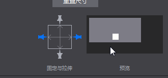

#UI Layout and Multi-resolution Support 

#####1 Cocos Studio

Auto-layout functionality mainly refers to "Pin & Sizing" property. 
 
 

You can have the effect in the above figure by setting Enable/ Disable the "Pins" around and the "Size bars" in the center.

#####Effects

- When a pin is enabled, a widget will be arranged at the corresponding border of its parent widget. The margins between a widget and its parent widget maintain a proportion as the parent widget changes its size. 

 
 
- When two pins are enabled, a widget will be arranged at the corresponding borders of its parent widget. 

 
 
- When a size bar is enabled, the widget scales maintaining its margin proportions to its parent widget.  

 
 
#####Other important information

- By default, a widget is fixed at the bottom right corner. 

- Currently, only Widget (except label and bitmap label) and Containers have this feature.

#####2 Cocos 2d-x (Cocos Framework) related notions and codes

**Design size and screen size**

First, let's see two concepts in cocos2d-x: design size and screen size. Screen is the physical size of the screen I am going to get the application running on. The design size is the size I am programming for initially. Knowing the design size, I will (more accurately, cocos2d-x will) be able to scale widgets correctly to other resolutions. 

The design size is usually set when system is started. Create the demo in

&emsp;&emsp;&emsp;&emsp;`AppDelegate::applicationDidFinishLaunching`

As follows, 

&emsp;&emsp;&emsp;&emsp;`director->getOpenGLView()->setDesignResolutionSize(960,640,ResolutionPolicy::FIXED_HEIGHT)`;

Set the design size as 960 * 640, and choose fixed_width for the canvas. However, even if we set it as 960 * 640, we may not get a design size as 960 * 640. Why? See the code:

Turn to "setDesignResolutionSize". Here we can see some judgement and assignment, and call `updateDesignResolutionSize` finally. Turn to `updateDesignResolutionSize`, part of the codes for this function is as follows:

    > //1.计算游戏界面在缩放至充满屏幕的情况下X、Y轴的缩放率:
    > _scaleX= (float)_screenSize.width/ _designResolutionSize.width;
    > _scaleY= (float)_screenSize.height/ _designResolutionSize.height;
    > //2.根据设配策略，调整缩放率和设计分辨率:
    > if(_resolutionPolicy== ResolutionPolicy::NO_BORDER)
    > {//将X、Y轴缩放值设置为其中的最大者
    > _scaleX = _scaleY = MAX(_scaleX,_scaleY);
    > }
    > else if(_resolutionPolicy== ResolutionPolicy::SHOW_ALL)
    > {//将X、Y轴缩放值设置为其中的最小者
    > _scaleX = _scaleY = MIN(_scaleX,_scaleY);
    > }
    > else if( _resolutionPolicy == ResolutionPolicy::FIXED_HEIGHT) {
    > _scaleX = _scaleY;//将X、Y轴缩放值固定为Y轴缩放值，调整设计分辨率的宽度，使设计分辨率的宽度在缩放后依然能够充满屏幕。
    > _designResolutionSize.width= ceilf(_screenSize.width/_scaleX);
    > }
    > else if( _resolutionPolicy == ResolutionPolicy::FIXED_WIDTH) {
    > _scaleY= _scaleX;//将X、Y轴缩放值固定为X轴缩放值，调整设计分辨率的高度，使设计分辨率的高度在缩放后依然能够充满屏幕。
    > _designResolutionSize.height= ceilf(_screenSize.height/_scaleY);
    > }
    > //其他缩放策略:EXACT_FIT不作调整

The code mainly accomplish tow functions: 

- Calculate the UI's scaling rate according to screen size and design size; 

- Adjust the design size.

According to the source code above, it may be easy to understand the different policies of scaling: 

`·NO_BORDER`: The entire application fills the specified area, without distortion but possibly with some cropping, while maintaining the original aspect ratio of the application.

`·SHOW_ALL`: (Default setting of cocos2d-x) The entire application is visible in the specified area without distortion while maintaining the original aspect ratio of the application. Borders can appear on two sides of the application.

`·FIXED_HEIGHT`: The application takes the height of the design resolution size and modifies the width of the internal canvas so that it fits the aspect ratio of the device no distortion will occur however you must make sure your application works on different aspect ratios.

`·FIXED_WIDTH`: The application takes the width of the design resolution size and modifies the height of the internal canvas so that it fits the aspect ratio of the device no distortion will occur however you must make sure your application works on different aspect ratios.

`·EXACT_FIT`: The entire application is visible in the specified area without trying to preserve the original aspect ratio. Distortion can occur, and the application may appear stretched or compressed.

So, which one to choose? I'm going to choose FIXED_HEIGHT OR FIXED_WIDTH. The two policy will scale images so that the height of the image fills the height of the device - so as long as the width of the image, after this scaling, is equal to or greater than the device width, all will look fine.

Load the interface in `HelloWorld::init`:

    > auto rootNode= CSLoader::createNode("MainScene.csb");
    > auto size= Director::getInstance()->getVisibleSize();
    > rootNode->setContentSize(size);  
    > ui::Helper::doLayout(rootNode);
    > addChild(rootNode);

Except loading the interface with `createNode`, and adding it to HelloWorld, we need to adjust two more settings: 

Adjust the ` ContentSize` of the loaded interface, call `ui::Helper::doLayout` for `rootNode`. 

**Effects**

- The screen size is bigger than the design size, and choose FIXED_HEIGHT as the design resolution size. 

 
 
- The screen size is bigger than the design size, and choose FIXED_WIDTH as the design resolution size. 

 
 
- The screen size is smaller than the design size, and choose FIXED_ HEIGHT as the design resolution size.

 
 
- The screen size is smaller than the design size, and choose FIXED_WIDTH as the design resolution size. 

 

***Note** The example ResolutionPolicy is the default option provided by framework. You need to know the screen resolution, and adjust the design size according to different screen resolution.*

