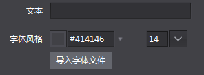
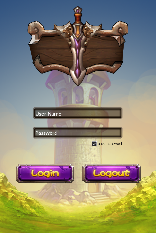
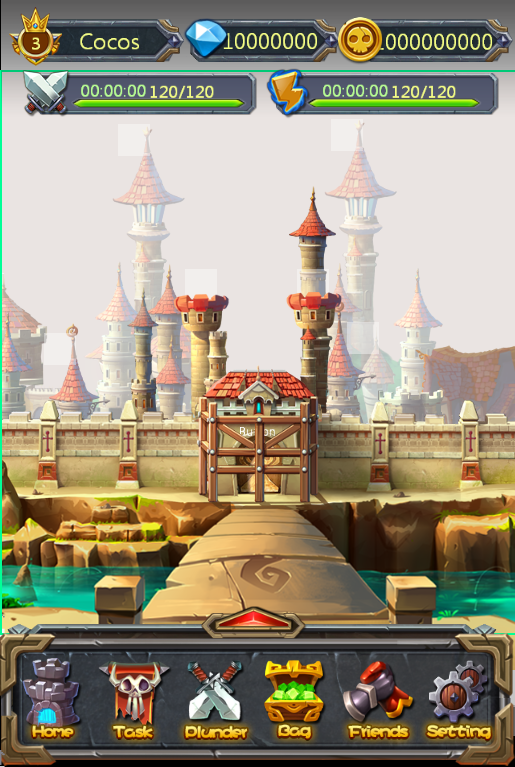
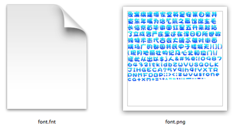
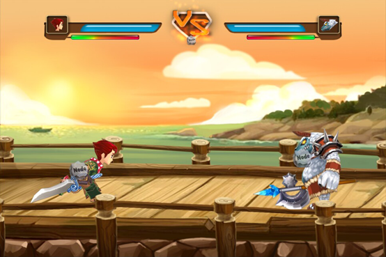
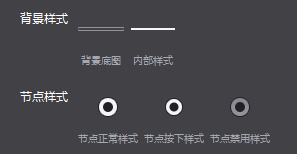
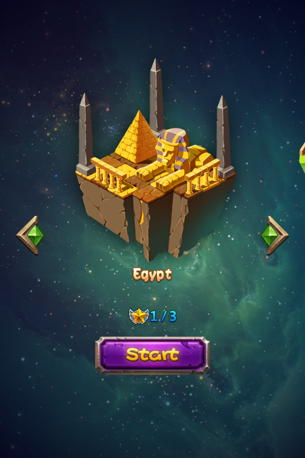
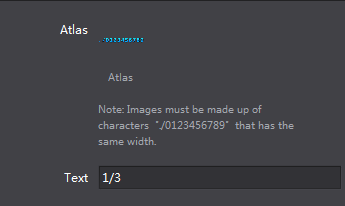

#控件

###1.按钮：

    
 &emsp;&emsp;按钮是游戏中最常用的控件类型之一，控制用户点击事件的开关，有正常、按下、禁用三种状态，您可以为他们设置样式及文本。

&emsp;&emsp;使用场景

&emsp;&emsp;按钮的使用十分普遍，以官方示例中的主场景示例为例，画框的内容均是由按钮控件组成 
 

&emsp;&emsp;在您的项目中，界面上方的等级、钻石、钱币也可以由按钮控件组成，当用户触摸时，跳转至相应的界面。

&emsp;&emsp;按钮控件属性众多，除了常规属性外，还包含尺寸属性和一些特性属性，我们从经常使用按钮控件的几种场景为您介绍如何更好的使用这种控件

&emsp;&emsp;场景1：修改按钮背景，设置按钮按下后效果和禁用效果

&emsp;&emsp;按钮具有三种状态，每一种状态都可以通过图片来定义。例如实现下图的按钮

 
&emsp;&emsp;您只需要在画布上添加一个按钮后，选择该按钮控件，在属性面板的特性部分会展示按钮控件当前的样式资源，您可以通过双击修改按钮控件的属性，也可以将图片资源拖动到当前的样式资源上以替换为新的资源。我们为按钮设置了正常和按下状态，这样在游戏中触摸该按钮时，按钮就会自动切换为按下状态的图片。如果有需要，您也可以为按钮设置禁用状态。

 
&emsp;&emsp;除此之外也能通过按钮控件的右键菜单添加新的资源。

&emsp;&emsp;场景2：使用按钮时，需要在按钮上设置文字
 

&emsp;&emsp;有时我们在设置按钮样式后，还希望给按钮设置文字，您可以使用修改按钮文本特性来实现这个需求。您可以自定义按钮文本的颜色、字体、大小。
&emsp;&emsp;修改按钮文本时只需选中按钮，在属性区修改文本属性，也可以通过“菜单-编辑文本”或双击唤出修改文本弹窗。

 
&emsp;&emsp;场景3：在游戏中，不希望该按钮响应用户的触摸事件

&emsp;&emsp;能够在属性面板或右键菜单设置按钮是否启用，按钮禁用后在最终的游戏里将不能响应触摸事件。

###2.复选框：

 
&emsp;&emsp;复选框是一种可同时选中多项的基础控件，您可设置他的各种样式，以及选中状态。

&emsp;&emsp;使用场景

&emsp;&emsp;复选框最常用的地方莫过于游戏登录界面上的“记住用户名”和“记住密码”，相信您一定经常见到。

 
&emsp;&emsp;还有就是一些游戏的设置界面，控制是否启用音乐的开关，通常也是复选框控件。 复选框控件属性众多，除了常规属性外，还包含尺寸属性和一些特性属性，我们从经常使用复选框控件的几种场景为您介绍如何更好的使用这种控件。

&emsp;&emsp;场景1：修改复选框样式

&emsp;&emsp;复选框具有五种状态：背景正常样式、背景按下样式、背景禁用样式、选中标识样式、选中标识禁用样式，每一种状态都可以通过图片来定义。 如果您要实现常规复选框的样式，如下图：

 
&emsp;&emsp;您可以分别设置五个状态的图片，已达到您的预期效果 如果您要实现设置界面的音乐开（关）样式，如下图 ：
 

&emsp;&emsp;您仅需要设置背景正常样式、背景按下样式、背景禁用样式，而将另外两个状态设置为不启用状态。 除此之外也能通过按钮控件的右键菜单添加新的资源。

&emsp;&emsp;场景2：游戏中默认复选框是勾选（不勾选）的。

&emsp;&emsp;当您设置一个复选框为选中时，这个复选框在游戏中的初始状态就为选中的状态。 通过属性面板或右键菜单能够修改复选框的选中状态。

###3.图片控件
 

 
&emsp;&emsp;添加一张可以设置九宫格的图片，九宫格是一种能够使本来拉伸后会失真的图片，经过一定的处理后，拉伸后不失真的技术。关于九宫格的用法请参考4、九宫格使用.docx

&emsp;&emsp;图片控件相对于精灵控件，具有以下特性：

&emsp;&emsp;可改变原图尺寸，而不出现图片失真效果。

&emsp;&emsp;可使用同一资源，通过设定九宫格的参数，达到不同的最终效果。

&emsp;&emsp;系统开销比精灵控件大，建议不要过度使用图片控件。

&emsp;&emsp;使用场景

&emsp;&emsp;同样还是官方示例中的这个界面，您能想象到哪些地方是由图片控件组成的么？

 
&emsp;&emsp;您可以获取官方示例后，打开DifficultSelect.csd文件查看我们是如何使用图片控件的，也许会对您的项目有所启发。 其中 的背景由一张尺寸为16x32的图片制作而成的。下面我们为您说明如何使用图片控件制作这一背景。

&emsp;&emsp;场景1：如何使用图片控件
 

&emsp;&emsp;在画布上添加一个图片控件后，设置其“图片资源”属性为上图所示资源，设置方式为在属性面板的特性部分会展示控件当前的图片资源缩略图，您可以通过双击缩略图修改控件的图片资源，也可以将图片资源拖动到当前的样式资源上以替换为新的资源。除此之外也能通过九宫格图片控件的右键菜单添加新的资源。 然后开启“九宫格”属性，并修改九宫格控件的上下左右边距分别为0,0,10,0，而后修改控件尺寸为70,32，定义的这些边距会影响九宫格拉伸的效果，并达到预期的效果。关于九宫格的原理和详细说明，参考4、九宫格使用.docx

###4.文本

&emsp;&emsp;文本也是游戏中最为常用的控件之一。添加一个文本，可以设置字体、字号、对齐等样式或属性。

&emsp;&emsp;使用场景

&emsp;&emsp;在示例中很多地方使用了文本控件，如主界面：

 
&emsp;&emsp;场景1：使用不同的字体修改文本样式

&emsp;&emsp;如果您需要特殊的字体则需要点击导入字体按钮导入一个 TTF格式的字体，这个字体将在您发布游戏时一起打包。 在修改文本的字体时需要注意，当您没有指定使用的字体时，使用的字体是所运行设备的默认字体，对于您所制作的游戏来说就是玩家设备的字体。

###5.FNT字体

&emsp;&emsp;可以通过设置FNT字体文件实现各种艺术字体。 和艺术数字比，FNT字体具有以下特性：

&emsp;&emsp;.	可用资源丰富，支持各类文字，下图就是一张制作好的FNT字体，不难发现，字体中包含中文，英文，数字以及某些特殊字符。

&emsp;&emsp;.	制作复杂，需要使用专业软件进行制作。

&emsp;&emsp;使用场景

 
&emsp;&emsp;场景1：使用FNT字体

&emsp;&emsp;在画布上添加一个FNT后，选择该FNT字体控件，在属性面板的特性部分会展示该控件当前的样式资源，您可以通过双击修改按FNT字体的属性，也可以将FNT资源拖动到当前的样式资源上以替换为新的资源。 除此之外也能通过按钮控件的右键菜单添加新的资源。 修改FNT字体文本时只需选中控件，在属性区修改文本属性，也可以通过“菜单-编辑文本”或双击唤出修改文本弹窗。

 
&emsp;&emsp;当您在输入框中输入了FNT中缺少的字符时，这些缺少的字符会被显示为空格。

###6.进度条

 
&emsp;&emsp;通过进度条可以显示处理任务的速度、完成度，您可以设置进度条的样式。

&emsp;&emsp;使用场景

&emsp;&emsp;官方示例中，体力恢复功能就使用了进度条控件，如下图所示绿色条
 

&emsp;&emsp;场景1：修改进度条样式

&emsp;&emsp;在画布上添加一个进度条后，选择该进度条控件，在属性面板的特性部分会展示进度条控件当前的样式资源，您可以通过双击修改进度条控件的资源图，也可以将图片资源拖动到当前的样式资源上以替换为新的资源。 除此之外也能通过进度条控件的右键菜单添加新的资源。 如示例中，我们就为其设置了如下背景：

 
&emsp;&emsp;场景2：设置进度条方向

 
&emsp;&emsp;实现如上图所示血条（一个向左，一个向右），只需要设置进度条的属性“类型”，分别设定为从左至右、从右至左，通过修改进度条方向可以在游戏中实现对战时生命值的展示。

###7.滑动条

&emsp;&emsp;滑动条可以设置滑动进度，滑块样式式等，用户可通过移动滑动滑动条在相应的控件中显示对应的值

&emsp;&emsp;使用场景

&emsp;&emsp;滑动条多用于设置某些连贯属性上，如在很多程序中的设置界面设置音量等，在官方示例中，我们也在设置界面做了滑动条的展示：
 

&emsp;&emsp;场景1：修改滑动条样式

&emsp;&emsp;如上图，要设置上图中的进度条，您需要以下五个资源，他们分别用于设置滑动条的背景样式、内部进度条样式、滑块正常样式、滑块按下样式、滑块禁用样式，每一种状态都可以通过图片来定义。在我们的示例中，禁用状态没有设置。
 

&emsp;&emsp;在画布上添加一个滑动条后，选择该滑动条控件，在属性面板的特性部分会展示滑动条控件当前的样式资源，您可以通过双击修改滑动条控件的属性，也可以将图片资源拖动到当前的样式资源上以替换为新的资源。
 
&emsp;&emsp;除此之外也能通过滑动条控件的右键菜单添加新的资源。

###8.艺术数字

 
&emsp;&emsp;可以通过一张从0到9的PNG图片实现艺术数字的效果，每个数字的高为图片的高，宽为图片的1/10，通过艺术数字可以实现艺术化效果的数字，能够简单有效的丰富游戏的视觉效果。 和FNT字体相比，艺术数字具有以下特性：

&emsp;&emsp;.	制作方便，FNT字体制作复杂，而艺术数字较简单

&emsp;&emsp;.	可用资源少，艺术数字仅支持0-9的数字

&emsp;&emsp;使用场景

&emsp;&emsp;我们的官方示例中，选择关卡这里就使用了艺术数字

 
&emsp;&emsp;场景1：修改艺术数字图片资源

&emsp;&emsp;在画布上添加一个艺术数字后，选择该艺术数字控件，在属性面板的特性部分会展示控件当前的图片资源缩略图，您可以通过双击缩略图修改控件的图片资源，也可以将图片资源拖动到当前的样式资源上以替换为新的资源。 除此之外也能通过艺术数字控件的右键菜单添加新的资源。 修改按钮文本时只需选中按钮，在属性区修改文本属性，也可以通过“菜单-编辑文本”或双击唤出修改文本弹窗。
 

&emsp;&emsp;特别说明

&emsp;&emsp;制作艺术数字时需要游戏美术设计人员提供一张包含了“0”到“9”的图片，确保顺序为0-9且按照图片宽度进行10等分能够分割出各个独立的数字。
 

&emsp;&emsp;一张典型的艺术数字图片资源

 

