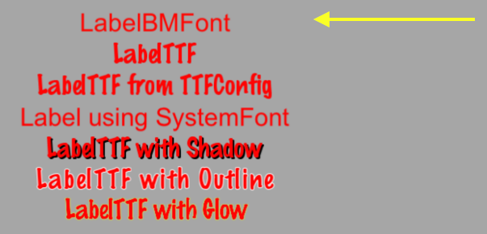
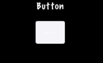

# Chapter 6: UI
Taking a look at the common apps you might use, I bet that you can spot UI
widgets without necessarily knowing what they are. They aren't specific to games,
every application probably uses a few widgets. What does __UI__ stand for? What do
__UI__ widgets do? Oh so many questions!

## Widgets, oh, my!
__UI__ is an abbreviation that stands for _user interface_. You know, things that
are on the screen. This include items like: __labels__, __buttons__, __menus__,
__sliders__ and __views__. Cocos2d-x provides a set of __UI__ widgets to make it
simple to add these controls to your projects. It may sound trivial, but a lot
goes in to creating a core class like a `Label`. There are so many aspects of
just this one. Could you imagine having to write your own custom widget set? Don't
worry, your needs are covered!

## Label
Cocos2d-x provides a `Label` object that can create labels using __true type__,
__bitmap__ or the built-in system font. This single class can handle all your `Label`
needs.

#### Label BMFont
`BMFont` is a label type that uses a bitmap font. The characters in a bitmap font
are made up of a matrix of __dots__. It is very fast and easy to use, but not
scalable as it requires a separate font for each size character. Each character
in a `Label` is a separate `Sprite`. This means that each character can be rotated,
scaled, tinted, have a different __anchor point__ and/or most any other property changed.

Creating a `BMFont` label requires two files: a __.fnt__ file and an image
representation of each character in __.png__ format. If you are using a tool like
__Glyph Designer__ these files are created automatically for you. Creating a
`Label` object from a __bitmap font__:

```cpp
auto myLabel = Label::createWithBMFont("bitmapRed.fnt", "Your Text");
```



All of the characters in the string parameter should be found in the provided
__.fnt__ file, otherwise they won't be rendered. If you render a `Label` object and
it is missing characters, make sure they exist in your __.fnt__ file.

#### Label TTF
__True Type Fonts__ are different from the __bitmap fonts__ we learned about above.
With __true type fonts__ the outline of the font is rendered. This is convenient
as you do not need to have a separate font file for each size and color you might
wish to use. Creating a `Label` object that uses a __true type font__ is easy. To
create one you need to specify a __.ttf__ font file name, text string and a size.
Unlike `BMFont`, `TTF` can render size changes without the need for a separate
font files. Example, using a __true type font__:

```cpp
auto myLabel = Label::createWithTTF("Your Text", "Marker Felt.ttf", 24);
```


Although it is more flexible than a __bitmap font__, a _true type font_ is slower
to render and changing properties like the __font face__ and __size__ is an expensive
operation.

If you need several `Label` objects from a __true type font__ that all have the
same properties you can create a `TTFConfig` object to manage them. A `TTFConfig`
object allows you to set the properties that all of your labels would have in
common. You can think of this like a *recipe* where all your `Label` objects
will use the same ingredients.

You can create a `TTFConfig` object for your `Labels` in this way:

```cpp
// create a TTFConfig files for labels to share
TTFConfig labelConfig;
labelConfig.fontFilePath = "myFont.ttf";
labelConfig.fontSize = 16;
labelConfig.glyphs = GlyphCollection::DYNAMIC;
labelConfig.outlineSize = 0;
labelConfig.customGlyphs = nullptr;
labelConfig.distanceFieldEnabled = false;

// create a TTF Label from the TTFConfig file.
auto myLabel = Label::createWithTTF(labelConfig, "My Label Text");
```


A `TTFConfig` can also be used for displaying Chinese, Japanese and Korean
characters.

#### Label SystemFont
`SystemFont` is a label type that uses the default system font and font size.
This is a font that is meant not to have its properties changed. You should think
of it as __system font, system rules__. Creating a `SystemFont` label:

```cpp
auto myLabel = Label::createWithSystemFont("My Label Text", "Arial", 16);
```


## Label Effects
After you have your `Label` objects on screen you might want to make them a bit
prettier. Perhaps they look flat or plain. Thankfully you don't have to create
your own custom fonts! `Label` objects can have effects applied to them. Not all
`Label` objects support all effects. Some effects include __shadow__, __outline__
and __glow__. You can apply one or more effects to a `Label` object easily:

Label with a __shadow__ effect:

```cpp
auto myLabel = Label::createWithTTF("myFont.ttf", "My Label Text", 16);

// shadow effect is supported by all Label types
myLabel->enableShadow();
```


Label with a __outline__ effect:

```cpp
auto myLabel = Label::createWithTTF("myFont.ttf", "My Label Text", 16);

// outline effect is TTF only, specify the outline color desired
myLabel->enableOutline(Color4B::WHITE, 1));
```


Label with a __glow__ effect:

```cpp
auto myLabel = Label::createWithTTF("myFont.ttf", "My Label Text", 16);

// glow effect is TTF only, specify the glow color desired.
myLabel->enableGlow(Color4B::YELLOW);
```


## Menu and Menu Items
We are all probably familiar with what a menu is. We see these in every application
we use. In your game you would probably use a `Menu` object to navigate through
game options. Menus often contain __buttons__ like _Play_, _Quit_, _Settings_ and
_About_, but could also contain other `Menu` objects for a nested menu system.
A `Menu` object is a special type of `Node` object. You can create an  empty
`Menu` object as a place holder for your __menu items__:

```cpp
auto myMenu = Menu::create();
```

As we described options above of _Play_, _Quit_, _Settings_ and
_About_, these are your __menu items__. A `Menu` without __menu items__ makes little
sense.  Cocos2d-x offers a variety of ways to create your __menu items__ including
by using a `Label` object or specifying an image to display. __Menu items__ usually
have two possible states, a __normal__ and a __selected__ state. When you tap or click
on the __menu item__ a __callback__ is triggered. You can think of this as a chain
reaction. You tap/click the __menu item__ and it runs the code you specified. A
`Menu` can have just a single item or many items.

```cpp
// creating a menu with a single item

// create a menu item by specifying images
auto closeItem = MenuItemImage::create("CloseNormal.png", "CloseSelected.png",
CC_CALLBACK_1(HelloWorld::menuCloseCallback, this));

auto menu = Menu::create(closeItem, NULL);
this->addChild(menu, 1);
```

A menu can also be created by using a __vector__ of `MenuItem` objects:

```cpp
// creating a Menu from a Vector of items
Vector<MenuItem*> MenuItems;

auto closeItem = MenuItemImage::create("CloseNormal.png", "CloseSelected.png",
CC_CALLBACK_1(HelloWorld::menuCloseCallback, this));

MenuItems.pushBack(closeItem);

/* repeat for as many menu items as needed */

auto menu = Menu::createWithArray(MenuItems);
this->addChild(menu, 1);
```

If you run the sample code for this chapter you will see a `Menu` containing
`Label` objects for `MenuItems`:


### Lambda functions as Menu callbacks
Above we just learned that when you click a __menu item__ it triggers a __callback__.
C++11 offers __lambda__ functions and therefore Cocos2d-x takes full advantage of
them! A __lambda__ function is a function you write inline in your source code.
__Lambdas__ are also evaluated at runtime instead of compile time.

A simple __lambda__:

```cpp
// create a simple Hello World lambda
auto func = [] () { cout << "Hello World"; };

// now call it someplace in code
func();
```

Using a __lambda__ as a `MenuItem` callback:

```cpp
auto closeItem = MenuItemImage::create("CloseNormal.png", "CloseSelected.png",
[&](Ref* sender){
	// your code here
});
```

## Buttons
I doubt that we need to explain buttons much. We all know them as those things
we click on to make something happen in our games. Perhaps you might use a button
to change __scenes__ or to add `Sprite` objects into your game play.
A button intercepts a touch event and calls a predefined callback when tapped.
A `Button` has a __normal__ and __selected__ state. The appearance of the `Button` can
change based upon it's state. Creating a `Button` and defining its __callback__
is simple:

```cpp
#include "ui/CocosGUI.h"

auto button = Button::create("normal_image.png", "selected_image.png", "disabled_image.png");

button->setTitleText("Button Text");

button->addTouchEventListener([&](Ref* sender, Widget::TouchEventType type){
		switch (type)
		{
				case ui::Widget::TouchEventType::BEGAN:
						break;
				case ui::Widget::TouchEventType::ENDED:
						std::cout << "Button 1 clicked" << std::endl;
						break;
				default:
						break;
		}
});

this->addChild(button);
```

As you can see in the above example we specify a _.png_ image for each of the
possible states the button can be in. A `Button` is made up of 3 graphics that
might look like this:

   


On screen a `Button` might look like this:



## CheckBox
We are all used to filling out __checkboxes__ on paper forms like job applications
and rental agreements. You can also have __checkboxes__ in your games. Perhaps, you
want to have the ability for your player to make a simple __yes__ or __no__ choice.
You might also hear this referred to as a __binary__ choice (0 and 1). A `CheckBox`
permits the user to make this type of choice. There are 5 different __states__ a
`Checkbox` can have: __normal__, __selected__ and __disabled__. It is simple to create
a `CheckBox`:

```cpp
#include "ui/CocosGUI.h"

auto checkbox = CheckBox::create("check_box_normal.png",
                                 "check_box_normal_press.png",
                                 "check_box_active.png",
                                 "check_box_normal_disable.png",
                                 "check_box_active_disable.png");

checkbox->addTouchEventListener([&](Ref* sender, Widget::TouchEventType type){
		switch (type)
		{
				case ui::Widget::TouchEventType::BEGAN:
						break;
				case ui::Widget::TouchEventType::ENDED:
						std::cout << "checkbox 1 clicked" << std::endl;
						break;
				default:
						break;
		}
});

this->addChild(checkbox);
```

As you can see in the above example we specify a _.png_ image for each of the
possible states the `Checkbox` can be in. Since there are 5 possible states that
a `CheckBox` can be in, it is up 5 graphics, one for each of its states. Example
graphics:

   
 
 


On screen a `Checkbox` might look like this:


## LoadingBar
Have you ever played a game where you had to wait while it loaded up all the
content it needed? It probably showed you a bar, filling in as it made progress
accomplishing its task. This is often referred to as a __progress bar__, __status bar__
or a __loading bar__. Creating a `LoadingBar`:

```cpp
#include "ui/CocosGUI.h"

auto loadingBar = LoadingBar::create("LoadingBarFile.png");

// set the direction of the loading bars progress
loadingBar->setDirection(LoadingBar::Direction::RIGHT);

this->addChild(loadingBar);
```

In the above example a __loading bar__ is created and we set the direction it
should fill towards as progress is made. In this case to the right direction.
However, you probably need to change the percentage of the `LoadingBar`. This is
easily done:

```cpp
#include "ui/CocosGUI.h"

auto loadingBar = LoadingBar::create("LoadingBarFile.png");
loadingBar->setDirection(LoadingBar::Direction::RIGHT);

// something happened, change the percentage of the loading bar
loadingBar->setPercent(25);

// more things happened, change the percentage again.
loadingBar->setPercent(35);

this->addChild(loadingBar);
```

As you can see in the above example we specify a _.png_ image for the `LoadingBar`
objects texture:


On screen a `LoadingBar` might look like this:


## Slider
Sometimes it is necessary to change a value slightly. Perhaps you have a character
and you want to allow the player to adjust the strength of attacking an enemy.
A `Slider` allows users to set a value by moving an indicator. To create a `Slider`:

```cpp
#include "ui/CocosGUI.h"

auto slider = Slider::create();
slider->loadBarTexture("Slider_Back.png"); // what the slider looks like
slider->loadSlidBallTextures("SliderNode_Normal.png", "SliderNode_Press.png", "SliderNode_Disable.png");
slider->loadProgressBarTexture("Slider_PressBar.png");

slider->addTouchEventListener([&](Ref* sender, Widget::TouchEventType type){
		switch (type)
		{
				case ui::Widget::TouchEventType::BEGAN:
						break;
				case ui::Widget::TouchEventType::ENDED:
						std::cout << "slider moved" << std::endl;
						break;
				default:
						break;
		}
});

this->addChild(slider);
```

As you can see in the above example we specify a _.png_ image for each of the
possible states the slider can be in. A `Slider` is made up of 5 graphics that
might look like this:

   
   


On screen a `Slider` might look like this:


## TextField
What if you wanted the player of your game to type in a special name to call the
main character? Where would they type it into? Yes, a __text field__, of course.
A `TextField` widget is used for inputting text. It supports touch event, focus,
percent positioning and percent content size. To create a `TextField` widget:

```cpp
#include "ui/CocosGUI.h"

auto textField = TextField::create("","Arial",30);

textField->addTouchEventListener([&](Ref* sender, Widget::TouchEventType type){
				std::cout << "editing a TextField" << std::endl;
});

this->addChild(textField);
```

In this example a `TextField` is created and a __callback__ specified.

`TextField` objects are versatile and can meet all of your input needs. Would you
like the user to enter a secret password? Do you need to limit the number of
characters a user can input? `TextField` objects have this all built-it and much
more! Let's take a look at an example:

```cpp
#include "ui/CocosGUI.h"

auto textField = TextField::create("","Arial",30);

// make this TextField password enabled
textField->setPasswordEnabled(true);

// set the maximum number of characters the user can enter for this TextField
textField->setMaxLength(10);

textField->addTouchEventListener([&](Ref* sender, Widget::TouchEventType type){
				std::cout << "editing a TextField" << std::endl;
});

this->addChild(textField);
```

On screen a `TextField` might look like this:


When you are editing a `TextField`, the onscreen keyboard comes up:


<!--
#### ImageView
A `ImageView` is a placeholder for displaying images. It supports touch events,
focus, percent positioning and percent content size. To create an `ImageView`:
```cpp
auto imageView = ImageView::create("ccicon.png");
imageView->setPosition(Vec2(0,0));
this->addChild(imageView);
```
It is also possible to create an `ImageView` from a `SpriteFrame`:
```cpp
auto imageView = ImageView::create("ccicon.png", TextureResType::PLIST);
imageView->setPosition(Vec2(0,0));
this->addChild(imageView);
```
## Text
A `Text` widget is used for displaying text. It can also use it as a _text-only_
button. You can think of a `Text` widget as `Text` supports system font and TTF fonts. To create a `Text` widget:
```cpp
auto text = Text::create("Text","fonts/MyTTF.ttf",30);

this->addChild(text);
```
You can add effects like _shadow_, _glow_ and _outline_ just like any `Label`
object.

### TextBMFont
A `TextBMFont` widget is used for displaying `BMFont` text. It supports touch
event, focus, percent positioning and percent content size. Creating a `TextBMFont`
is list like the `Text` widget:
```cpp
auto textBMFont = TextBMFont::create("BMFont", "bitmapFontTest2.fnt");
textBMFont->setPosition(Vec2(0,0));
this->addChild(textBMFont);
```

#### TextAtlas
A `TextAtlas` widget is used for displaying text as an _atlas font_. It  supports
touch event, focus, percent positioning and percent content size.\
```cpp
auto textAtlas = TextAtlas::create("1234567890", "labelatlas.png", 17, 22, "0");
textAtlas->setPosition(Vec2(0,0));
this->addChild(textAtlas);
```

#### RichText
A `RichText` widget is used for displaying text, image and custom nodes.  It
supports touch event, focus, percent positioning and percent content size. When
receiving a touch event the whole `RichText` widget receives the event. To create
a `RichText` widget:
```cpp
auto richText = RichText::create();
richText->ignoreContentAdaptWithSize(false);
richText->setContentSize(Size(100, 100));

auto re1 = RichElementText::create(1, Color3B::WHITE, 255, str1, "Marker Felt", 10);

richText->pushBackElement(re1);
richText->setPosition(Vec2(0,0));
richText->setLocalZOrder(10);
this->addChild(_richText);
```
-->
