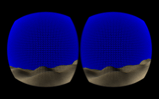

# Virtual Reality (VR)
You have probably heard the term __Virtual Reality__ or __VR__ used before.
__VR__ isn't new. Its roots can be traced back to earlier than the 1970's. The
original goal of __VR__ was to take an environment or situation, both realistic
and unrealistic and let the user feel what it is like to experience it by simulating
their physical presence in the environment. You can think of it as *transporting*
the user to another experience, all the while never leaving their physical surroundings.
You might even associate __VR__ with wearing a *head-mounted display* or special
gloves or even taking place on a special platform.


Modern __VR__ is focused around *games* and *immersive video*.

## How to get started
First, it is important to double check your hardware to make sure your device
supports __VR__. VR needs two things:

  * Stereo rendering (distortion mesh): available on every platform

    

  * headset input: available only on iOS and Android

In this initial release, a *generic renderer* is provided that will run on a
__Google Cardboard__ *head-tracking* display. We will be adding additional support
for the following SDK's:

  * [Google Cardboard](https://vr.google.com/cardboard/index.html)
  * [Oculus Rift](https://www.oculus.com/en-us/rift/)
  * [Deepoon E2](http://en.deepoon.com/)
  * [Samsung Gear VR](https://www.oculus.com/en-us/gear-vr/)

You need to __enable__ the __VR__ SDK and let that take over rendering your game.
In typical Cocos2d-x fashion, enabling __VR__ takes just a few lines of code. It
is important to note that enabling __VR__ is best done in __AppDelegate.cpp__.
```cpp
// implementing the "generic" VR renderer
auto vrImpl = new VRGenericRenderer;
glview->setVR(vrImpl);
```

<!--Second, you need to decide what __VR__ implementation you want to use. This decision
largely requires you to think about what *head-tracking* hardware you have available
to you. There are several __VR__ implementations that Cocos2d-x provides *drop-in* support
for:

  * [Google Cardboard](https://vr.google.com/cardboard/index.html)
  * [Oculus Rift](https://www.oculus.com/en-us/rift/)
  * [Deepoon E2](http://en.deepoon.com/)
  * [Samsung Gear VR](https://www.oculus.com/en-us/gear-vr/)

Plus, there is also a *generic* __VR__ implementation you can get started with to
learn concepts and test. It isn't suitable to only use this generic implementation.
It is completely software based and as a result has limitations the other SDK's
that are coupled with hardware do not have.

Third, you need to add the __VR__ implementation you picked into your game's project.
By default Cocos2d-x doesn't ship with __VR__ by default. It is necessary to use
the __Cocos Package Manager__ to add __VR__ to your game. If you are unfamiliar
with __Cocos Package Manager__, please refer to our chapter on the **[Cocos Command-line tool](../editors_and_tools/cocosCLTool/)**. Add __VR__ in a few easy steps:

  * first, make sure you can use the `cocos` command-line tool by testing it.
```cpp
$ which cocos
/Volumes/GitHub/cocos2d-x/tools/cocos2d-console/bin/cocos
```

  If you get a return value, `cocos` is available.

  * second, install the __VR__ SDK you wish to use:
```cpp
$ cocos package ##__to do here__
```

Fourth, you need to __enable__ the __VR__ SDK and let that take over rendering your game.
In typical Cocos2d-x fashion, enabling __VR__ takes just a few lines of code. It
is important to note that enabling __VR__ is best done in __AppDelegate.cpp__.
```cpp
// implementing the "generic" VR renderer
auto vrImpl = new VRGenericRenderer;
glview->setVR(vrImpl);

// implementing the "Cardboard" VR renderer
auto vrImpl = new VRCardboardRenderer;
glview->setVR(vrImpl);

// implementing the "Gear" VR renderer
auto vrImpl = new VRGearRenderer;
glview->setVR(vrImpl);

// implementing the "Oculus" VR renderer
auto vrImpl = new VROculusRenderer;
glview->setVR(vrImpl);

// implementing the "Deepoon" VR renderer
auto vrImpl = new VRDepoonRenderer;
glview->setVR(vrImpl);
```-->

## Caveats
When using __VR__ it is important to note the following items:

  * Touch events don't work as expected when developing for __VR__. In fact,
  touch events should be disabled in __VR__ games.
  * __VR__ games should be configured to use a gamepad and/or another external
  input device, such as a *head-mounted display*.
